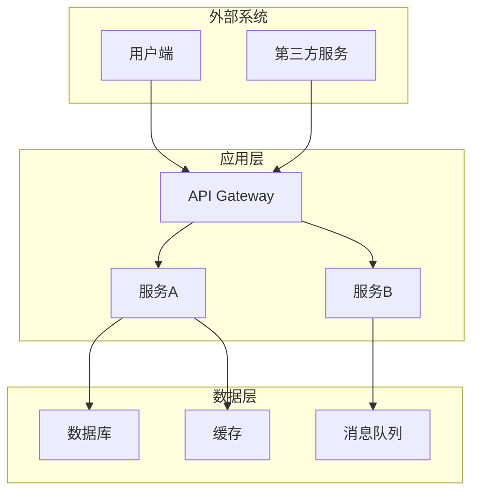
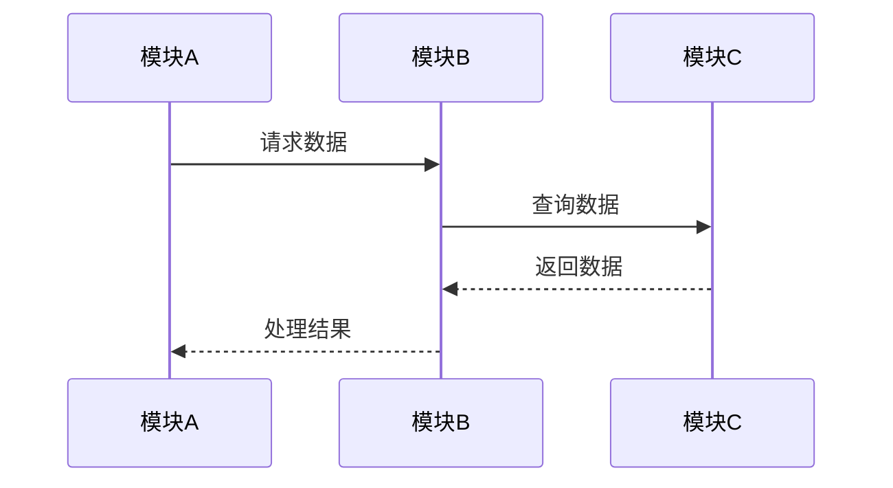
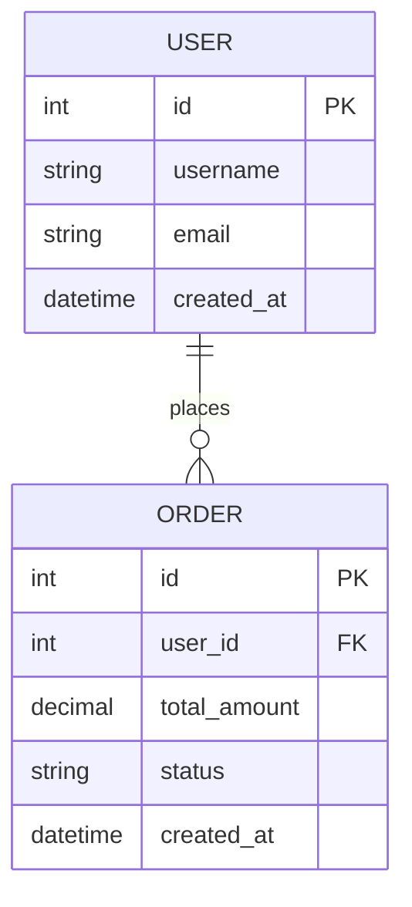
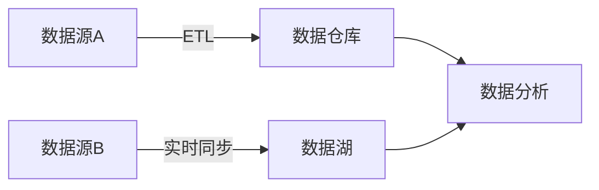
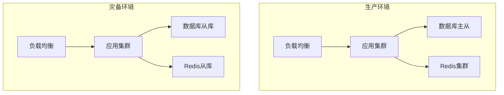
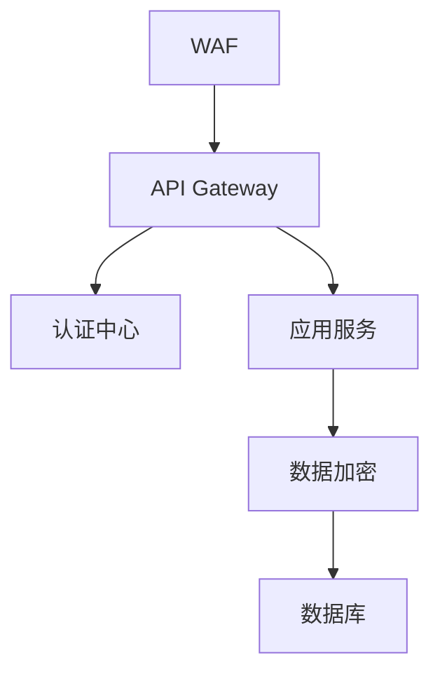
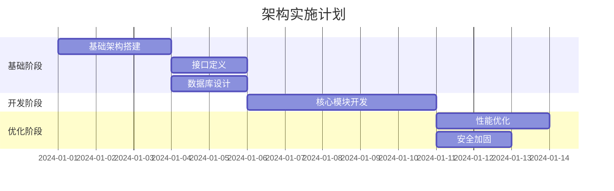

# 架构设计文档模板

> **文档类型**: 架构设计文档 (Architecture Design Document)  
> **负责角色**: 架构师 (Architect)  
> **文档位置**: `docs/architect/ARCHITECTURE_DESIGN_<项目名称>_<版本号>.md`

---

## 文档信息

| 项目 | 内容 |
|------|------|
| 文档名称 | |
| 项目名称 | |
| 版本号 | v1.0.0 |
| 创建日期 | YYYY-MM-DD |
| 最后更新 | YYYY-MM-DD |
| 负责架构师 | |
| 审核人 | |
| 状态 | 草稿/评审中/已批准/已归档 |

---

## 更新履历

| 版本 | 日期 | 更新人 | 更新内容 | 审核状态 |
|------|------|--------|----------|----------|
| v1.0.0 | YYYY-MM-DD | 架构师姓名 | 初始版本创建 | 待审核 |
| v1.1.0 | YYYY-MM-DD | 架构师姓名 | 更新内容描述 | 已审核 |

---

## 1. 项目概述

### 1.1 项目背景
- **业务背景**: 描述项目的业务背景和业务价值
- **技术背景**: 描述技术选型的背景和约束条件
- **项目目标**: 明确项目的核心目标和成功标准

### 1.2 范围定义
- **包含范围**: 明确包含在架构设计中的内容
- **排除范围**: 明确不包含在架构设计中的内容
- **边界定义**: 系统与外部系统的边界

### 1.3 关键干系人
- **业务方**: 业务负责人和需求提出方
- **技术方**: 技术团队和相关系统负责人
- **运维方**: 运维团队和基础设施负责人

---

## 2. 架构愿景

### 2.1 架构目标
- **业务目标**: 架构需要支撑的业务目标
- **技术目标**: 架构需要达成的技术指标
- **质量目标**: 架构需要满足的质量属性

### 2.2 架构原则
- **高内聚低耦合**: 模块职责清晰，依赖关系合理
- **可扩展性**: 支持业务快速发展和功能扩展
- **可维护性**: 代码结构清晰，易于理解和维护
- **安全性**: 安全设计贯穿整个架构
- **性能**: 满足业务性能需求

### 2.3 技术约束
- **技术栈约束**: 必须使用的技术栈
- **集成约束**: 必须集成的现有系统
- **合规约束**: 必须满足的合规要求

---

## 3. 系统架构设计

### 3.1 总体架构

#### 3.1.1 架构图

#### 3.1.2 架构分层
| 层级 | 职责 | 技术组件 | 部署位置 |
|------|------|----------|----------|
| 接入层 | 流量接入和安全防护 | Nginx/WAF | 公网区 |
| 应用层 | 业务逻辑处理 | Spring Boot/Node.js | 应用区 |
| 服务层 | 领域服务实现 | 微服务框架 | 应用区 |
| 数据层 | 数据存储和访问 | MySQL/Redis | 数据区 |

### 3.2 模块设计

#### 3.2.1 模块划分
| 模块名称 | 模块职责 | 依赖模块 | 被依赖模块 |
|----------|----------|----------|------------|
| 模块A | 职责描述 | 模块B, 模块C | 模块D |
| 模块B | 职责描述 | 模块C | 模块A |

#### 3.2.2 模块交互图

### 3.3 接口设计

#### 3.3.1 外部接口
| 接口名称 | 接口类型 | 协议 | 输入 | 输出 | 异常处理 |
|----------|----------|------|------|------|----------|
| 接口A | REST API | HTTP/JSON | Request DTO | Response DTO | 错误码定义 |
| 接口B | RPC | gRPC | Proto Message | Proto Message | 异常定义 |

#### 3.3.2 内部接口
| 接口名称 | 调用方 | 被调用方 | 调用方式 | 数据格式 |
|----------|--------|----------|----------|----------|
| 接口A | 服务A | 服务B | 同步调用 | JSON |
| 接口B | 服务B | 服务C | 异步消息 | Protobuf |

### 3.4 数据架构

#### 3.4.1 数据模型

#### 3.4.2 数据流转

---

## 4. 技术架构

### 4.1 技术栈选型

#### 4.1.1 前端技术栈
| 技术领域 | 选型 | 版本 | 选型理由 |
|----------|------|------|----------|
| 框架 | React/Vue | v18/v3 | 生态完善 |
| 状态管理 | Redux/Pinia | latest | 社区活跃 |
| UI组件库 | Ant Design/Element Plus | latest | 企业级组件 |

#### 4.1.2 后端技术栈
| 技术领域 | 选型 | 版本 | 选型理由 |
|----------|------|------|----------|
| 语言 | Java/Go/Python | 17/1.20/3.11 | 团队熟悉 |
| 框架 | Spring Boot/Gin/FastAPI | 3.x/latest/latest | 性能优秀 |
| 数据库 | MySQL/PostgreSQL | 8.0/15 | 稳定可靠 |
| 缓存 | Redis | 7.x | 高性能 |
| 消息队列 | Kafka/RabbitMQ | latest | 高吞吐 |

#### 4.1.3 基础设施
| 技术领域 | 选型 | 版本 | 选型理由 |
|----------|------|------|----------|
| 容器化 | Docker/Kubernetes | latest | 云原生标准 |
| 服务网格 | Istio/Linkerd | latest | 微服务治理 |
| 监控 | Prometheus/Grafana | latest | 开源生态 |
| 日志 | ELK/Loki | latest | 可观测性 |

### 4.2 部署架构

#### 4.2.1 部署拓扑

#### 4.2.2 环境规划
| 环境 | 用途 | 配置 | 数据 |
|------|------|------|------|
| 开发环境 | 日常开发 | 2C4G | 模拟数据 |
| 测试环境 | 功能测试 | 4C8G | 测试数据 |
| 预发环境 | 上线前验证 | 8C16G | 生产脱敏数据 |
| 生产环境 | 正式服务 | 16C32G | 生产数据 |

---

## 5. 质量属性设计

### 5.1 性能设计

#### 5.1.1 性能指标
| 指标项 | 目标值 | 测试方法 | 优化策略 |
|--------|--------|----------|----------|
| 响应时间 | P99 < 200ms | 压力测试 | 缓存+异步 |
| 吞吐量 | QPS > 1000 | 负载测试 | 水平扩展 |
| 并发数 | 支持1000并发 | 并发测试 | 连接池优化 |

#### 5.1.2 性能优化策略
- **缓存策略**: 多级缓存设计（本地缓存+分布式缓存）
- **数据库优化**: 索引优化、分库分表、读写分离
- **异步处理**: 消息队列解耦、异步任务处理
- **CDN加速**: 静态资源CDN分发

### 5.2 可用性设计

#### 5.2.1 可用性指标
| 指标项 | 目标值 | 实现方式 |
|--------|--------|----------|
| 可用性 | 99.99% | 多活架构 |
| MTTR | < 30分钟 | 自动化运维 |
| MTBF | > 720小时 | 高可用设计 |

#### 5.2.2 容灾设计
- **同城双活**: 同城两个数据中心同时提供服务
- **异地灾备**: 异地数据中心数据同步
- **故障转移**: 自动故障检测和流量切换

### 5.3 安全性设计

#### 5.3.1 安全架构

#### 5.3.2 安全措施
| 安全领域 | 措施 | 实现方式 |
|----------|------|----------|
| 传输安全 | HTTPS/TLS | 全链路加密 |
| 认证授权 | OAuth2/JWT | 统一认证中心 |
| 数据安全 | 加密存储 | AES/RSA加密 |
| 访问控制 | RBAC | 角色权限控制 |

### 5.4 可扩展性设计

#### 5.4.1 水平扩展
- **无状态设计**: 应用服务无状态，支持水平扩展
- **数据分片**: 数据库分库分表，支持数据水平扩展
- **服务拆分**: 微服务架构，独立部署和扩展

#### 5.4.2 垂直扩展
- **模块化设计**: 功能模块化，支持独立升级
- **插件化架构**: 支持功能插件动态加载

---

## 6. 任务拆分与规划

### 6.1 架构实施任务

#### 6.1.1 任务清单
| 任务ID | 任务名称 | 任务描述 | 依赖任务 | 预估工时 | 负责人 | 状态 |
|--------|----------|----------|----------|----------|--------|------|
| ARCH-001 | 基础架构搭建 | 搭建项目基础架构 | 无 | 3天 | 架构师 | 待开始 |
| ARCH-002 | 核心模块开发 | 开发核心业务模块 | ARCH-001 | 5天 | 开发团队 | 待开始 |
| ARCH-003 | 接口定义 | 定义系统内外部接口 | ARCH-001 | 2天 | 架构师 | 待开始 |
| ARCH-004 | 数据库设计 | 设计数据模型和表结构 | ARCH-001 | 2天 | 架构师 | 待开始 |
| ARCH-005 | 性能优化 | 性能测试和优化 | ARCH-002 | 3天 | 架构师 | 待开始 |
| ARCH-006 | 安全加固 | 安全审查和加固 | ARCH-002 | 2天 | 架构师 | 待开始 |

#### 6.1.2 任务依赖图

### 6.2 进度检查清单

#### 6.2.1 阶段检查点
| 阶段 | 检查项 | 完成标准 | 检查方式 | 负责人 |
|------|--------|----------|----------|--------|
| 设计完成 | 架构文档 | 文档评审通过 | 评审会议 | 架构师 |
| 开发完成 | 代码实现 | 代码审查通过 | 代码审查 | 技术负责人 |
| 测试完成 | 测试报告 | 测试用例100%通过 | 测试报告 | 测试专家 |
| 上线完成 | 上线检查 | 生产环境验证通过 | 上线检查表 | 运维负责人 |

#### 6.2.2 质量门禁
| 门禁项 | 标准 | 检查工具 | 阻断发布 |
|--------|------|----------|----------|
| 代码覆盖率 | > 80% | SonarQube | 是 |
| 安全漏洞 | 高危=0 | SonarQube | 是 |
| 性能指标 | 满足SLA | 性能测试 | 是 |
| 接口契约 | 100%匹配 | 契约测试 | 是 |

---

## 7. 风险评估

### 7.1 技术风险
| 风险项 | 风险等级 | 影响范围 | 缓解措施 | 负责人 |
|--------|----------|----------|----------|--------|
| 技术选型风险 | 中 | 整体架构 | 技术预研+POC验证 | 架构师 |
| 性能风险 | 高 | 用户体验 | 性能测试+优化 | 架构师 |
| 集成风险 | 中 | 系统对接 | 接口契约+联调 | 架构师 |

### 7.2 实施风险
| 风险项 | 风险等级 | 影响范围 | 缓解措施 | 负责人 |
|--------|----------|----------|--------|--------|
| 进度风险 | 中 | 项目交付 | 里程碑检查+缓冲时间 | 项目经理 |
| 人员风险 | 低 | 开发质量 | 代码审查+知识分享 | 技术负责人 |

---

## 8. 附录

### 8.1 术语表
| 术语 | 定义 | 说明 |
|------|------|------|
| 术语A | 定义描述 | 补充说明 |
| 术语B | 定义描述 | 补充说明 |

### 8.2 参考资料
- [参考文档1](链接)
- [参考文档2](链接)
- [技术规范](链接)

### 8.3 相关文档
- [需求文档](../product-manager/PRD_<项目名称>.md)
- [测试计划](../test-expert/TEST_PLAN_<项目名称>.md)
- [接口文档](./API_SPEC_<项目名称>.md)

---

## 9. 审核记录

| 审核轮次 | 审核日期 | 审核人 | 审核意见 | 处理结果 |
|----------|----------|--------|----------|----------|
| 第一轮 | YYYY-MM-DD | 审核人 | 审核意见描述 | 已处理 |
| 第二轮 | YYYY-MM-DD | 审核人 | 审核意见描述 | 已处理 |

---

**文档结束**

> 本文档由架构师角色创建和维护，任何修改必须更新版本号和更新履历。
