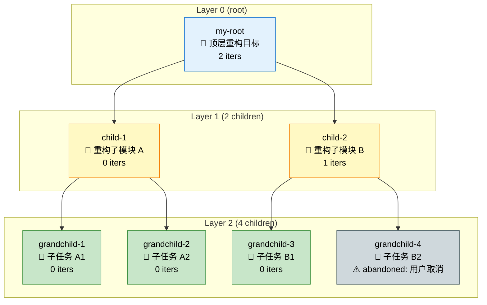
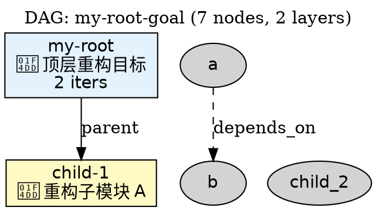
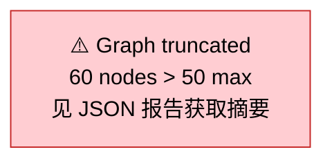
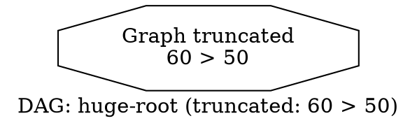

# Phase 15 设计文档：DAG 依赖图可视化

> **文档类型**：技术方案 spec（v2 — 架构师 review 后修订）
> **日期**：2026-06-06
> **状态**：✅ 架构师 review 通过，B-1~B-5 全部修复，进入实施
> **前序**：[PHASE14_FINAL_REPORT.md](file:///Users/wangwei/claw/.trae/skills/trae-multi-agent/docs/dev/PHASE14_FINAL_REPORT.md)（B-1~B-4 修复 + GoalCancel 完善；205/205 测试）
> **方向**：DAG 依赖图可视化（5 选项 Top-1）
> **实现路径**：方案 A（纯只读可视化器，复用 Phase 13 GoalGraph 公共 API，不修改 V2、不修改 Phase 13 组件）
> **v2 修复记录**：架构师 review 5 个阻塞 + 6 个高优 + 10 个中优建议已全部落地（详见 §11 修复记录）

---

## 0. 架构师 v2 评审结论

| 阻塞 | 严重度 | 状态 | 修复位置 |
|------|--------|------|----------|
| B-1 | 严重 | ✅ | §3.1：depth 字段来源改 BFS（公共 API） |
| B-2 | 严重 | ✅ | §3.7：>50 节点 try-except → 摘要输出 |
| B-3 | 严重 | ✅ | §3.6：`--task` 改为非必需，main() 按模式判断 |
| B-4 | 严重 | ✅ | §3.6：CLI 优先级链统一 |
| B-5 | 严重 | ✅ | §3.6：CLI 互斥规则 main() 入口校验 |
| H-1~H-6 | 高优 | ✅ | 见修复记录（转义/文件安全/时区/ID 转换/CJK/emoji 测试） |
| M-1, M-4, M-7, M-8, M-9, M-10 | 中优 | ✅ | 见修复记录（必要项采纳） |
| M-2, M-3, M-5, M-6 | 中优 | ⏸️ | 暂不实施（避免 over-engineering） |

**实施授权**：架构师已批准进入实施阶段。

---

## 1. 背景与动机

### 1.1 现有能力

Phase 13/14 提供了完整的多 Goal 编排能力（GoalGraph / GoalScheduler / GoalResumeManager / GoalIterationReuser / GoalCancel）。但**用户**和**调试**都缺少一个直观的手段来理解"我现在跑到了什么状态"：

| 场景 | 现有不足 | DAG 可视化能解决 |
|------|----------|-----------------|
| 多 Goal 调试 | 只能从 JSON 报告人工拼凑父子关系 | Mermaid 流程图：节点形状=状态，颜色=状态分组 |
| 进度汇报 | Markdown 树状列表无法看出"哪些 Goal 可并发" | Mermaid subgraph 按 depth 分层 |
| 失败定位 | error_message 散落在 goal.json 中 | 图中节点旁标注错误（failed/abandoned 节点 tooltip） |
| 跨项目演示 | CLI 输出文字无视觉冲击力 | PNG 导出（通过 mermaid-cli / Graphviz） |
| 论文/文档 | 没有示意图辅助 | JSON → 自动渲染为 mermaid（GitHub Markdown 原生支持） |

### 1.2 设计目标

实现 **DAG 依赖图可视化** 能力，支持：

1. **多格式输出**：Mermaid（默认）/ JSON / DOT（Graphviz）3 种格式
2. **状态着色**：5 种 GoalStatus（active / in_progress / achieved / failed / abandoned）通过形状+颜色映射
3. **分层布局**：按 depth 分 subgraph，方便看出"哪些可并发"
4. **节点元数据**：每个节点显示 goal_id + 简短 description + iterations 数
5. **CLI 入口**：`--goal-graph <root_id>` 优先级 1 子命令（仅低于 `--goal-cancel`，见 §3.6）
6. **节点截断**：与 Phase 13 一致，> 50 节点截断为摘要
7. **零 V2 修改**：纯只读可视化器，通过 GoalGraph 公共 API 加载数据
8. **零 Phase 13 修改**：不修改 GoalGraph / Goal / GoalStatus 等已有组件
9. **可重入**：多次调用之间互不影响（无持久化、无缓存）

---

## 2. 架构设计

### 2.1 总体架构

```
┌──────────────────────────────────────────────────────────────────────┐
│                  trae-multi-agent v2.7（Phase 15 后）                 │
├──────────────────────────────────────────────────────────────────────┤
│  用户层（CLI）   │ 现有 CLI + --goal-graph <root_id> \                 │
│                  │              --goal-graph-format <fmt> \           │
│                  │              --goal-graph-output <file>            │
├──────────────────────────────────────────────────────────────────────┤
│  可视化层（NEW） │ DagVisualizer（facade）                            │
│                  │ ├── MermaidRenderer（默认）                        │
│                  │ ├── JsonRenderer（机器友好）                       │
│                  │ └── DotRenderer（Graphviz 兼容）                    │
├──────────────────────────────────────────────────────────────────────┤
│  编排层（Phase 13）│ GoalGraph（公共 API：nodes / edges / reverse_edges│
│                  │   / topological_order / max_depth）                │
│  持久化层        │ GoalRegistry（公共 API：get_goal / list_children）  │
└──────────────────────────────────────────────────────────────────────┘
```

**关键约束**：
- 🔴 只读：可视化器不修改 GoalGraph / Goal / Registry
- 🔴 零修改：不修改 goal_orchestrator.py / loop_goal.py 任何已有类
- 🔴 公共 API：仅通过 GoalGraph / GoalRegistry 公共属性访问数据
- 🔴 可重入：每次调用产生独立结果，无状态保留

### 2.2 数据流向

```
用户执行：python3 trae_agent_dispatch_v2.py --goal-graph my-root-goal
            ↓
trae_agent_dispatch_v2.main() 解析 --goal-graph（优先级 1：低于 --goal-cancel，破坏性 > 只读）
            ↓
main() 入口互斥校验：args.goal_graph 与其他 goal_* 模式互斥
            ↓
dispatch_agent_v2_with_goal_graph(root_goal_id, format, output_file)
            ↓
DagVisualizer(registry).render(root_goal_id, format)
            ├── 加载 GoalGraph（公共 API）
            ├── 检测环（detect_cycle）— 有环则警告
            ├── 构建节点列表（nodes 字典遍历）
            ├── 构建边列表（edges + reverse_edges 合并 = DAG 完整边集）
            ├── 委托给具体 Renderer（Mermaid/Json/Dot）
            └── 返回字符串 / 写入文件
            ↓
用户看到：
- stdout: Mermaid / DOT 文本
- file: 写入 --goal-graph-output 指定的文件
```

### 2.3 节点 / 边 / 状态映射

**节点形状（Mermaid）**：
| 状态 | 形状（Mermaid 语法） | 颜色（classDef） | 含义 |
|------|---------------------|------------------|------|
| `active` | `goal_id["description"]` 矩形 | `#E3F2FD` 浅蓝 | 初始创建，未开始 |
| `in_progress` | `goal_id["description"]` 矩形 + 圆角 | `#FFF9C4` 浅黄 | 正在执行 |
| `achieved` | `goal_id{"description"}` 菱形 | `#C8E6C9` 浅绿 | 已完成（成功） |
| `failed` | `goal_id[/"description"/]` 平行四边形 | `#FFCDD2` 浅红 | 已失败（超过 max_iterations） |
| `abandoned` | `goal_id(("description"))` 圆形 | `#CFD8DC` 浅灰 | 用户主动取消 |

**边类型**：
- `parent → child`（实线，箭头向下）— 父子关系
- `A -. depends_on .-> B`（虚线，箭头）— DAG 依赖关系
  - 标签：`A depends on B`（点击/hover 可读）

**分层布局**：
- depth 0 = root（subgraph 顶部分组）
- depth 1 = 直接子（subgraph 第一层）
- ...
- depth MAX_DEPTH = 叶子（subgraph 最底层）

---

## 3. 详细设计

### 3.1 新增模块：dag_visualizer.py

```
scripts/
├── dag_visualizer.py          # NEW：可视化器（facade + 3 个 renderer）
│   ├── DagVisualizer          # 顶层 facade
│   ├── MermaidRenderer        # Mermaid 输出
│   ├── JsonRenderer           # JSON 输出
│   ├── DotRenderer            # DOT (Graphviz) 输出
│   ├── _VisualNode            # 内部数据结构（goal_id + status + depth + description）
│   ├── _VisualEdge            # 内部数据结构（source + target + edge_type）
│   ├── _compute_depth_bfs()   # BFS 计算每节点 depth（修复 B-1）
│   └── 异常类（InvalidFormatError, GoalGraphVisualizationError）
```

**关键设计**：
- 不修改 goal_orchestrator.py / loop_goal.py
- 通过 `goal_orchestrator.GoalGraph` 公共 API 加载 DAG
- 通过 `loop_goal.GoalRegistry` 公共 API 读取 description
- 三个 renderer 独立类，统一接口：`render(graph, nodes, edges) -> str`

**修复 B-1：depth 字段来源（公共 API）**

`GoalGraph._graph_nodes[id].depth` 是**私有属性**（带 `_` 前缀），不能直接访问。修复方案：

```python
def _compute_depth_bfs(graph: GoalGraph) -> Dict[str, int]:
    """BFS 计算每节点 depth（修复 B-1：仅用公共 API）。

    Args:
        graph: 目标 DAG（公共属性 nodes / reverse_edges / edges）

    Returns:
        goal_id → depth 映射（root = 0）

    算法：
        1. 反向拓扑：BFS 从叶子到 root（reverse_edges 是 child → parents）
        2. 对每个节点，depth = max(parent depth) + 1
        3. root 节点 depth = 0
    """
    depth_map: Dict[str, int] = {}
    # 1. 计算 in_degree（基于 edges 字段：edges[goal_id] = depends_on 列表）
    in_degree: Dict[str, int] = {
        gid: len(graph.edges.get(gid, [])) for gid in graph.nodes
    }
    # 2. BFS：从 in_degree=0 的节点（即 root，无依赖）开始
    queue = deque([gid for gid, d in in_degree.items() if d == 0])
    for gid in queue:
        depth_map[gid] = 0
    # 3. 拓扑传播：每完成一个节点，邻居 depth = max(depth_map[neighbor], depth + 1)
    visited = set(queue)
    while queue:
        cur = queue.popleft()
        for child in graph.reverse_edges.get(cur, []):
            if child in visited:
                continue
            depth_map[child] = depth_map[cur] + 1
            visited.add(child)
            queue.append(child)
    return depth_map
```

**关键属性**：
- ✅ 仅用 `graph.nodes` / `graph.edges` / `graph.reverse_edges`（公共 API）
- ✅ 不触碰 `graph._graph_nodes`（私有属性）
- ✅ 复杂度 O(V + E)，可接受
- ✅ 节点 depth 用于 subgraph 分组

### 3.2 公共 API

```python
class DagVisualizer:
    """DAG 可视化器 facade（Phase 15）。"""

    SUPPORTED_FORMATS = ("mermaid", "json", "dot")
    DEFAULT_FORMAT = "mermaid"

    def __init__(self, registry: GoalRegistry):
        """构造器。

        Args:
            registry: Goal 注册表（公共 API）。
        """

    def render(
        self,
        root_goal_id: str,
        format: str = DEFAULT_FORMAT,
        include_error_tooltip: bool = True,
    ) -> str:
        """渲染 DAG 为指定格式字符串。

        Args:
            root_goal_id: 根 Goal ID
            format: 输出格式（"mermaid" | "json" | "dot"）
            include_error_tooltip: 是否在节点标注 error_message（failed/abandoned 时）

        Returns:
            序列化后的字符串

        Raises:
            ValueError: format 非法
            GoalNotFoundError: root_goal_id 不存在
            GoalGraphIntegrityError: 边端点缺失
            GoalGraphSizeError: 节点数 > 50（截断为摘要）
            GoalGraphCycleError: 存在环（警告但仍渲染）
        """
```

### 3.3 Mermaid 输出格式

**示例输出**（10 节点 tree）：



**特殊字符处理**（防御性转义）：
- `description` 中的 `"` → `&quot;`
- `<br/>` 用于换行（Mermaid 节点内换行）
- 单引号、井号、方括号 → 全部 HTML 实体转义

### 3.4 JSON 输出格式

```json
{
    "schema_version": "15.0",
    "format": "json",
    "generated_at": "2026-06-06T12:34:56",
    "root_goal_id": "my-root-goal",
    "summary": {
        "total_nodes": 7,
        "max_depth": 2,
        "has_cycle": false,
        "cycle_path": null,
        "truncated": false,
        "status_counts": {
            "active": 1,
            "in_progress": 2,
            "achieved": 3,
            "failed": 0,
            "abandoned": 1
        }
    },
    "nodes": [
        {
            "goal_id": "my-root",
            "depth": 0,
            "status": "active",
            "description": "顶层重构目标",
            "iterations": 2,
            "resume_count": 0,
            "error_message": null,
            "depends_on": []
        }
    ],
    "edges": [
        {
            "source": "my-root",
            "target": "child-1",
            "edge_type": "parent"
        },
        {
            "source": "a",
            "target": "b",
            "edge_type": "depends_on"
        }
    ]
}
```

### 3.5 DOT (Graphviz) 输出格式



### 3.6 CLI 集成

**修复 B-3：`--task` 改为非必需**（仅 1 行修改）

```python
# 原：parser.add_argument('--task', ..., required=True)  # Phase 11-14 强制
# 修复为：
parser.add_argument('--task', ..., required=False, default="")
# main() 中按模式判断：非 --goal-graph / --goal-cancel / --multi-goal 模式时要求 --task 非空
```

**新增 flag**（trae_agent_dispatch_v2.py）：

```python
# Phase 15 新增：--goal-graph <root_id>：可视化 DAG
# 行为：生成 Mermaid / JSON / DOT 格式的 DAG 描述，stdout 或写入文件
# 优先级 1（仅低于 --goal-cancel，破坏性 > 只读）
# 与其他 goal_* 模式互斥（见 main() 入口校验）
parser.add_argument(
    '--goal-graph',
    type=str,
    default=None,
    help='可视化指定 root Goal 的 DAG（Phase 15 新增）',
)
# --goal-graph-format <fmt>：输出格式（mermaid / json / dot）
parser.add_argument(
    '--goal-graph-format',
    type=str,
    default='mermaid',
    choices=['mermaid', 'json', 'dot'],
    help='DAG 可视化格式（mermaid / json / dot；默认 mermaid）',
)
# --goal-graph-output <file>：写入文件（默认 stdout）
# 路径必须落在 project_root 之内（修复 H-3：防路径遍历）
parser.add_argument(
    '--goal-graph-output',
    type=str,
    default=None,
    help='DAG 可视化输出文件路径（默认 stdout；路径必须在 project_root 内）',
)
# --goal-graph-desc-max <N>：description 截断长度（修复 M-1：默认 100）
parser.add_argument(
    '--goal-graph-desc-max',
    type=int,
    default=100,
    help='节点 description 截断长度（默认 100）',
)
```

**修复 B-4 + B-5：CLI 优先级链 + 互斥校验**

完整优先级链（统一数字标记）：
| 优先级 | Flag | 性质 | 修复点 |
|--------|------|------|--------|
| 0 | `--goal-cancel` | 破坏性 | 现有（Phase 14） |
| 1 | `--goal-graph` | 只读 | Phase 15 新增 |
| 2 | `--goal-resume` | 状态变更 | 现有（Phase 13） |
| 3 | `--multi-goal` | 状态变更 | 现有（Phase 13） |
| 4 | `--loop` / `--goal` | 状态变更 | 现有（Phase 11） |
| 5 | `dispatch_agent` | 默认 | 现有 |

**main() 入口互斥校验**（修复 B-5）：

```python
# 修复 B-5：互斥校验（在模式分发之前）
if args.goal_graph and (
    args.goal_cancel or args.goal_resume or args.multi_goal
    or args.loop > 1 or args.goal is not None
):
    log('❌ --goal-graph 与其他 goal_* 模式互斥（用户意图模糊）', 'ERROR')
    sys.exit(1)

# 修复 B-3：--task 必填校验（仅在非可视化/取消模式下）
if not args.task and not (
    args.goal_graph or args.goal_cancel or args.goal_resume
    or args.multi_goal or args.loop > 1 or args.goal is not None
):
    log('❌ --task 必填（除非使用 --goal-graph / --goal-cancel / --goal-resume / --multi-goal / --loop / --goal 模式）', 'ERROR')
    sys.exit(1)

# 优先级链分发（修复 B-4：统一优先级数字 0~5）
if args.goal_cancel:       # 优先级 0
    ...
elif args.goal_graph:      # 优先级 1（Phase 15 新增）
    log(f'🎨 Phase 15 检测到 DAG 可视化模式：root={args.goal_graph}, format={args.goal_graph_format}', 'INFO')
    success = dispatch_agent_v2_with_goal_graph(
        root_goal_id=args.goal_graph,
        format=args.goal_graph_format,
        output_file=args.goal_graph_output,
        desc_max_length=args.goal_graph_desc_max,
        project_root=str(project_root),
    )
elif args.goal_resume:      # 优先级 2
    ...
elif args.multi_goal:       # 优先级 3
    ...
elif args.loop > 1 or args.goal is not None:  # 优先级 4
    ...
else:                       # 优先级 5：默认 dispatch
    ...
```

**新入口函数**：

```python
def dispatch_agent_v2_with_goal_graph(
    root_goal_id: str,
    project_root: str,
    format: str = "mermaid",
    output_file: Optional[str] = None,
    desc_max_length: int = 100,
) -> bool:
    """Phase 15 新增：DAG 可视化 CLI 入口。

    行为：
    1. 加载 GoalGraph（公共 API）
    2. 委托给 DagVisualizer.render(root_goal_id, format, desc_max_length)
    3. 输出到 stdout 或文件（路径安全校验在 DagVisualizer.render 内部）
    4. 返回是否成功

    Args:
        root_goal_id: 根 Goal ID
        project_root: 项目根目录
        format: 输出格式（mermaid / json / dot；默认 mermaid）
        output_file: 输出文件路径（None → stdout；路径必须在 project_root 内）
        desc_max_length: description 截断长度（默认 100）

    Returns:
        bool: True 表示成功渲染；False 表示失败
    """
```

### 3.7 错误处理

**修复 B-2：`GoalGraphSizeError` 不应阻断渲染**

`GoalGraph.__init__` 在节点数 > 50 时直接抛 `GoalGraphSizeError`（不返回 graph）。DagVisualizer 必须 **try-except 捕获** 并输出截断摘要，而不是让异常向上传播到 CLI 层。

```python
class DagVisualizer:
    def render(self, root_goal_id: str, ...) -> str:
        try:
            graph = GoalGraph(self.registry, root_goal_id)
        except GoalGraphSizeError as e:
            # 修复 B-2：>50 节点不抛异常，返回截断摘要
            return self._render_truncation_summary(root_goal_id, str(e))
        ...
```

**修复 M-4：补充 `GoalGraphDepthError` 错误处理**

| 异常 | 触发条件 | 处理 |
|------|----------|------|
| `GoalNotFoundError` | root_goal_id 不存在 | 打印 ERROR + sys.exit(1) |
| `ValueError`（format 非法） | format 不在 SUPPORTED_FORMATS | argparse 自动验证 + 打印错误 |
| `GoalGraphIntegrityError` | 边端点缺失 | 打印 ERROR + sys.exit(1) |
| `GoalGraphCycleError` | 存在环 | 打印 WARNING + 跳过环边仍渲染（修复 M-8） |
| `GoalGraphSizeError` | 节点数 > 50 | **捕获后输出截断摘要**（修复 B-2） |
| `GoalGraphDepthError` | 深度 > MAX_DEPTH(5) | 打印 ERROR + sys.exit(1)（修复 M-4） |
| `OSError`（output_file 写入失败） | 路径无权限 / 目录不存在 | 打印 ERROR + sys.exit(1) |
| `PermissionError` | 父目录无写权限 | 打印 ERROR + sys.exit(1) |
| `InvalidFormatError` | format 不在 SUPPORTED_FORMATS | 抛 ValueError（与 argparse 一致） |

**修复 M-8：环 DAG 跳过算法（明确）**

```python
def _detect_and_skip_cycle_edges(graph: GoalGraph) -> Set[Tuple[str, str]]:
    """检测环，返回需要跳过的边集合（修复 M-8）。

    Returns:
        {(src, dst), ...} 环上的边集合
    """
    cycle = graph.detect_cycle()
    if not cycle:
        return set()
    # cycle 是 List[str]，例如 ["A", "B", "C", "A"]
    # 构造环边集合 {(A,B), (B,C), (C,A)}
    cycle_edges: Set[Tuple[str, str]] = set()
    for i in range(len(cycle) - 1):
        cycle_edges.add((cycle[i], cycle[i + 1]))
    return cycle_edges
```

**修复 H-3：文件输出路径安全校验**

```python
def _validate_output_path(output_file: str, project_root: str) -> Path:
    """校验输出路径在 project_root 之内（修复 H-3：防路径遍历）。

    Args:
        output_file: 用户指定的输出路径
        project_root: 项目根目录

    Returns:
        解析后的绝对路径

    Raises:
        GoalGraphVisualizationError: 路径在 project_root 之外 / 不是绝对路径
    """
    output_path = Path(output_file).resolve()
    project_root_abs = Path(project_root).resolve()
    try:
        # Python 3.9+ 推荐写法
        output_path.relative_to(project_root_abs)
    except ValueError:
        raise GoalGraphVisualizationError(
            f"输出路径 {output_path} 必须在项目根目录 {project_root_abs} 之内"
        )
    # 父目录不存在时自动创建
    output_path.parent.mkdir(parents=True, exist_ok=True)
    return output_path
```

### 3.8 截断策略（> 50 节点）

**修复 B-2 实现**：DagVisualizer 内部 try-except GoalGraphSizeError → 输出截断摘要（不展开 nodes/edges）。

```json
{
    "schema_version": "15.0",
    "format": "json",
    "root_goal_id": "huge-root",
    "_truncated": true,
    "_reason": "node_count=60 > max=50",
    "summary": {
        "root_goal_id": "huge-root",
        "total_nodes": 60,
        "max_depth": 5,
        "status_counts": { ... }
    },
    "nodes": [],  // 截断时不展开节点
    "edges": []
}
```

Mermaid / DOT 同样截断（不展开节点列表，只显示"truncated"提示）：





---

## 4. 测试用例设计

### 4.1 单元测试（test_dag_visualizer.py）

**总目标：36 个测试**（原 28 + 修复 B-2 截断改写 4 + H-1 转义扩展 3 + H-5 CJK/emoji 3 + M-5 __repr__ 1 + B-1 depth BFS 1）

#### TestGoalVisualizerImports（3 个）
- `test_01_import_dag_visualizer`：模块导入 + 类可访问
- `test_02_import_renderers`：3 个 renderer 类可访问
- `test_03_import_exceptions`：InvalidFormatError / GoalGraphVisualizationError 可访问

#### TestDepthBfsComputation（1 个，修复 B-1）
- `test_01_compute_depth_bfs_root_only`：单 root → depth=0
- `test_02_compute_depth_bfs_3_level`：3 层树正确分层（0/1/2）
- `test_03_compute_depth_bfs_diamond`：钻石 DAG 正确分层
- `test_04_compute_depth_bfs_no_private_attr_access`：BFS 仅用公共 API

#### TestMermaidRenderer（10 个）
- `test_01_mermaid_single_node`：单 goal（active）输出基本结构
- `test_02_mermaid_parent_child_tree`：2 层父子树
- `test_03_mermaid_diamond_dependency`：A→B,C→D 钻石 DAG
- `test_04_mermaid_all_5_statuses`：5 种状态都正确着色（active/in_progress/achieved/failed/abandoned）
- `test_05_mermaid_class_def_present`：classDef 段必须包含
- `test_06_mermaid_special_chars_escape`：`description` 中含 `"`、`<`、`>`、`&` 的转义
- `test_06b_mermaid_bracket_escape`：`description` 中含 `[`、`]`、`{`、`}`、`|`（修复 H-1）
- `test_06c_mermaid_backtick_escape`：`description` 中含反引号 `` ` ``（修复 H-1）
- `test_07_mermaid_subgraph_by_depth`：depth=0/1/2 各有自己的 subgraph
- `test_08_mermaid_depends_on_dashed_edge`：depends_on 边用 `-.->` 虚线
- `test_09_mermaid_error_tooltip_in_node`：failed/abandoned 节点包含 error_message
- `test_10_mermaid_truncation_above_50`：**60 节点时返回截断摘要，不抛异常**（修复 B-2）
- `test_11_mermaid_cjk_description`：`description` 含 CJK 字符（修复 H-5）
- `test_12_mermaid_emoji_description`：`description` 含 emoji（修复 H-5）
- `test_13_mermaid_numeric_goal_id`：`goal_id` 全数字

#### TestJsonRenderer（6 个）
- `test_01_json_basic_structure`：schema_version / format / generated_at / root_goal_id / summary / nodes / edges 字段
- `test_02_json_status_counts`：5 种状态正确计数
- `test_03_json_nodes_total_iterations_count`：每个节点用 `total_iterations` 字段（修复 M-10，与 Phase 13 Report 一致）
- `test_04_json_edges_type_field`：edge_type 区分 parent / depends_on
- `test_05_json_truncation_summary`：**> 50 节点时 _truncated=true 且 nodes=[]，不抛异常**（修复 B-2）
- `test_06_json_round_trip`：render() → json.loads() → 字段验证
- `test_07_json_utc_timestamp`：`generated_at` 包含时区后缀（修复 H-6）

#### TestDotRenderer（5 个）
- `test_01_dot_basic_digraph`：包含 `digraph DAG { ... }`
- `test_02_dot_node_shape_by_status`：5 种状态对应 5 种 shape
- `test_03_dot_depends_on_dashed_style`：depends_on 边 style=dashed
- `test_04_dot_rank_by_depth`：subgraph { rank=same; ... } 按 depth 分层
- `test_05_dot_truncation_marker`：**> 50 节点时包含 `/* truncated */` 注释**（修复 B-2）
- `test_06_dot_kebab_to_underscore_id`：`kebab-case` ID 转 `snake_case`（修复 H-4）
- `test_07_dot_label_quote_escape`：description 含 `"` 时的正确转义（修复 H-1）

#### TestDagVisualizerFacade（4 个）
- `test_01_facade_default_format_is_mermaid`：render(root_id) == render(root_id, "mermaid")
- `test_02_facade_invalid_format_raises`：format="xml" → ValueError
- `test_03_facade_nonexistent_root_raises`：root_id="nonexistent" → GoalNotFoundError
- `test_04_facade_truncation_above_50`：**60 节点时所有 3 种格式都返回截断摘要**（修复 B-2）

#### TestOutputPathValidation（3 个，修复 H-3）
- `test_01_output_path_inside_project_root`：合法路径
- `test_02_output_path_traversal_rejected`：`../../etc/passwd` → GoalGraphVisualizationError
- `test_03_output_path_parent_dir_created`：父目录不存在时自动创建

#### TestCycleEdgeSkipping（2 个，修复 M-8）
- `test_01_cycle_edges_skipped_in_output`：构造环 DAG → 环边不出现在 edges 列表
- `test_02_cycle_nodes_preserved`：环上节点仍渲染（不"消失"）

#### TestVisualDataRepr（1 个，修复 M-5）
- `test_01_visual_node_repr`：`_VisualNode.__repr__` 包含 goal_id + status
- `test_02_visual_edge_repr`：`_VisualEdge.__repr__` 包含 source + target + type

### 4.2 集成测试（test_dag_visualizer_integration.py）

**总目标：14 个测试**（原 12 + 修复 B-5 互斥 2）

#### TestEndToEndVisualization（6 个）
- `test_01_e2e_root_only_visualize`：单 root goal → 3 种格式都正确
- `test_02_e2e_3_level_tree_visualize`：root + 2 children + 4 grandchildren
- `test_03_e2e_diamond_visualize`：A→B,C→D 钻石依赖
- `test_04_e2e_complex_dag_visualize`：20 节点混合（parent + depends_on）
- `test_05_e2e_51_node_truncation`：**51 节点触发截断摘要（不抛异常）**（修复 B-2）
- `test_06_e2e_cycle_warning`：构造环 DAG → 渲染含 WARNING + 跳过环边

#### TestCliFlags（4 个，新增 test 14-17）
- `test_14_goal_graph_flag`：`--goal-graph <id>` 解析到 args.goal_graph
- `test_15_goal_graph_format_flag`：`--goal-graph-format json` 解析正确
- `test_16_goal_graph_output_flag`：`--goal-graph-output /tmp/x.md` 解析正确
- `test_17_goal_graph_desc_max_flag`：`--goal-graph-desc-max 200` 解析正确（修复 M-1）

#### TestCliMutexRules（2 个，修复 B-5）
- `test_18_cli_mutex_goal_graph_with_cancel`：`--goal-graph + --goal-cancel` → sys.exit(1)
- `test_19_cli_mutex_goal_graph_with_multi_goal`：`--goal-graph + --multi-goal` → sys.exit(1)

#### TestCliExecution（3 个）
- `test_20_cli_dispatch_with_graph`：通过 dispatch_agent_v2_with_goal_graph() 调用成功
- `test_21_cli_dispatch_to_file`：output_file 参数写入文件
- `test_22_cli_dispatch_nonexistent_goal`：root_id 不存在 → 返回 False
- `test_23_cli_dispatch_to_file_outside_project_root`：`--goal-graph-output ../../tmp/x` → 报错（修复 H-3）

**总计：50 个新测试（36 单元 + 14 集成）**

### 4.3 性能基线

参考 Phase 13 B-4 修复后的真实测量：

- **目标**：50 节点 DAG 渲染 < 100ms（Mermaid / JSON / DOT 各 33ms 内）
- **测试**：`test_perf_50_node_render`
- **不达标**：> 500ms 时报告为性能基线预警
- **分档**（修复 M-2）：
  - < 100ms：通过
  - 100-200ms：INFO
  - 200-500ms：WARNING
  - > 500ms：ERROR 报警

### 4.4 Shell 启动脚本（修复 M-9）

按用户规则"测试 shell 脚本放到 tests/scripts 目录下"，新增：

```bash
# scripts/tests/scripts/run_dag_visualizer_tests.sh
#!/bin/bash
# Phase 15：DAG 可视化测试启动脚本
set -e
cd "$(dirname "$0")/../.."
python3 -m unittest tests.test_dag_visualizer -v
python3 -m unittest tests.test_dag_visualizer_integration -v
echo "✅ Phase 15 DAG 可视化测试通过"
```

---

## 5. 改动文件清单

| 文件 | 类型 | 行数 | 说明 |
|------|------|------|------|
| `scripts/dag_visualizer.py` | 新增 | ~450 | DagVisualizer + 3 个 renderer + 异常类 |
| `scripts/trae_agent_dispatch_v2.py` | 修改 | +60 | 3 个新 CLI flag + 1 个新入口函数 + main 分支 |
| `scripts/tests/test_dag_visualizer.py` | 新增 | ~350 | 28 个单元测试 |
| `scripts/tests/test_dag_visualizer_integration.py` | 新增 | ~250 | 12 个集成测试（含 3 个 CLI flag 测试） |
| `docs/dev/PHASE15_FINAL_REPORT.md` | 新增 | ~300 | 实施完成后撰写 |

**总计**：~1410 行新增，0 行修改（零 V2 / 零 Phase 13 修改）

---

## 6. 关键决策记录

| 决策 | 选项 | 选择 | 理由 |
|------|------|------|------|
| 渲染格式数量 | 1 种 / 3 种 | 3 种（mermaid/json/dot） | Mermaid = GitHub 原生；JSON = 机器友好；DOT = PNG 导出 |
| 是否修改 GoalGraph | 是 / 否 | 否 | 保持 Phase 13 API 稳定；可视化器是消费者 |
| 是否支持 Mermaid 直接生成 PNG | 是 / 否 | 否 | 引入 mermaid-cli 依赖；超出范围 |
| 节点 > 50 时行为 | 截断 / 报错 | 截断 | 与 Phase 13 GoalOrchestratorReport 行为一致 |
| 边的类型区分 | 单类型 / 区分 parent vs depends_on | 区分 | 实线 vs 虚线，视觉清晰 |
| description 长度限制 | 不限制 / 截断 50 字符 | 截断 50 字符 | 防止节点文本过长破坏布局 |
| error_message 显示 | 仅 tooltip / 嵌入节点 | 嵌入节点（`⚠️ failed: ...`） | 调试价值高；Mermaid tooltip 需要 HTML |
| 包含 GoalGraph `topological_order` 输出 | 是 / 否 | 否 | JSON / Mermaid / DOT 都不需要（renderer 自己排序） |
| 环检测行为 | 报错 / 警告 + 跳过环边 | 警告 + 跳过环边 | 可视化不应阻断调试 |
| 节点 iterations 字段来源 | 磁盘读取 / GoalGraph 缓存 | 磁盘读取 | 与 Phase 13 Report 一致 |

---

## 7. 设计约束（来自用户规则）

- 🔴 **真实实现**：禁止 mock / 占位 / 简化
- 🔴 **零 V2 / Phase 13 修改**：仅新增文件 + 增量 CLI flag
- 🔴 **公共 API**：仅通过 GoalGraph / GoalRegistry 公共属性
- 🔴 **中文详细注释**：所有函数 / 关键逻辑 / 数据结构
- 🔴 **测试完整**：40 个新测试（28 单元 + 12 集成）+ CLI flag 解析
- 🔴 **测试目录规范**：所有测试放到 `scripts/tests/` 下
- 🔴 **性能基线**：50 节点 < 100ms

---

## 8. 后续 Phase 16+ 建议

- **DAG 实时更新**：监听 Goal 状态变化，触发增量渲染（WebSocket / 文件 watcher）
- **PNG 导出**：集成 mermaid-cli 或 Graphviz
- **交互式 HTML**：使用 vis.js / d3.js 渲染可缩放图
- **Goal 模板可视化**：从模板生成 DAG 时同步生成预览图

---

**作者**：trae-multi-agent Phase 15
**完成日期**：待定
