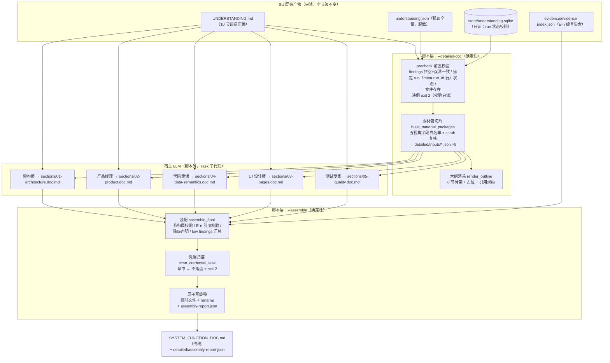

# 架构设计：系统功能与业务流程详说（SFD，post-render 专家详说阶段）

- **文档编号**：ARCH-SFD-001
- **所属项目**：TraeMultiAgentSkill
- **能力代号**：SFD（System Function Detail，系统功能与业务流程详说）
- **版本**：v1.1
- **日期**：2026-09-30
- **上游依据**：PRD-SFD-001（`docs/dev/SYSTEM_FUNCTION_DOC_PRD.md`，13 REQ + 5 NFR）、ARCH-SU-001（`docs/dev/SYSTEM_UNDERSTANDING_ARCHITECTURE.md`）
- **编写角色**：架构师（multi-agent-team）
- **状态**：评审通过（已按 2026-09-30 架构审查修订，待实现）

> 本文为**设计文档**，只给出模块职责、类/函数签名、CLI 契约、产物布局与追溯矩阵，不含实现代码。
> 实现阶段必须逐条回勾本文第 9 章 REQ→模块函数追溯矩阵与 PRD-SFD-001 验收标准。
> **约束继承声明**：SFD 是 SU 流水线的附加阶段，不修改 SU 任何既有模块的行为；
> SU 五条安全红线（ARCH-SU-001 §5.1）、退出码约定（§8.2：0/2/130 子集）、
> 幂等策略（§7.3：时间戳取 `run_meta.started_at`）在详说阶段全部继承生效。

---

## 目录

1. [总体设计：第三阶段定位与数据流](#1-总体设计post-render-专家详说阶段)
2. [新模块设计：`scripts/su/detailed_doc.py`](#2-新模块设计scriptsudetailed_docpy)
3. [CLI 集成设计](#3-cli-集成设计)
4. [五专家 prompt 文档规格](#4-五专家-prompt-文档规格)
5. [产物目录定稿](#5-产物目录定稿)
6. [幂等与时间戳策略](#6-幂等与时间戳策略)
7. [技术选型与决策记录（ADR）](#7-技术选型与决策记录adr)
8. [安全设计（红线继承与凭据扫描收口）](#8-安全设计红线继承与凭据扫描收口)
9. [REQ→模块函数追溯矩阵](#9-req模块函数追溯矩阵)
10. [测试设计要点](#10-测试设计要点)
11. [遗留风险与实现注意事项](#11-遗留风险与实现注意事项)

---

## 1. 总体设计：post-render 专家详说阶段

### 1.1 阶段定位

SU 既有工作流为两阶段（ARCH-SU-001 §6.3）：

```
阶段A（确定性采集）→ 阶段B（宿主 LLM findings 回填）→ 阶段C（--render-only 渲染收口）
```

SFD 在此之后追加**第三阶段"post-render 专家详说"**：

- **输入**：仅为 SU 已脱敏落盘产物（`UNDERSTANDING.md`、`understanding.json`、
  `evidence/evidence-index.json`、`state/understanding.sqlite` 只读）——零新增凭据面、
  零网络、零 LLM 调用（PRD OUT-1/OUT-2、NFR-SFD-001）；
- **执行者分工**：脚本层做确定性支撑（前置校验、素材切片、大纲渲染、装配、凭据扫描）；
  五个专家角色的语义产出由**宿主 LLM 经 Task 子代理并行执行**（脚本不越界）；
- **输出**：叙述性《系统功能与业务流程详说》终稿 `SYSTEM_FUNCTION_DOC.md`，
  与证据汇编 `UNDERSTANDING.md` 并存（PRD OUT-4，理由见 ADR-3）；
- **与 `--render-only` 的关系**：详说阶段**消费** render-only 的产物而不与其共用代码路径，
  两者互斥（同给 → exit 2，REQ-SFD-005 AC1）。详说阶段**不重新采集、不重渲染
  UNDERSTANDING.md**，SU 既有产物字节级不变（REQ-SFD-012 AC2）。

### 1.2 数据流（文字版）

```
SU 产物（UNDERSTANDING.md / understanding.json / evidence-index.json / 状态库只读）
   │
   ▼
[脚本] 前置校验 precheck —— 文件存在 + findings 非空+双源一致 + 锚定 run（meta.run_id 行）
   │        ∈ {completed, interrupted}（2026-09-30 审查修订：锚定 understanding.json
   │        meta.run_id 对应行而非最新行——render-only 成功后最新 run 恒为 render run）
   │        （违例 exit 2；校验全程只读，校验通过前绝不 acquire_lock——继承
   │          ARCH-SU-001 §2.3.1 的 read_latest_run 教训口径）
   ▼
[脚本] 素材包切片 —— understanding.json → 五视角字段白名单包 → detailed/inputs/*.json
   │        （每包过 config.redact / config.scrub_text 复核 + manifest 来源计数）
   ▼
[脚本] 大纲骨架 —— 8 节固定大纲 SYSTEM_FUNCTION_DOC.md（骨架形态，含占位与引用规约）
   │
   ▼
[宿主 LLM] 五专家并行（架构师/产品/走读/UI/测试，各自读素材包 + UNDERSTANDING.md）
   │        → detailed/sections/0N-*.doc.md 五份分段草稿（可并行、可缺省）
   ▼
[脚本] --assemble 装配终稿 —— 节归属校验 + E-n 引用校验 + 降级声明 + 凭据扫描收口
   │        → 终稿 SYSTEM_FUNCTION_DOC.md（原子写）+ detailed/assembly-report.json
   ▼
交付（终稿 8 节 = 5 份专家草稿映射节 + 3 节装配层自动生成，见 §4.4 映射表）
```

### 1.3 数据流（mermaid）



### 1.4 阶段时序与退出码

| 步骤 | 触发 | 失败类别 | 退出码 |
|---|---|---|---|
| `--detailed-doc` | 前置校验 | 缺文件 / JSON 损坏 / findings 空 / run 状态违例 / 与 `--render-only` 互斥 | 2 |
| `--detailed-doc` | 素材包/大纲写出 | 凭据扫描命中（理论上不可能——输入已脱敏，防御性收口） | 2 |
| `--detailed-doc` / `--assemble` | SIGINT | 半成品不覆写上一版（临时文件+rename，PRD E-6） | 130 |
| `--assemble` | 缺草稿 / 引用非法 | **不视为失败**：降级声明 + `[未验证引用]` 标记 + report 计数 | 0 |
| `--assemble` | 凭据扫描命中 | 终稿不落盘 + 报告命中位置类别 | 2 |
| 任意 | argparse 非法参数 | 标准报错 | 2（SystemExit） |

---

## 2. 新模块设计：`scripts/su/detailed_doc.py`

### 2.1 单模块决策与文件位置

新增**且仅新增**一个脚本模块 `scripts/su/detailed_doc.py`（约 600~800 行，单文件内以
注释分节），**不拆包**（ADR-1）。模块内只允许 import 标准库 + `su.dto` / `su.config`，
对 `state_store` 的依赖经**构造函数参数注入 duck-typed store**（只调
`read_latest_run()` / `stats()` 两个只读方法；findings 计数复用
`stats().findings_total`，不另开 SQL 面——2026-09-30 审查修订：P1-6 双源一致性断言
复用既有只读方法而非扩接口）。**锚定 run 状态读取口径**（2026-09-30 审查修订，P0-2）：
`read_latest_run()` 返回的是**最新行**，而 render-only 成功后最新行恒为 render run
（`acquire_lock` 对 completed 行总是新建 running 行、render 收口置 completed，
`system_understanding.py:567-594` 实测语义），因此锚定校验必须针对
**understanding.json `meta.run_id` 对应的 run_meta 行**——实现以既有
`read_latest_run()` 为主干：最新行 `run_id` 与 meta.run_id 一致时直接取用其 status；
不一致（render-only 后典型场景）时如实登记"锚定 run 非最新行，状态以 understanding.json
渲染时点为真相源（`meta.run_status` + `meta.started_at`）"，不为此在 StateStore 新增公开
方法（保持"两个只读方法"约束与 SU 零改动红线）。

复用既有脱敏对象与**既有公开只读接口**（`read_latest_run` / `stats`，SU 模块零改动；
实现阶段若评审认定"按 run_id 读锚定行"公开接口必要，可作为 SU 侧显式评审项处理——
2026-09-30 审查修订 P0-2 补充实现口径）：

| 复用点 | 出处 | 详说阶段用法 |
|---|---|---|
| `config.scrub_text(text)` | `su/config.py:591` | 素材包字符串叶子复核、终稿凭据扫描 |
| `config._INLINE_USERINFO_RE` | `su/config.py:108` | 扫描器 U2 规则直接 import 该编译对象（任意 scheme URL 内嵌凭据） |
| `config.redact(obj)` | `su/config.py`（统一管线） | 素材包写出前的最终脱敏（返回 `RedactedDict`） |
| `state_store._CLAIM_CREDENTIAL_RE` | `su/state_store.py:246` | 扫描器 C3 规则（键值对形态凭据），import 复用不复制正则 |
| `dto.SuError` / `dto.SuConfigError` | `su/dto.py:89` | 异常基类与 exit=2 语义 |
| `dto.RedactedDict` | `su/dto.py` | 素材包写盘入口类型断言（继承红线①四层组合） |
| `StateStore.read_latest_run()` | `su/state_store.py:607` | 前置校验只读 run 状态（不取锁、不新建行）；锚定口径见 §2.1（2026-09-30 审查修订） |
| `StateStore.stats()` | `su/state_store.py:1410` | 前置校验辅助计数与 manifest 来源计数；findings 双源断言用 `stats().findings_total`（`:1432` 实测存在） |
| evidence-index 条目结构 `{seq, ref, description}` | `document_renderer._index_evidence`（`:1459`）/ 第 9 节 `E{seq:04d}` 展示（`:1261`） | E-n 引用校验口径（2026-09-30 审查修订）：`seq = len(self._evidence_index) + 1` 按单次 render() 累加顺序分配，**仅在单次 render 内稳定**（同 ref 去重不重复登记）；跨 render（如 findings 空→非空重渲染）seq 整体后移。装配校验升级为 (seq, ref) 双键 + 派发锚点（见 §2.2.5） |

### 2.2 完整类/函数签名清单与职责

> 签名均为 Python 3.8+ 语法（`typing` 显式标注，NFR-SFD-005 中文 docstring）。
> `DetailedDocError` 与前置校验违例统一 exit_code=2，与 `SuConfigError` 语义等价——
> **复用 `SuConfigError`**（NFR-SFD-003 复用优先，不新增错误类），仅在文档中以
> 别名形式声明以便日志区分来源：
>
> **口径修正**（2026-09-30 审查修订，P2-11）：经核实 `dto.SuConfigError.__init__`
> 实际签名仅 `(message, hints=None)`，`code` 在基类构造时**固定为 `"config_error"`**
> （`su/dto.py:95-96`），调用方无法传入 `sfd_` 前缀自定义 code——原"日志/报错口径靠
> code 前缀 'sfd_' 区分"表述不成立，删除。SFD 侧报错统一以 **message 前缀 `[SFD]`**
> 区分来源（与 §3.4 派发指引的 `[SFD]` 前缀口径一致）。

```python
# 语义别名（不新建类；日志/报错口径靠 message 统一 '[SFD]' 前缀区分来源，
# 2026-09-30 审查修订：SuConfigError 的 code 固定为 'config_error'，不可定制前缀）
DetailedDocError = SuConfigError
```

```python
# ---- 常量（模块级，全部大写 + 中文行注释）----
DETAILED_DIRNAME: str = "detailed"                       # <out>/<sid>/ 下详说产物根目录
FINAL_DOC_FILENAME: str = "SYSTEM_FUNCTION_DOC.md"        # 终稿（<out>/<sid>/ 根下）
OUTLINE_DOC_FILENAME: str = "SYSTEM_FUNCTION_DOC.md"      # 大纲骨架与终稿同名（骨架被终稿覆盖式产出，见 §2.2.6 注）
ROLE_PROMPTS_DIR: str = "docs/spec/role-prompts"          # 五专家 prompt 文档目录（相对 skill 根）

SECTION_TITLES_SFD: Dict[int, str] = {...}
# 8 节固定大纲标题（§2.2.5 定稿表）；大纲节 → 草稿文件映射见 SECTION_SOURCE_SFD

SECTION_SOURCE_SFD: Dict[int, str] = {...}
# 节归属表：1/2/3/4/5/7 → 对应草稿文件名；6 声明在 02 草稿内部（§2.2.5 裁决）；
# 8 → 装配层自动生成（"__assembler__" 哨兵值）

FORBIDDEN_PACKAGE_KEYS: Tuple[str, ...] = (
    # 素材包禁入 understanding.json 顶层 key（REQ-SFD-002 AC2 白名单前置排除）：
    "findings_prompt",   # 回填契约引用段，对五专家无素材价值
    "lenses",            # 透镜状态段——状态语义已由 manifest 的 lens_coverage 表达
)

# 五视角字段白名单（§2.2.4 表；值为 understanding.json 顶层 key 元组）
ARCHITECT_PACKAGE_KEYS: Tuple[str, ...] = ("meta", "pages", "endpoints", "db_tables", "redis_patterns")
PRODUCT_PACKAGE_KEYS: Tuple[str, ...]   = ("pages", "edges", "endpoints", "findings")
DEV_PACKAGE_KEYS: Tuple[str, ...]       = ("db_tables", "implicit_fk_candidates", "endpoints", "relations", "findings")
UI_PACKAGE_KEYS: Tuple[str, ...]        = ("pages", "edges", "blocked_events", "findings")
QA_PACKAGE_KEYS: Tuple[str, ...]        = ("pages", "endpoints", "blocked_events", "relations", "findings")

_INLINE_CRED_SCAN_RE = _INLINE_USERINFO_RE          # 复用 config 编译对象（su/config.py:108）
_CLAIM_CRED_SCAN_RE = _CLAIM_CREDENTIAL_RE          # 复用 state_store 编译对象（su/state_store.py:246）
EVIDENCE_REF_TOKEN_RE = re.compile(r"(?<![A-Za-z0-9])E(\d{4})(?!\d)")
# 详说草稿中的 E-n 引用 token：恰好 4 位数字 + 前后边界（2026-09-30 审查修订，P2-13：
# 原 r"E(\d{4,})" 会把 "E00123" 截断匹配为 E0012+残留"3"、把 "SEQUENCE1234" 类单词误切；
# 边界断言保证 E0012 独立成 token，5 位以上编号视为非法文本由 [未验证引用] 路径处理）

# C4 扩展敏感键名表（2026-09-30 审查修订，P0-3b：db_samples 非敏感键名采样值穿透
# 现有 C1-C3 三判据的缺口收口）。注意与 su/config.SENSITIVE_KEY_PATTERN（redact 管线层、
# 键名完整匹配）不同口径——C4 仅用于素材包/终稿的**防御性复核拦截**（判违规、不改写），
# 词表用"包含"匹配而非全等（键名 auth_code、db_credential 等复合形态都要命中）：
SENSITIVE_KEY_SFD_EXTRA = re.compile(
    r"(?i)(credential|auth_?code|pwd|secret|token|api_?key|access_key|private_key)"
)
# 高熵/短随机形态值判据（与 C4 键名命中构成双因子，**同时命中才拦截**，从简实现：
# 值中存在长度≥12 且同时含字母与数字的连续 token——纯数字/纯字母/短语值不误伤）：
_HIGH_ENTROPY_TOKEN_RE = re.compile(r"(?=[a-z0-9]*[a-z])(?=[a-z0-9]*[0-9])[a-z0-9]{12,}")
```

#### 2.2.1 前置校验（REQ-SFD-001）

```python
@dataclass(frozen=True)
class DetailedPaths:
    """详说流程的全部路径常量（一次构造、全流程只读传递）。"""
    sys_root: Path          # <out>/<system_id>/
    state_db: Path          # sys_root/state/understanding.sqlite
    understanding_json: Path  # sys_root/understanding.json
    understanding_md: Path  # sys_root/UNDERSTANDING.md
    evidence_index: Path    # sys_root/evidence/evidence-index.json
    detailed_dir: Path      # sys_root/detailed/
    inputs_dir: Path        # sys_root/detailed/inputs/
    sections_dir: Path      # sys_root/detailed/sections/
    final_doc: Path         # sys_root/SYSTEM_FUNCTION_DOC.md
```

```python
def precheck_detailed_run(out_root: Path, system_id: str) -> DetailedPaths:
    """详说入口前置校验（REQ-SFD-001，--detailed-doc 专用；--assemble 用 §2.2.6 的轻校验）。

    校验顺序（全部只读，校验通过前绝不触碰状态库写路径——继承 _run_render_only
    的"先读历史 run、后取锁"口径）：
      1. <sys_root>/UNDERSTANDING.md、understanding.json、evidence/evidence-index.json
         必须存在 → 否则 DetailedDocError(exit 2) 逐项列出缺项（PRD E-1）；
      2. understanding.json 必须可解析为 dict 且 findings 段为非空 list
         → 空数组/缺段 → exit 2 且提示先完成 PROMPT-SU-001 回填（PRD E-2）；
         提示语须区分"未回填"与"专家撤回全部结论"两种语义——findings 空数组是
         SFD 侧口径（SU 允许撤回全部结论，此时锚定 run 仍可为 completed），
         与 SU --render-only 对空数组放行的口径不同（2026-09-30 审查修订，P0-2）；
      3. findings 双源一致性断言（2026-09-30 审查修订，P1-6）：
         len(understanding.json findings) ≠ stats().findings_total
         → exit 2 提示"findings 与状态库不同步，请先 --render-only"
         （understanding.json 被手工改过 findings 段而未回灌状态库的防御）；
      4. 锚定 run 状态校验（2026-09-30 审查修订，P0-2——原"最新 run"口径废弃）：
         锚定对象 = understanding.json meta.run_id 对应的 run_meta 行（非最新行）。
         render-only 成功后最新 run 恒为 render run（acquire_lock 对 completed 行
         总是新建 running 行再收口），若沿用"最新行"口径则任何二次 render 都会
         把锚定语义丢失。实现（§2.1 口径）：read_latest_run() 最新行 run_id ==
         meta.run_id → 直接校验该行 status ∈ {completed, interrupted}；
         run_id 不一致（render-only 后典型）→ 以 understanding.json meta 段为
         渲染时点真相源（meta.run_status ∈ {completed, interrupted} 放行），
         manifest 与派发指引如实登记"锚定 run 非最新行（render run 在后）"；
      5. 状态库不存在（产物目录来自拷贝/归档场景）→ 降级为宽松通过，但在
         manifest 与派发指引中如实声明"run 状态不可考"（AP-3 缺失即声明）。
    """
    ...
```

#### 2.2.2 素材包切片器（REQ-SFD-002）

```python
@dataclass(frozen=True)
class MaterialPackageSpec:
    """一个专家素材包的规格（五包各一条，模块级常量表 _PACKAGE_SPECS）。"""
    role: str              # architect | product | dev | ui | qa
    prompt_doc: str        # docs/spec/role-prompts/su-detailed-*.md（派发指引引用）
    output_section: str    # 该角色草稿的确切输出文件名（§4.4）
    include_keys: Tuple[str, ...]   # understanding.json 顶层 key 白名单
    # （值 = 上述五个 *_PACKAGE_KEYS 常量；未列入的顶层 key 一律物理不进包）


def build_material_packages(
    understanding: Dict[str, Any],
    started_at: Optional[float],
    lens_status: Dict[str, str],
    evidence_index_sha256: str = "",
) -> Dict[str, RedactedDict]:
    """按五视角白名单从 understanding.json 切出五个素材包（纯函数，单测友好）。

    注（2026-09-30 审查修订，P2-4 同步）：`evidence_index_sha256` 为锚点扩展
    参数——`--detailed-doc` 编排层读取 evidence/evidence-index.json 计算 sha256
    后传入，逐包写入 manifest（§5.2 锚点字段）；默认空串仅供单测省略。

    伪代码（对每个 spec）：
      for key in spec.include_keys:
          节点 = understanding.get(key, [])           # 缺失透镜 → 空列表 + lens 声明
      scrub 复核（§8.2 双保险）：对包内全部字符串叶子过 config.scrub_text，
          逐处比对 scrub(值) != 值 → 记入 violations（含 key 路径，不含原文）
      manifest = {
          "role", "system_id", "started_at",           # 时间戳 = run 级常量（§6）
          "run_id": understanding["meta"]["run_id"],   # 派发锚定 run（2026-09-30 审查修订，
                                                       # P0-1b：--assemble 时据此与 evidence-index
                                                       # sha256 联合复核编号漂移）
          "evidence_index_sha256": "<evidence-index.json 文件 sha256>",  # 派发时点锚点（同上）
          "generated_by": "su/detailed_doc.build_material_packages",
          "sources": {key: len(节点) for key in include_keys},   # AC3 来源计数
          "lens_status": {...},                        # 透镜 collected/skipped 事实
          "db_samples_masked_by": "DataMasker",        # 仅走读包（2026-09-30 审查修订，
                                                       # P0-3b：db_tables[].samples 采样值经
                                                       # SU redact 管线/DataMasker 口径声明）
          "scrub_violations": [...],                   # 命中即上层拦截（§8.2）
      }
      包体 = {"manifest": ..., "data": {key: 节点...}}
    返回 {role: RedactedDict}；violations 非空 → 上层抛 DetailedDocError(exit 2)。
    """


def scrub_json_tree(obj: Any) -> List[Tuple[str, str]]:
    """递归遍历 dict/list/str，返回 [(json_path, 违规类别), ...]（不含原文）。

    违规类别：'pii'（scrub_text 值形态改写）| 'url_userinfo'（_INLINE_USERINFO_RE
    命中）| 'kv_credential'（_CLAIM_CREDENTIAL_RE 命中）| 'entropy_key'
    （C4：dict 键名命中 SENSITIVE_KEY_SFD_EXTRA 且其字符串值命中
    _HIGH_ENTROPY_TOKEN_RE 双因子——2026-09-30 审查修订，P0-3b：收口 db_samples
    非敏感键名 + 真实形态凭据值穿透三判据的缺口，如 {"auth_code":"a1b2c3d4e5f6g7h8"}）。
    只检测不改写——素材包正文本身已由 SU 脱敏，此处是 REQ-SFD-002 AC2 的
    防御性复核（REQ-SFD-013 的素材包侧分支在同一函数上复用）。
    """


def write_material_packages(paths: DetailedPaths, packages: Dict[str, RedactedDict]) -> List[str]:
    """五包原子落盘 detailed/inputs/，返回写出的相对路径清单。

    伪代码：对每包：入口 assert isinstance(pkg, RedactedDict)（红线①四层组合之②）
      → json.dumps(pkg, ensure_ascii=False, sort_keys=True, indent=2)
      → 写 <role>.json（临时文件 .tmp.<role> + os.replace，继承 E-6 原子写口径）。
    sort_keys + run 级时间戳 ⇒ 同输入逐字节稳定（NFR-SFD-002）。
    """
```

#### 2.2.3 五包字段白名单表（定稿）

> 白名单为 understanding.json **顶层 key** 级（切片即物理排除，非渲染时过滤）；
> `meta` 中 `config_snapshot` 随架构师包整体进入时天然为 SU 已脱敏形态
> （ARCH-SU-001 §5.2 落盘管线保证：`document_renderer.render()` 对 understanding.json
> 整体过 `redact()`，`SENSITIVE_KEY_PATTERN` 完整键名命中值已替换 `***REDACTED***`，
> 实测 `document_renderer.py:595-618`），详说层不复制其明文逻辑。
> **口径统一**（2026-09-30 审查修订，P0-3a）：PRD REQ-SFD-002 禁入清单原列
> "config_snapshot 全文"与本节矛盾——以本节为准：config_snapshot **允许**随 meta 进
> 架构师包（其为 SU redact 后形态），PRD 已同步删去该禁入项并注明 meta 脱敏口径。

| 素材包 | 角色 | 取用顶层 key | 视角说明 |
|---|---|---|---|
| `architect.json` | 架构师 | `meta`、`pages`（含 tech_fingerprint）、`endpoints`、`db_tables`、`redis_patterns` | 技术栈指纹、分层推断（前端/UI 层→API 层→存储层）、中间件形态 |
| `product.json` | 产品经理 | `pages`、`edges`、`endpoints`、`findings` | 功能全景矩阵、导航流、核心价值流（页面 url_key 链 + 端点） |
| `dev.json` | 独立开发者·走读 | `db_tables`（columns+samples）、`implicit_fk_candidates`、`endpoints`、`relations`、`findings` | 表/字段业务语义、状态枚举、隐式 FK、写路径 API→表推断 |
| `ui.json` | UI 设计师 | `pages`（status=done 的 actions）、`edges`、`blocked_events`、`findings` | 信息架构、逐页元素/动作语义、导航流合理性 |
| `qa.json` | 测试专家 | `pages`（timeout/error 态）、`endpoints`、`blocked_events`、`relations`、`findings` | T3 未触发动作、写面观测、盲区清单、低置信复核 |

**禁入清单（双级）**：

1. **顶层 key 禁入**：`findings_prompt`、`lenses`（理由见 §2.2.1 常量注释）；五包
   `include_keys` 并集仍覆盖全部信息性顶层 key，禁入两项均为"契约/状态元数据"而非素材；
2. **字符串叶子复核**：任何叶子值命中 `scrub_json_tree` 三判据 → 整批素材包不落盘 +
   exit 2（凭据残留属上游产物异常，必须停止并报告，绝不转录——REQ-SFD-011 红线的脚本侧镜像）。

`db_samples` 无独立顶层 key（采样内嵌于 `db_tables[].samples`，实测
`state_store.export_understanding` 结构 `:1288-1301`），故走读包天然拿到已脱敏采样；
PRD 禁入清单中"`value_sample` 原文"对应 redis 侧——redis 包仅 QA 视角需要
`blocked_events` 而非 `redis_keys` 明细，五包 `include_keys` 均不含 `redis_keys`，
`value_sample` 因此**物理不进任何包**（白名单默认拒绝的自然结果，见 ADR-2）。

#### 2.2.4 大纲渲染器（REQ-SFD-003）

**8 节大纲定稿**（任务书裁决点：第 6 节"业务规则与状态机"**不单设顶级节**，
归入第 2 节内部 `### 2.4 业务规则与状态机` 小节，由产品草稿 02 承载；
"未验证推断与附录"独立为第 8 节由装配层自动生成。理由：保持"一文件一节主干"，
产品视角本就同时产出"流程叙述 + 规则汇编"，装配层拆分单文件内小节反而引入脆弱的
markdown 结构解析）：

| 节 | 标题 | 主责角色 | 来源 |
|---|---|---|---|
| 1 | 系统定位与技术架构 | 架构师 | `01-architecture.doc.md` |
| 2 | 功能全景与业务流程（含 `### 2.4 业务规则与状态机`） | 产品经理 | `02-product.doc.md` |
| 3 | 页面功能详说 | UI 设计师 | `03-pages.doc.md` |
| 4 | 数据模型业务语义 | 独立开发者·走读 | `04-data-semantics.doc.md` |
| 5 | 接口契约说明 | 独立开发者·走读（第二输出） | `04-data-semantics.doc.md` 的 `<!-- SFD-SECTION: 5 -->` 标记段 |
| 6 | 质量盲区与风险建议 | 测试专家 | `05-quality.doc.md` |
| 7 | 未验证推断与附录 | 装配层自动 | 全部 `confidence=low` findings + 非法 E-n 引用清单 + 漂移引用清单（drift_suspected 时含强制漂移声明，2026-09-30 审查修订） |
| 8 | 附录：证据索引与运行说明 | 装配层自动 | `evidence-index.json` 表 + manifest 汇总 + 脱敏/方法论声明（常量文案，措辞与 UNDERSTANDING.md 第 9 节区分阅读目的，ADR-3） |

```python
def render_outline(paths: DetailedPaths, understanding: Dict[str, Any]) -> str:
    """渲染《系统功能与业务流程详说》8 节骨架 Markdown（纯函数，REQ-SFD-003）。

    内容：标题 + generated 行（run 级常量）+ 引用规约说明段（E-n 语义、
    [推断] 标注约定、非法引用后果）+ 8 节标题。专家负责节写
    "> 待专家回填：<角色>（草稿文件：<路径>）"占位；自动节（7/8）写
    "> 本节由 --assemble 装配时自动生成"声明。
    Mermaid 预留块带语言标注（```flowchart / ```sequenceDiagram /
    ```stateDiagram-v2，AC2——产品草稿据此附流程图与时序图）。
    """


def write_text_atomic(path: Path, text: str) -> None:
    """UTF-8 文本原子写：同目录临时文件（.tmp.<name>）写入 + os.replace。

    SIGINT 半程只留 .tmp.* 残差，上一版终稿永不被覆写（PRD E-6）。
    """


def run_detailed_doc(args: argparse.Namespace, out_root: Path, system_id: str) -> int:
    """--detailed-doc 主编排（在 CLI 层构造，本函数收口全部脚本侧步骤）。

    伪代码：
      paths = precheck_detailed_run(out_root, system_id)
      understanding = json.load(paths.understanding_json)
      packages = build_material_packages(understanding, started_at, lens_status)
      violations = 汇总各包 scrub_json_tree 结果
      if violations: raise DetailedDocError（列出命中位置类别，不落任何半成品，exit 2）
      write_material_packages(paths, packages)
      write_text_atomic(paths.final_doc, render_outline(paths, understanding))
      print(专家派发指引, §3.4 格式)
      return 0
    """
```

#### 2.2.5 装配器（REQ-SFD-004）

```python
@dataclass
class DraftOutcome:
    """单个专家草稿的装配结果（assembly-report 的 sections 条目数据源）。"""
    section_no: int
    source_file: str        # 相对 detailed/ 的路径；自动节为 "__assembler__"
    status: str             # ok | degraded（缺失/节头非法/角色未完成/多写标记）
    ref_total: int          # 草稿原文 E-n token 总数（改写前统计，2026-09-30 审查修订 P0-4a）
    ref_invalid: int        # seq ∉ evidence-index 集合的 token 数
    ref_drifted: int = 0    # 同 seq 不同 ref 的"漂移引用"数（2026-09-30 审查修订 P0-1a）


def load_evidence_index(evidence_index_path: Path) -> Dict[int, str]:
    """读 evidence/evidence-index.json，返回 seq→ref 映射 {seq: ref}。

    条目结构 {"seq","ref","description"}（document_renderer._index_evidence 同源）。
    展示层编号口径 E{n:04d}（如 E0012）→ token 解析后 int 归一比对，幂等稳定。
    （2026-09-30 审查修订，P0-1a：原 `load_evidence_seq_set` 仅返回 seq 集合，
    无法检出"同 seq 不同 ref"的跨 render 漂移——升级为返回 seq→ref 双键映射。）
    """


def assemble_final_doc(
    paths: DetailedPaths,
    understanding: Dict[str, Any],
    evidence_map: Dict[int, str],
    drift_suspected: bool,
) -> Tuple[str, Dict[str, Any]]:
    """装配终稿与报告（纯函数：输入 → (终稿文本, report dict)，不落盘，单测直测）。

    伪代码：
      outline_before = 从磁盘读既有 SYSTEM_FUNCTION_DOC.md（骨架）的 sha256
      outline_rerendered = sha256(render_outline(paths, understanding))
          # 2026-09-30 审查修订 P1-7a：outline_sha256 = 装配时以当前 understanding
          # 重渲染骨架取 sha256（report 同时记磁盘值，两值不等 ⇒ 骨架被手改，
          # 登记 outline_modified: true 不阻塞——P2-14）
      for 节 in SECTION_SOURCE_SFD:                        # ①② 逐节
          草稿 = sections/ 下对应文件（04 草稿按 <!-- SFD-SECTION: 5 -->
                 标记切出第 5 节；无标记 → 第 5 节按 degraded 处理；
                 标记出现 ≥2 次 → 04 草稿**整体 degraded，第 4/5 节同时降级**，
                 report 记 degraded_reason="SFD-SECTION:5 标记多写"
                 ——2026-09-30 审查修订 P0-4b：标记多写意味着草稿意图把同一内容
                 灌进两节，逐段切分必然产生重复正文，整体降级比静默截取安全）
          首行校验容错（2026-09-30 审查修订 P0-4c）：允许首部空行与 '---'
              front matter（front matter 整体跳过），**首个非空行**必须与
              SECTION_TITLES_SFD 完全一致，否则 status=degraded
          缺失 / 空文件 → status=degraded，正文替换为"素材不足/角色未完成"
              声明（AC1，降级不崩，NFR-SFD-004）
          tokens = EVIDENCE_REF_TOKEN_RE.findall(草稿原文)  # ③ 引用统计
              # 统计范围 = **专家草稿原文（改写前）**；第 7/8 节装配层自动生成
              # 内容恒 ref_total=0/ref_invalid=0，本节生成移至统计之后并排除——
              # 否则装配器自产引用文本会被下轮统计误计（自污染）
              # （2026-09-30 审查修订 P0-4a，PRD §7 口径同源）
          非法 token（int ∉ evidence_map 键集）→ 原文保留、逐处改写为
              "E0012 [未验证引用]"（已带标记则不重复加）并计数（AC2）
          漂移校验（2026-09-30 审查修订 P0-1a，drift_suspected=True 时执行）：
              对合法 seq 逐一比对"草稿引用上下文锚注（E0012(pages:3) 形态）或
              seq→ref 映射"——若派发锚点已失效（见 run_assemble），
              同 seq 在草稿标注 ref ≠ evidence_map[seq] → 改写为
              "E0012 [漂移引用]" 并计数 ref_drifted；无法判定时仅计数不改写
      第 7 节 = 自动汇总 findings 中 confidence=low 条目（claim+E-n+finding_id）
                ∪ 全部非法引用清单 ∪ 全部漂移引用清单（§2.2.4 定稿）；
                drift_suspected=True → 节首**强制声明**"证据编号可能漂移，
                引用需复核"（2026-09-30 审查修订 P0-1b）
      第 8 节 = evidence-index 表 + 五包 manifest 来源计数 + 脱敏/方法论常量声明
      body = 按 SECTION_TITLES_SFD 顺序拼接 8 节 + 头部行（时间取 run 级常量）
      report = build_assembly_report(...)                   # §5.3 结构
      return body, report
    """


def finalize_assembly(
    paths: DetailedPaths, body: str, report: Dict[str, Any]
) -> int:
    """落盘收口：凭据扫描 →（通过才）原子写终稿 + 报告。

    伪代码：
      scan = scan_credential_leak({"SYSTEM_FUNCTION_DOC.md": body,
                                   "detailed/inputs/*.json": 五包文本})
      if scan.hits:
          # 终稿与报告都不落盘（PRD E-5/E-6：上一版保持不动），stdout/stderr
          # 打印命中位置类别（文件 + json_path/md_line + 类别，绝不含原文片段）
          return 2
      write_text_atomic(paths.final_doc, body)              # 临时文件+rename ⑤
      报告写 detailed/assembly-report.json（同原子写；报告在扫描通过后才落盘，
          保证"报告存在 ⇔ 终稿为该报告对应版本"的一致性）
      清理 .tmp.* 残差
      return 0
    """


def run_assemble(out_root: Path, system_id: str) -> int:
    """--assemble 主编排：轻校验 → 装配 → finalize。

    轻校验口径（--assemble 独立于 --detailed-doc，PRD/任务书裁决）：
      - --out 与 --system-id 必填（同 --detailed-doc，缺失 → SuConfigError exit 2；
        2026-09-30 审查修订 P1-5b：原清单遗漏该两项）；
      - detailed/inputs/、sections/、understanding.json、evidence-index.json 必须存在
        → 否则 exit 2 缺项提示；
      - 既有终稿头部 status: final → 默认 exit 2 提示加 --force（与 --detailed-doc
        的 P1-5d 同口径，防误覆盖已交付终稿；2026-09-30 审查修订）；
      - 漂移锚点判定（2026-09-30 审查修订 P0-1b）：读五包 manifest 记录的
        run_id（= 派发时 understanding.json meta.run_id）与
        evidence_index_sha256；当前 evidence-index.json 文件 sha256 与记录
        **不一致**（或 run_id 与当前 understanding.json meta.run_id 不一致）
        → drift_suspected=True 传入 assemble_final_doc（第 7 节强制漂移声明）；
      - 骨架手改检测（2026-09-30 审查修订 P2-14）：既有 SYSTEM_FUNCTION_DOC.md
        头部 status: outline 且磁盘 sha256 ≠ 重渲染 sha256 → report 记
        outline_modified: true（**不阻塞**装配）；头部 status: final → 走
        --force 路径（同上）；
      - UNDERSTANDING.md 缺失 → 只降级声明（装配仅消费 json+index，诚实登记）；
      - 不重做 findings 非空 / run 状态校验（详说流程的严肃性由 --detailed-doc
        入口把关；装配是对"既有草稿"的纯操作，反复设卡反而阻断降级修复路径）。
    """
```

#### 2.2.6 凭据扫描器（REQ-SFD-013）

```python
@dataclass(frozen=True)
class ScanHit:
    """一处凭据命中（只记位置与类别，绝不携带原文——避免扫描报告自身成泄露面）。"""
    location: str      # 相对路径 + 定位（md 文件给行号；json 给点分 key 路径）
    rule: str          # pii | url_userinfo | kv_credential | entropy_key


@dataclass(frozen=True)
class ScanReport:
    hits: List[ScanHit]

    @property
    def categories(self) -> List[str]:
        """去重排序的命中类别（exit 2 报告的"位置类别"输出源）。"""


def scan_credential_leak(named_texts: Dict[str, str]) -> ScanReport:
    """对 {文件名: 文本} 集合执行四判据凭据扫描（终稿 + 素材包统一入口）。

    四判据（C1-C3 全部复用既有编译对象，判据口径与 SU 三层命中动作表对齐）：
      C1 scrub 差集：scrub_text(line) != line → 类别 pii；
      C2 url_userinfo：_INLINE_USERINFO_RE.search(line)（任意 scheme 内嵌凭据）。
         **脱敏形态豁免**（2026-09-30 审查修订，P1-10 假阳性收口）：userinfo 部分
         已是 `***REDACTED***`（dto.REDACTED_PLACEHOLDER）或 `<REDACTED:*>`
         （config._PII_PLACEHOLDER）形态 → 不算命中——scrub 后的 URL 自引用
         （如审计文本转录 `mysql://***REDACTED***@host` 本身）不得被 C2 再命中，
         否则终稿引用"已脱敏样例"会被误拦；
      C3 kv_credential：_CLAIM_CREDENTIAL_RE.search(line)（键值对形态，
         收窄口径——业务文本合法提及"token 列"等词组不构成命中，避免假阳性）；
      C4 entropy_key（2026-09-30 审查修订，P0-3b）：JSON 结构中 dict 键名命中
         SENSITIVE_KEY_SFD_EXTRA（credential|auth_?code|pwd|secret|token|api_?key|
         access_key|private_key，包含匹配）且其字符串值命中 _HIGH_ENTROPY_TOKEN_RE
         （长度≥12 且同时含字母数字的连续 token）→ 双因子同时命中才算命中。
         收口 db_samples 非敏感键名采样值（如 {"auth_code":"a1b2c3d4e5f6g7h8"}）
         穿透 C1-C3 的缺口；md 文本无键名语境，C4 仅作用于 JSON walk。
    md 文本逐行扫描报行号；json 文本先 loads 再 walk 报 key 路径
    （解析失败按逐行文本兜底扫描——兜底模式 C4 不可用，如实降级为 C1-C3）。
    命中动作：调用方 finalize_assembly 决定不落盘 + exit 2（AC1）。
    """
```

---

## 3. CLI 集成设计

### 3.1 `build_arg_parser()` 增量（不改动既有参数行）

在既有 `--render-only` 之后、`--verbose` 之前插入**一个互斥组**（模式参数彼此互斥，
沿用既有 `resume_group` 的写法惯例）：

```python
mode_group = parser.add_mutually_exclusive_group()
mode_group.add_argument("--render-only", action="store_true", ...)   # 既有行：迁入组内，help 文本不变
mode_group.add_argument("--detailed-doc", action="store_true",
                        help="专家详说（第三阶段）：前置校验 SU 产物 → 生成五专家"
                             "素材包与 8 节大纲骨架 → 打印派发指引（REQ-SFD-001~005；"
                             "要求 findings 已回填且锚定 run（understanding.json "
                             "meta.run_id 行）∈ {completed, interrupted}——2026-09-30 "
                             "审查修订 P0-2：锚定口径非最新行）")
mode_group.add_argument("--assemble", action="store_true",
                        help="装配详说终稿：读取 detailed/sections/ 专家草稿 → "
                             "E-n 引用校验 → 凭据扫描 → 原子写 SYSTEM_FUNCTION_DOC.md "
                             "+ assembly-report.json（可独立于 --detailed-doc 反复执行）")
# 互斥组之外新增独立开关（2026-09-30 审查修订，P1-5d）：
parser.add_argument("--force", action="store_true",
                    help="仅与 --detailed-doc/--assemble 配合：覆盖既有终稿"
                         "（头部 status: final）时跳过 exit 2 保护；仅此场景使用")
```

> 说明：`argparse` 的 mutually_exclusive_group 在**两个 flag 同时给出时**由 argparse
> 标准报错 `SystemExit(2)`——恰为 REQ-SFD-005 AC1 要求的 exit 2（"同时给→exit 2"），
> 无需代码层重复互斥判断；三个 flag 彼此互斥亦防止 `--assemble --detailed-doc`
> 这类无意义组合。`--render-only` 行为语义零变化（仅参数容器位置变化，属既有
> 文件的唯一改动点，实现阶段需在 PR 说明中标注）。

### 3.2 `run()` 派发与 `_run_detailed_doc()` / `_run_assemble()` 子流程

`SystemUnderstanding.run()` 在既有 `--render-only` 分支判定之前加入：

```python
if getattr(args, "detailed_doc", False):
    return self._run_detailed_doc()
if getattr(args, "assemble", False):
    return self._run_assemble()
if args.render_only:
    return self._run_render_only()   # 既有分支不动
```

> getattr 兜底说明（2026-09-30 审查修订，P1-5c 保留现有写法）：既有代码对
> `render_only` 也用 `getattr(args, "render_only", False)` 兜底
> （`system_understanding.py:296`）——防御测试替身/编程式构造 args 时缺属性，
> 新增两分支沿用同一惯例，属有意为之而非笔误。

**组合拒绝判定顺序**（2026-09-30 审查修订，P1-5a——写进本节为规范条款）：

1. argparse 互斥组先行拦截 `--render-only` / `--detailed-doc` / `--assemble`
   三者同给（标准 SystemExit(2)）；
2. 进入 `_run_detailed_doc()` / `_run_assemble()` 后**第一步**（先于 --out/
   --system-id 必填校验）检查 `args.fresh or args.resume or args.skip_llm_phase`
   任一为真 → `SuConfigError`（message 前缀 `[SFD]`）显式 exit 2：
   "详说阶段只消费既有落盘产物，与采集生命周期参数（--fresh/--resume/
   --skip-llm-phase）组合无意义，拒绝执行"——绝不静默忽略这三个参数；
3. 再校验 `--out` / `--system-id` 必填（两模式同口径，P1-5b/P2-12）；
4. 最后做既有终稿保护（头部 `status: final` → exit 2 提示加 `--force`，P1-5d）。

`_run_detailed_doc()` / `_run_assemble()` 是**薄封装方法**（各自 ≤15 行）：解析
`--out`/`--system-id` 必填性（违例 `SuConfigError` exit 2，错误文案仿 `_run_render_only`
:498-510 的既有口径）→ 调 `detailed_doc.run_detailed_doc(...)` /
`detailed_doc.run_assemble(...)`。两分支**不要求 playwright/凭据/配置**（REQ-SFD-005），
不构造 `SuConfig`，不 acquire_lock（素材包与装配全部是文件级操作；状态库仅
`read_latest_run` 只读）。`SuError` 收口由既有 `main()` 兜底（`main()` 已捕获
`SuError → format() → exit_code`，`su/dto.py` 错误家族零改动）。

**与 `--render-only` 的关系定稿**：`--detailed-doc` 隐含"findings 已回填"前置
（precheck 强校验 findings 非空，等价于"此前 `--render-only` 已至少成功收口一次、
UNDERSTANDING.md 与 evidence-index.json 已存在"）；`--assemble` 独立——只依赖
`detailed/` 草稿与 `evidence-index.json`，允许在 findings 后续修订、草稿反复返工
的场景下单独重跑（NFR-SFD-004）。

### 3.3 退出码

沿用 SU 约定之子集：**0** 成功（含降级出稿）；**2** 前置违例 / 引用扫描前凭据命中 /
argparse 互斥违例；**130** SIGINT（终稿原子写保证半成品不覆写上一版）。
不引入新退出码（REQ-SFD-005）。

### 3.4 stdout 派发指引格式（`--detailed-doc` 成功输出，逐字定稿）

`[SFD]` 前缀即 SFD 侧报错/输出的来源标识（2026-09-30 审查修订 P2-11：报错 message
统一 `[SFD]` 前缀，不用 code 前缀——`SuConfigError.code` 固定为 `config_error`）。
**路径口径**（2026-09-30 审查修订，P2-12）：派发指引中的素材包/大纲/输出路径一律
打印**生效路径的绝对路径**（`Path.resolve()` 后输出），宿主子代理无需再解析相对路径。

```
[SFD] 前置校验通过 system=<sid> anchored_run=<meta.run_id> run_status=<completed|interrupted|不可考>（锚定 run 非最新行时如实附注）started_at=<float>
[SFD] 素材包（5）：
  - /abs/<out>/<sid>/detailed/inputs/architect.json
  - /abs/<out>/<sid>/detailed/inputs/product.json
  - /abs/<out>/<sid>/detailed/inputs/dev.json
  - /abs/<out>/<sid>/detailed/inputs/ui.json
  - /abs/<out>/<sid>/detailed/inputs/qa.json
[SFD] 大纲骨架：/abs/<out>/<sid>/SYSTEM_FUNCTION_DOC.md（8 节；专家节为占位，装配后被终稿覆盖）
[SFD] 专家派发（宿主 LLM 并行执行，prompt 路径相对 skill 根目录）：
  - 角色=架构师   prompt=/abs/<skill根>/docs/spec/role-prompts/su-detailed-architect.md
    素材包=/abs/<out>/<sid>/detailed/inputs/architect.json
    输出=/abs/<out>/<sid>/detailed/sections/01-architecture.doc.md
  - 角色=产品经理   prompt=/abs/<skill根>/docs/spec/role-prompts/su-detailed-product.md
    素材包=/abs/<out>/<sid>/detailed/inputs/product.json
    输出=/abs/<out>/<sid>/detailed/sections/02-product.doc.md
  - 角色=代码走读   prompt=/abs/<skill根>/docs/spec/role-prompts/su-detailed-walkthrough.md
    素材包=/abs/<out>/<sid>/detailed/inputs/dev.json
    输出=/abs/<out>/<sid>/detailed/sections/04-data-semantics.doc.md
  - 角色=UI设计师   prompt=/abs/<skill根>/docs/spec/role-prompts/su-detailed-ui.md
    素材包=/abs/<out>/<sid>/detailed/inputs/ui.json
    输出=/abs/<out>/<sid>/detailed/sections/03-pages.doc.md
  - 角色=测试专家   prompt=/abs/<skill根>/docs/spec/role-prompts/su-detailed-qa.md
    素材包=/abs/<out>/<sid>/detailed/inputs/qa.json
    输出=/abs/<out>/<sid>/detailed/sections/05-quality.doc.md
[SFD] 装配命令：python scripts/system_understanding.py --out <out> --system-id <sid> --assemble
[SFD] 下一步：将上述五条派发分别交给对应专家子代理（可并行），草稿齐备（或接受降级）后执行装配命令。
```

---

## 4. 五专家 prompt 文档规格

### 4.1 新增文件清单（`docs/spec/role-prompts/`，5 个新文件，命名定稿）

| 编号 | 文件名 | 角色 |
|---|---|---|
| PROMPT-SFD-ARCH | `su-detailed-architect.md` | 架构师 |
| PROMPT-SFD-PM | `su-detailed-product.md` | 产品经理 |
| PROMPT-SFD-DEV | `su-detailed-walkthrough.md` | 独立开发者·代码走读 |
| PROMPT-SFD-UI | `su-detailed-ui.md` | UI 设计师 |
| PROMPT-SFD-QA | `su-detailed-qa.md` | 测试专家 |

### 4.2 每个 prompt 文档的必备五段结构

1. **角色定位**：一句话视角声明 + 与 UNDERSTANDING.md（证据汇编）的分工关系
   （"你写叙述详说，不做证据清单"）；
2. **输入**：素材包路径（`--detailed-doc` 指引中的确切路径）+ `UNDERSTANDING.md`
   路径（`<out>/<sid>/UNDERSTANDING.md`，作为交叉印证与 E-n 编号对照表）；
   **同源声明**（2026-09-30 审查修订，P1-8）：UNDERSTANDING.md 第 9 节与
   `evidence/evidence-index.json` 恒同源（`document_renderer.render()` 内由同一
   `_evidence_index` 累加器一次产出，实测 `document_renderer.py:560-578` 第 9 节
   延后渲染引用完整索引、`:653-664` 同批落盘 evidence-index.json），专家只需对照
   第 9 节；装配校验合法集合 = evidence-index.json（两者不一致只可能是 SU 产物被
   手改，属上游异常）；
   声明"除这两个文件外不得读取任何其他路径、不得访问网络/DB"；
3. **输出**：`sections/0N-xxx.doc.md` 确切文件名（§4.1 表）+ 首行节头必须与
   `SECTION_TITLES_SFD` 完全一致（装配器据此做节归属校验，不符即降级）+
   走读角色须以 `<!-- SFD-SECTION: 5 -->` 独占行标记第 5 节起点；
4. **证据引用规约**：每条业务结论句尾附 `（E-nnnn）`（编号 = UNDERSTANDING.md
   第 9 节 / `evidence/evidence-index.json` 的 `E{seq:04d}`）；推荐升级为
   `E0012(pages:3)` 锚注形态——括号内附证据 ref（第 9 节表格"引用"列可见），
   使装配器可在编号漂移场景下做 (seq, ref) 双键复核（2026-09-30 审查修订 P0-1a）；
   无证据可引的推断显式标注 `[推断]`；装配器对不存在的编号改写为
   `E-nnnn [未验证引用]`、对锚点失效场景的同 seq 异 ref 引用改写为
   `E-nnnn [漂移引用]`，均计入报告——合法率目标 ≥95%（PRD §7，
   口径 = 专家草稿原文 token，仅度量不拦截）；
5. **诚实红线（PROMPT-SFD 系列共有，REQ-SFD-011）**：只读素材包与 UNDERSTANDING.md；
   禁止索取/猜测凭据；不得虚构未见过的页面/端点/功能；**发现素材含疑似凭据残留 →
   立即停止并报告，绝不转录**（脚本侧 `scan_credential_leak` / `scrub_json_tree`
   为同一红线的机器镜像）。

各角色专属产出要求按 PRD REQ-SFD-006~010 逐条转写（架构分层 confidence 标注 /
Mermaid flowchart+sequenceDiagram / implicit_fk_candidates 逐条"接受·存疑·拒绝+理由" /
逐页覆盖全部 done 页 / 每盲区风险级别+建议），此处不重复。

### 4.3 节归属映射表（5 草稿 → 8 节大纲，定稿）

| 终稿节 | 标题 | 来源 |
|---|---|---|
| 1 | 系统定位与技术架构 | `01-architecture.doc.md`（整篇） |
| 2 | 功能全景与业务流程（含 2.4 业务规则与状态机） | `02-product.doc.md`（整篇，含内嵌第 6 题裁决小节） |
| 3 | 页面功能详说 | `03-pages.doc.md`（整篇） |
| 4 | 数据模型业务语义 | `04-data-semantics.doc.md` 标记前段 |
| 5 | 接口契约说明 | `04-data-semantics.doc.md` 的 `<!-- SFD-SECTION: 5 -->` 后段 |
| 6 | 质量盲区与风险建议 | `05-quality.doc.md`（整篇） |
| 7 | 未验证推断与附录 | **装配层自动**（low findings + 非法引用清单） |
| 8 | 附录：证据索引与运行说明 | **装配层自动**（evidence-index + manifest + 常量声明） |

---

## 5. 产物目录定稿

### 5.1 目录树（REQ-SFD-012，全部落在 `<out>/<sid>/` 下，不污染 SU 既有产物）

```
<out>/<sid>/
├── UNDERSTANDING.md                  # SU 既有——字节级不变（AC2）
├── understanding.json                # SU 既有——详说阶段只读
├── evidence/evidence-index.json      # SU 既有——详说阶段只读（E-n 合法集合源）
├── SYSTEM_FUNCTION_DOC.md            # 终稿（--detailed-doc 产出骨架 → --assemble 覆盖为终稿）
└── detailed/
    ├── inputs/                       # 素材包（--detailed-doc 产出，原子写）
    │   ├── architect.json
    │   ├── product.json
    │   ├── dev.json
    │   ├── ui.json
    │   └── qa.json
    ├── sections/                     # 专家草稿目录（宿主 LLM 写入；装配时读取）
    │   ├── 01-architecture.doc.md
    │   ├── 02-product.doc.md
    │   ├── 03-pages.doc.md
    │   ├── 04-data-semantics.doc.md
    │   └── 05-quality.doc.md
    └── assembly-report.json          # 装配报告（与终稿同批原子落盘）
```

注：`sections/` 由 `--detailed-doc` 创建空目录；草稿文件名即契约（§4.3）；
`.tmp.*` 残差文件在每次 `--assemble` 收尾时清理。

### 5.2 素材包 manifest 结构（REQ-SFD-002 AC3）

```json
{
  "manifest": {
    "role": "architect", "system_id": "<sid>",
    "started_at": 1234567890.0,                 // run 级常量（§6）
    "run_id": "<meta.run_id>",                  // 派发锚定 run（2026-09-30 审查修订 P0-1b）
    "evidence_index_sha256": "<sha256>",        // 派发时点 evidence-index.json 锚点（同上）
    "generated_by": "su/detailed_doc.build_material_packages",
    "sources": {"meta": 1, "pages": 42, "endpoints": 17, "db_tables": 25, "redis_patterns": 8},
    "lens_status": {"ui": "collected", "api": "collected", "db": "collected", "redis": "skipped"},
    "db_samples_masked_by": "DataMasker",       // 仅走读包（2026-09-30 审查修订 P0-3b）
    "scrub_violations": []
  },
  "data": { "pages": [], "endpoints": [], "db_tables": [], "redis_patterns": [], "meta": {} }
}
```

### 5.3 assembly-report.json 结构字段（REQ-SFD-004）

```json
{
  "system_id": "<sid>",
  "started_at": 1234567890.0,
  "assembled_at_section_basis": "started_at",       // 声明时间戳策略（run 级常量）
  "sections": [                                      // 8 条，节序固定
    {"section_no": 1, "title": "系统定位与技术架构", "source": "sections/01-architecture.doc.md",
     "status": "ok", "ref_total": 12, "ref_invalid": 0, "ref_drifted": 0, "invalid_refs": []},
    {"section_no": 7, "title": "未验证推断与附录", "source": "__assembler__",
     "status": "auto", "ref_total": 0, "ref_invalid": 0, "ref_drifted": 0, "invalid_refs": []}
     // 自动节 ref_total/ref_invalid/ref_drifted 恒 0（装配器自产内容排除在统计外，
     // 2026-09-30 审查修订 P0-4a 自污染收口）
  ],
  "degraded_sections": [3],                          // 降级节清单（节号）
  "degraded_reasons": {"4": "SFD-SECTION:5 标记多写"},  // 降级原因登记（P0-4b）
  "ref_total": 96, "ref_valid": 94, "ref_drifted": 1,  // 口径=专家草稿原文 token（P0-4a）
  "ref_legality_rate": 0.979,                        // ≥0.95 达标线（PRD §7，仅度量不拦截）
  "drift_suspected": false,                          // 派发锚点（run_id+evidence-index sha256）
                                                     // 失配标记（P0-1b；true → 第 7 节强制声明）
  "outline_modified": false,                         // 骨架被手改检测（P2-14，不阻塞）
  "credential_scan": {"status": "clean", "categories": []},
  "outline_sha256": "<装配时以当前 understanding 重渲染骨架的 sha256>",
                                                     // P1-7a：重渲染值（非磁盘值）
  "outline_sha256_on_disk": "<装配前磁盘骨架 sha256>", // 两值不等 ⇒ outline_modified=true（P1-7b/P2-14）
  "inputs_manifest_digest": {"architect.json": "<sha256>", "...": "..."}
}
```

---

## 6. 幂等与时间戳策略（NFR-SFD-002 / S-5）

完全继承 ARCH-SU-001 §7.3，不另造机制：

1. **时间戳唯一真相源 = understanding.json 的 `meta.started_at`**（经
   `understanding.json` 的 `meta.started_at` 读取，与 `document_renderer._run_started_at()`
   :1492 同源口径——该方法读的同样是 understanding 内 meta 段）；
   **禁止从 run_meta 另取**（2026-09-30 审查修订，P0-2：render-only 后最新 run_meta
   行是 render run，其 started_at ≠ 锚定 run 的 started_at，两处取数会分叉）。
   素材包 manifest、大纲头部行、终稿头部行、assembly-report 一律取该 run 级常量——
   **禁止**在详说产物中写 `time.time()`（SU 的 UNDERSTANDING.md 头部
   `generated_at` 是既有例外，详说产物不效仿）；
2. **JSON 全部 `sort_keys=True` + `ensure_ascii=False` + `indent=2`**（与
   `document_renderer.render()` :617-618 既有写盘口径逐参数一致）；
3. **Markdown 渲染纯函数化**：节序固定遍历 `SECTION_TITLES_SFD`，草稿输入相同 ⇒
   输出逐字节相同（S-5 断言：`--assemble` 连跑两次终稿 `sha256` 相等）；
4. **全部落盘原子写**（`write_text_atomic`：临时文件 + `os.replace`），SIGINT
   任意时刻中断上一版产物完好（E-6）；
5. 专家草稿本身由宿主管理，装配器只读——重跑 `--assemble` 的幂等性仅取决于
   草稿输入不变，这是设计边界而非缺陷（文档明示）；
6. **大纲幂等前置条件**（2026-09-30 审查修订，P1-7b）：`render_outline` 的
   "同输入逐字节稳定"成立条件是 **understanding.json 字节不变**——SFD 阶段本身
   不写该文件（SU 只读红线），但该文件可被 SU 侧 `--render-only` 再次刷新
   （findings 修订）；report 同时记"装配前磁盘骨架 sha256"与"以当前 understanding
   重渲染骨架 sha256"（§5.3 `outline_sha256` / `outline_sha256_on_disk`），
   两值差异即"大纲输入变化或骨架被手改"的审计锚点。

---

## 7. 技术选型与决策记录（ADR）

| # | 决策点 | 选择 | 备选 | 决策理由 | 后果/代价 |
|---|---|---|---|---|---|
| ADR-1 | 详说脚本层代码组织 | **单模块 `su/detailed_doc.py`**，文件内注释分节 | 拆 `detailed/` 子包（切片/大纲/装配/扫描 4 文件） | Simplicity First：详说阶段全部是"读 JSON→写 MD/JSON"的确定性变换，无状态机、无并发、无外部协议，模块间耦合度高（共享 `DetailedPaths`/常量表/引用正则），拆包只会制造 import 样板；总行数预估 <800，与 `document_renderer.py` 单文件承载 10 节的既有先例一致 | 文件较长，靠顶部目录注释与分节横幅缓解；后续若增长超 1500 行再评估拆分（YAGNI） |
| ADR-2 | 素材包字段过滤策略 | **顶层 key 白名单**（未列入物理不进包）+ 字符串叶子 scrub 复核 | 黑名单（排除 config_snapshot/storage_state/value_sample…） | 安全默认拒绝：SU 产物 schema 未来新增 key（新字段、新透镜）时，黑名单会**静默放行**新面进 LLM 通道；白名单则新 key 默认不进包，扩包是显式评审动作。任务书点名的三类禁入项：`config_snapshot` 实际随架构师包 `meta` 进入（SU 落盘管线保证其恒为 RedactedDict 脱敏形态，§2.2.3 说明；2026-09-30 审查修订 P0-3a：PRD 禁入清单已同步删去该项）；`storage_state` 本就不在 understanding.json 顶层（ARCH-SU-001 §5.5 物理隔离）；`value_sample` 在 `redis_keys` key 下，五包均不引用该 key，物理不进。白名单 + C1-C4 四判据复核（C4 为 2026-09-30 审查修订 P0-3b 新增双因子判据）双保险 | 白名单维护成本：SU schema 演进需同步评审 §2.2.3 表——列为实现后维护项（§11） |
| ADR-3 | 终稿与 UNDERSTANDING.md 关系 | **并存**：`SYSTEM_FUNCTION_DOC.md` 独立成稿，互链不合并 | 合并进 UNDERSTANDING.md 追加节 | 两种阅读目的（PRD OUT-4）：证据汇编供审计者逐条核验，叙述详说供新成员通读；合并会破坏 SU 渲染器的 10 节幂等契约（同一状态库重渲染会把专家节冲掉，PRD REQ-SFD-012 AC2 直接违例）；互链：终稿第 8 节引用 evidence-index 路径，UNDERSTANDING.md 保持零改动 | 读者需知道两份文档存在——终稿头部一行导航说明解决 |
| ADR-4 | E-n 引用校验强度 | **软校验**（保留原文 + `[未验证引用]`/`[漂移引用]` 标记 + report 计数） | 硬拒绝（非法引用 → exit 2） | PRD REQ-SFD-004 AC2 明文；LLM 产出编号笔误是常态，硬拒绝会让"返工成本×5 角色"阻塞出稿；合法率以 assembly-report 度量（≥95% 达标线，**仅度量不拦截**）交人工裁决。统计口径（2026-09-30 审查修订）：P0-4a——token 统计范围 = 专家草稿原文（改写前），第 7/8 节装配层自动内容恒 0 并排除在统计外（防自污染）；P0-1a——seq 仅在单次 render 内稳定（`_index_evidence` 按 len+1 累加），跨 render 漂移由派发锚点（manifest run_id + evidence-index sha256）失配触发 (seq, ref) 双键复核与第 7 节强制声明。不采纳"硬拒绝漂移引用"备选：漂移属上游产物演进场景，标记+声明的诚实呈现与软校验哲学一致 | 终稿可能含未验证/漂移标记句——第 7 节自动汇总这些引用，诚实可见 |

---

## 8. 安全设计（红线继承与凭据扫描收口）

### 8.1 五条红线在详说阶段的镜像

| SU 红线 | 详说阶段落点 |
|---|---|
| ① 凭据不进 LLM 上下文/不落盘明文 | 素材包写盘入口 `isinstance(RedactedDict)` 断言 + `scrub_json_tree` 复核；终稿 `scan_credential_leak` 收口（命中不落盘）；prompt 文档红线段（REQ-SFD-011） |
| ②③④ DB/Redis/浏览器只读 | 详说阶段**零网络、零 DB、零浏览器**（NFR-SFD-001）——红线天然满足；静态审查项：`detailed_doc.py` 内不得 import playwright/pymysql/redis |
| ⑤ 危险动作零执行 | 不适用（无执行面）；详说对 blocked_events 只做**叙述** |

### 8.2 凭据扫描三层动作表（对齐 ARCH-SU-001 §6.2）

| 层 | 对象 | 规则 | 动作 |
|---|---|---|---|
| 素材包复核（切片时） | 五包全部字符串叶子（JSON 结构含键名语境） | C1 pii（scrub 差集）/ C2 url_userinfo（脱敏形态豁免，P1-10）/ C3 kv_credential / C4 entropy_key（键名+高熵值双因子，2026-09-30 审查修订 P0-3b） | **整批不落盘 + exit 2**（上游产物异常必须停机，不转录） |
| 终稿扫描（装配落盘前） | 终稿全文 + 五包文本 | 同上四判据（终稿为 md 无键名语境，C4 仅作用于五包 JSON walk） | **终稿与报告均不落盘 + exit 2** + 打印命中位置类别（REQ-SFD-013 AC1；报告不落盘保证"报告⇔终稿"一致性） |
| 正常场景 | — | — | 0 命中（S-1/S-3 断言面；S-3 正反例含"DB 采样非敏感键名+真实形态凭据值"正例与"脱敏形态自引用"反例，2026-09-30 审查修订 P0-3c/P1-10） |

**静态审查项**（并入 SU 既有 CI 清单）：`detailed_doc.py` 禁止出现
`time.time()`（幂等）、`import playwright/pymysql/psycopg2/redis`（零网络依赖）、
明文样例凭据字面量（连 fixture 也用结构变形而非 `password=hunter2` 类可 grep 串，
S-3 注入样例与判据同源生成，见 §10.3）。

---

## 9. REQ→模块函数追溯矩阵

| REQ | 主题 | 主责单元（`su/detailed_doc.py` 除注明外） | 协作 |
|---|---|---|---|
| REQ-SFD-001 | 前置校验 | `precheck_detailed_run`（锚定 meta.run_id 行口径 + findings 双源断言，2026-09-30 审查修订 P0-2/P1-6） | `StateStore.read_latest_run` + `stats().findings_total`（均只读）、CLI `--detailed-doc` 必填校验 |
| REQ-SFD-002 | 素材包切片 | `build_material_packages` / `write_material_packages` / `_PACKAGE_SPECS` 白名单表 / `scrub_json_tree` | `config.redact`、`config.scrub_text`、`dto.RedactedDict` |
| REQ-SFD-003 | 大纲生成 | `render_outline` / `SECTION_TITLES_SFD` / `write_text_atomic` | §6 幂等策略 |
| REQ-SFD-004 | 分段装配 | `assemble_final_doc` / `finalize_assembly` / `run_assemble` / `load_evidence_index`（seq→ref 双键，2026-09-30 审查修订 P0-1a）/ `DraftOutcome` | `evidence-index.json`（SU 产物只读）、§5.3 report、漂移锚点判定（manifest run_id + sha256） |
| REQ-SFD-005 | CLI 集成 | `system_understanding.py`：`build_arg_parser` mode_group、`run()` 派发、`SystemUnderstanding._run_detailed_doc` / `_run_assemble` | `detailed_doc.run_detailed_doc`、§3.4 派发指引格式 |
| REQ-SFD-006 | 架构师视角 | `docs/spec/role-prompts/su-detailed-architect.md`（prompt 层）+ `architect.json` 白名单 | `build_material_packages` |
| REQ-SFD-007 | 产品经理视角 | `su-detailed-product.md` + `product.json` | 同上（Mermaid 预留块见 `render_outline`） |
| REQ-SFD-008 | 走读视角 | `su-detailed-walkthrough.md` + `dev.json` | `SFD-SECTION: 5` 标记契约（§4.3） |
| REQ-SFD-009 | UI 视角 | `su-detailed-ui.md` + `ui.json` | — |
| REQ-SFD-010 | 测试视角 | `su-detailed-qa.md` + `qa.json` | — |
| REQ-SFD-011 | 诚实红线 | 5 份 prompt 文档"诚实红线"必备段 + 脚本镜像 `scrub_json_tree`（发现残留→停止报告） | §8.2 |
| REQ-SFD-012 | 产物布局 | `DetailedPaths` 路径常量化（唯一路径真相源）；SU 文件只读 | `write_text_atomic` |
| REQ-SFD-013 | 凭据零泄漏收口 | `scan_credential_leak` / `ScanHit` / `ScanReport` + `finalize_assembly` 拦截分支 | 复用 `_INLINE_USERINFO_RE`、`_CLAIM_CREDENTIAL_RE`、`scrub_text`；C4 新增 `SENSITIVE_KEY_SFD_EXTRA`/`_HIGH_ENTROPY_TOKEN_RE`（P0-3b） |

NFR 覆盖：NFR-001→零网络 import 静态审查 + 全部纯函数可离线单测（§10）；NFR-002→§6；
NFR-003→§2.1 复用面表（`DetailedDocError=SuConfigError` 复用而非新造）；NFR-004→
`assemble_final_doc` 降级不崩 + `run_assemble` 轻校验；NFR-005→全部签名中文 docstring。

---

## 10. 测试设计要点（供测试专家）

### 10.1 单元测试切分（`scripts/tests/`，unittest，与 `test_su_*.py` 并列）

| 测试文件 | 目标单元 | 关键断言 |
|---|---|---|
| `test_su_detailed_precheck.py` | `precheck_detailed_run` | 缺 UNDERSTANDING.md / understanding.json / evidence-index → 各自 exit 2 且文案含缺项路径；findings 空数组/非数组/缺段 → exit 2（E-2，提示语区分"未回填/已撤回"，P0-2）；**findings 双源不一致**（json 条数 ≠ `stats().findings_total`）→ exit 2（P1-6，2026-09-30 审查修订）；锚定 run status=running → exit 2；**锚定 run 非最新行**（render-only 后典型）→ 放行 + 附注登记（P0-2，2026-09-30 审查修订）；状态库缺失 → 宽松通过 + "不可考"声明；**违例路径零写副作用**（目录 mtime/文件集不变） |
| `test_su_detailed_packages.py` | `build_material_packages` / `write_material_packages` / `scrub_json_tree` | 五包 include_keys 与 `_PACKAGE_KEYS` 常量表逐一对表；`redis_keys`/`findings_prompt`/`lenses` 物理不进包；violations 注入（**四种规则各一例**，含 C4 entropy_key：`{"auth_code":"<12+位字母数字>"}`，2026-09-30 审查修订 P0-3b）→ 整批拒写；manifest sources 计数与输入 len 一致、run_id/evidence_index_sha256/db_samples_masked_by 字段齐备；二次写出逐字节相等 |
| `test_su_detailed_outline.py` | `render_outline` | 8 节标题与 `SECTION_TITLES_SFD` 逐节匹配；占位行含角色与草稿路径；Mermaid 预留块三种语言标注各出现 ≥1；同输入二次渲染逐字节相等 |
| `test_su_detailed_assemble.py` | `assemble_final_doc` / `load_evidence_index` | 全 5 草稿合规 → 8/8 节；缺 3 份 → `degraded_sections` 恰为对应 3 节且正文为降级声明；非法 E-n（如 E9999）→ 原文保留 + `[未验证引用]` 标记 + `ref_invalid` 计数 + 汇入第 7 节；**漂移场景**（manifest sha256 失配 + 草稿 `E0012(pages:3)` 与 evidence_map[12]≠pages:3）→ `[漂移引用]` 标记 + `ref_drifted` 计数 + 第 7 节强制声明（P0-1，2026-09-30 审查修订）；04 草稿缺 `SFD-SECTION: 5` 标记 → 第 5 节 degraded；**标记多写（≥2 次）→ 第 4/5 节同时 degraded 并记 degraded_reason**（P0-4b）；首行节头：首部空行/front matter 容错 + 首个非空行不符 → degraded（P0-4c）；**统计口径**：含第 7/8 节自动引用样例时 ref_total 仍只计草稿原文（P0-4a）；report 的 `ref_legality_rate` 手算复核；`outline_sha256`（重渲染）与 `outline_sha256_on_disk`（磁盘）双记录、不等时 `outline_modified: true` 不阻塞（P1-7/P2-14） |
| `test_su_detailed_scan.py` | `scan_credential_leak` / `finalize_assembly` | **四规则**（PII 值形态、任意 scheme URL userinfo、kv 凭据、C4 键名+高熵值双因子）各正反例 ≥3；**C2 反例必含"脱敏形态自引用"**（`mysql://***REDACTED***@host`、`<REDACTED:email>@` 形态不算命中，P1-10）；**C4 反例必含纯数字长串与短 token**（不误伤）；正例 → 终稿与报告均不落盘 + 返回 2 + 上一版完好；报告类别无原文片段 |
| `test_su_detailed_cli.py` | `build_arg_parser` + `run()` 派发 | `--detailed-doc`/`--assemble` 与 `--fresh`/`--resume`/`--skip-llm-phase` 任一组合 → exit 2（P1-5a）；缺 `--out`/`--system-id` → exit 2（P1-5b）；既有终稿 `status: final` 未加 `--force` → exit 2，加 `--force` → 放行（P1-5d） |

### 10.2 Fixture 策略

- 复用 `scripts/tests/fixtures/su_state_builder.py` 现场 seed 状态库 →
  以 `document_renderer.DocumentRenderer`（既有）渲染出真实
  UNDERSTANDING.md / understanding.json / evidence-index.json 三件套，
  **不要手搓 JSON**（避免与 `export_understanding` 实际结构漂移——本设计的
  白名单 key 表直接依赖该结构）；
- **种子扩展点**（2026-09-30 审查修订，P1-9：列为实现阶段对 fixture 的改造点，
  经走读 `su_state_builder.py` 现状核实）：implicit_fk_candidates ≥1 与
  blocked_events ≥1 **已满足**（`:147-152` / `:125-129` 现有 INSERT）；
  T3 未执行动作需**显式断言强化**（`:109-113` 已有 1 条 INSERT，但缺
  `actions_t3_unexecuted` 计数断言，QA 素材包场景需补）；**timeout/error 页
  缺失需新增**（`SEED_PAGES` 四页全部 `status='done'`，`:30-36`——QA 包
  "timeout/error 态"视角当前无素材，须补 1 页 `status='timeout'`）；
- 专家草稿 fixture 放 `fixtures/sfd_drafts/`（合规 5 份 + 降级用例 2 份 +
  非法引用样例 1 份），纯文本入库；
- 凭据注入样例（S-3）与扫描判据**同源生成**（运行时由判据正则反构形态，
  仓库内不落任何可 grep 的明文凭据字面量——静态审查项）。

### 10.3 e2e 场景映射（PRD §8 → `run_system_understanding.sh` 追加段，2026-09-30 审查修订 P1-9 重写）

既有 e2e 脚本（`run_system_understanding_e2e.sh`）已占用场景 [0]-[8]，SFD 场景
**编号接续为 [9]-[13]**，声明与既有 `--only` 白名单机制兼容（未选中场景打印
显式 SKIP 行，矩阵如实呈现，绝不假通过）。落地性口径：

| 场景 | 前置构造 | 浏览器依赖 | 断言要点 |
|---|---|---|---|
| [9] SFD 全链路（PRD S-1） | 复用场景[2] 全链路产物（SU 完整跑完 fixture 站点）→ `--detailed-doc` → 放置 5 份合规草稿 → `--assemble` | **依赖浏览器**：playwright/chromium 缺失时整体显式 SKIP，SKIP 策略同场景[2]（复用其产物与 SKIP 判定，不假通过） | 终稿 8/8 节、`ref_invalid=0`、`credential_scan.status=clean`、UNDERSTANDING.md 前后 `sha256` 不变（AC2） |
| [10] SFD 降级链路（PRD S-2） | `su_state_builder.py` 种子库 + 手工 findings + `--render-only` 构造三件套 → 只放 2 份草稿 → `--assemble` | **零浏览器，恒执行** | exit 0、`degraded_sections` 长度 3、终稿照常含降级声明节 |
| [11] SFD 安全链路（PRD S-3） | 同 [10] 前置 → 篡改 sections/ 草稿注入假凭据（**必含 DB 采样非敏感键名+真实形态凭据值向量与脱敏形态自引用反例**，P0-3c/P1-10）→ `--assemble` | **零浏览器，恒执行** | exit 2、终稿未更新（sha 不变）、stdout 类别报告、`assembly-report.json` 未新增 |
| [12] SFD 校验链路（PRD S-4） | 同 [10] 前置 → 分别构造：无 findings / 缺文件 / `--detailed-doc --render-only` 同给 / `--detailed-doc --resume` 组合 | **零浏览器，恒执行** | 各 exit 2（互斥违例由 argparse 保证；组合违例由 §3.2 判定顺序保证）；`--assemble` 缺 `detailed/` → exit 2 |
| [13] SFD 幂等链路（PRD S-5） | 同 [10] 前置（草稿就位）→ `--assemble` 连跑两次 | **零浏览器，恒执行** | 终稿与 report `sha256` 逐字节一致 |

注：[10]-[13] 不依赖 fixture 站点/浏览器是本场景组的落地性底线——CI 无浏览器环境
下 SFD 回归面（[10]-[13]）恒可执行，仅 [9] 全链路与既有场景[2] 同进退。

单测入口沿用 `scripts/tests/run_tests.py` 自动发现 `test_su_detailed_*.py`；
shell 段追加进既有 `scripts/tests/scripts/run_system_understanding.sh`（场景[9]-[13]
各步独立断言、失败汇总非 0 退出）。

---

## 11. 遗留风险与实现注意事项

| 风险 | 缓解 |
|---|---|
| SU `export_understanding` 顶层 schema 演进导致白名单漏素材/漏安全评审 | 白名单即显式评审点（ADR-2）；单测 `test_su_detailed_packages.py` 对 understanding.json fixture 的 key 全集做断言，SU 新 key 出现即测试红，强制评审 §2.2.3 表 |
| 宿主草稿首行节头与 `SECTION_TITLES_SFD` 不一致导致大面积降级 | prompt 文档"输出"段逐字给出首行样例；`--detailed-doc` 派发指引打印确切文件名，装配 report 的 degraded 原因写明"节头不符（期望 X 实际 Y）" |
| `--render-only` 迁入互斥组属既有 CLI 行为面改动 | 仅容器变化、参数名/help/语义不变；集成回归须复跑 ARCH-SU-001 §11.3 场景[5]（render-only 违例清算）确认零回归 |
| 大纲骨架与终稿同名（`SYSTEM_FUNCTION_DOC.md`）可能造成"骨架被误当终稿"观感 | 骨架内每节显式"待专家回填"占位 + 头部 `status: outline` 注释行，终稿头部替换为 `status: final`；装配 report `outline_sha256` 留审计锚点；`status: final` 存在时 `--detailed-doc`/`--assemble` 默认 exit 2 需 `--force`（2026-09-30 审查修订 P1-5d/P2-14 强化） |
| 第 5 节依赖 04 草稿的 HTML 注释标记，LLM 可能漏写 | 漏写 → 第 5 节整节降级（可见、可修：补标记后重跑 `--assemble`）；标记**多写**（≥2 次）→ 第 4/5 节同时整体降级并记 degraded_reason（2026-09-30 审查修订 P0-4b）；prompt 文档中该标记给逐字样例 |
| seq 编号跨 render 漂移导致专家草稿引用"张冠李戴" | 派发锚点（manifest run_id + evidence-index sha256）失配 → `[漂移引用]` 标记 + 第 7 节强制"编号可能漂移，引用需复核"声明（2026-09-30 审查修订 P0-1）；纯 ref 引用形态为长期演进方向（成本评估见 §2.2.5，从简起步采双键+锚点组合） |

**实现顺序建议**（先文档后代码闭环）：常量与 `DetailedPaths` → `precheck_detailed_run` →
切片器 + 扫描器（纯函数先行，配套单测）→ `render_outline` → 装配器（纯函数）→
`finalize_assembly`/`run_assemble`/`run_detailed_doc` → CLI 集成（互斥组 + run() 派发）→
5 份 prompt 文档 → e2e 场景段。每步交付对应单测，最后 S-1~S-5 全量收口。

---

## 附：本设计对 PRD-SFD-001 闭环声明

- 13 条 REQ、5 条 NFR 在第 9 章矩阵中全覆盖，无缺口、无超出 PRD 范围的新增功能；
- PRD §6 边界 E-1~E-6 全部有归属：E-1/E-2→precheck、E-3→assemble 引用标记、
  E-4→降级出稿 exit 0、E-5→扫描拦截、E-6→原子写；
- 任务书裁决点定稿：8 节结构（§2.2.4）、第 6 节归入 02 产品草稿内部小节、
  第 7/8 节装配层自动（§4.3 映射表）；`--assemble` 独立轻校验口径（§2.2.5）；
- 唯一既有文件改动点 = `system_understanding.py` 的 `build_arg_parser`（互斥容器 +
  `--force` 开关，2026-09-30 审查修订 P1-5d）与 `run()` 两行派发，其余全部为新增
  文件（1 模块 + 5 prompt + 本设计 + 测试文件）。

---

## 修订记录

### 2026-09-30 对抗审查修订（v1.0 → v1.1）

按 2026-09-30 架构审查结论（4 P0 + 6 P1 + 5 P2）逐条落实；修订处均标注
"（2026-09-30 审查修订）"。逐条落点与核实情况：

| 审查条目 | 处置 | ARCH 落点 |
|---|---|---|
| P0-1 证据编号不稳定 | **采纳方案①+③组合**（代码事实核实属实：`document_renderer.py:1471` seq=`len+1` 单次 render 累加；evidence-index 条目实测 `{seq, ref, description}`）。双键校验实现成本可控（装配时 seq→ref 比对 + manifest 锚点），未退纯方案③ | §1.2/§1.3、§2.1 复用表、§2.2 常量注释、§2.2.2 manifest、§2.2.5（`load_evidence_index`、`DraftOutcome.ref_drifted`、`assemble_final_doc` 漂移分支、`run_assemble` 锚点判定）、§3.4、§4.2 规约 4、§5.2/§5.3、ADR-4、§9、§10.1、§11 |
| P0-2 run 状态口径 | **采纳**（代码事实核实属实：`state_store.py:342` completed 总是新建 running 行；`system_understanding.py:567-594` render run 收口）。锚定改为 meta.run_id 行；时间戳唯一真相源 = understanding.json `meta.started_at`。**实现取舍记录**：审查建议"直接校验锚定 run_meta 行 status"，但 StateStore 公开只读接口仅 `read_latest_run()`（最新行）——为守"SFD 对 SU 零改动"与"两个只读方法"约束，采"最新行 run_id 匹配→直接校验；不匹配→以 understanding.json meta 段为渲染时点真相源"的等价口径（understanding.json 本就是该行状态的渲染时点投影），不为此新增 SU 公开方法（§2.1/§2.2.1 记录，必要时实现阶段走 SU 侧显式评审） | §1.2/§1.3、§2.1、§2.2.1、§5.3、§6 条款 1、§9、§10.1 |
| P0-3 素材包安全 | **采纳 a/b/c**：a) PRD REQ-SFD-002 删 config_snapshot 禁入项并注明 meta 为 SU redact 后形态（`document_renderer.py:595-618` 实测整体过 redact）；b) C4 双因子判据（`SENSITIVE_KEY_SFD_EXTRA` + 高熵值正则，词表按审查建议定稿并加 `auth_?code` 变体）、走读包 manifest 记 `db_samples_masked_by=DataMasker`；c) S-3 覆盖该向量 | PRD REQ-SFD-002/S-3；ARCH §2.2 常量、§2.2.2、§2.2.3、§2.2.6、§5.2/§5.3、ADR-2、§8.2、§9、§10.1/§10.3 |
| P0-4 引用统计自污染与多写标记 | **采纳 a/b/c**：统计范围=草稿原文（改写前）、第 7/8 节恒 0 且生成移至统计后并排除；标记 ≥2 次 → 04 整体 degraded（4/5 节同降）记 degraded_reason；首行校验容错空行与 front matter | §2.2.5、§5.3、ADR-4、§10.1 |
| P1-5 CLI 组合四缺口 | **采纳 a/b/c/d**：组合拒绝判定顺序写入 §3.2；--assemble 轻校验补 --out/--system-id 必填；getattr 兜底保留并注明原因（`system_understanding.py:296` 既有惯例核实属实）；新增 `--force` flag（§3.1） | §3.1、§3.2、§5.3、§10.1（新增 `test_su_detailed_cli.py`）、§11 |
| P1-6 findings 双源分叉 | **采纳**（`state_store.py:1432` findings_total 实测存在，用 `stats()`；§2.1"两个只读方法"约束表述已按审查建议改为"findings 计数复用 stats().findings_total"） | §2.1、§2.2.1 步骤 3、§9、§10.1 |
| P1-7 report 时间戳与 outline_sha256 | **采纳 a/b**：outline_sha256=装配时以当前 understanding 重渲染骨架取 sha256（伪代码已补）；大纲幂等前置条件=understanding.json 字节不变写入 §6 条款 6；report 双记磁盘值与重渲染值 | §2.2.5、§5.3、§6 |
| P1-8 同源声明 | **采纳**（`document_renderer.py:560-578`/`:653-664` 同一 `_evidence_index` 同源核实属实） | §4.2 输入段 |
| P1-9 e2e 落地性 | **采纳**，场景编号接续 [9]-[13]、SKIP 策略声明、种子扩展点写入 §10.2。**事实修正（部分不采纳审查陈述）**：审查要求种子扩展"implicit_fk_candidates≥1、blocked_events≥1"——经走读 `su_state_builder.py` 实测**已满足**（`:147-152`/`:125-129`），无需改造；T3 动作已有 1 条 INSERT（`:109-113`）仅补断言强化；timeout 页确认缺失需新增（`SEED_PAGES` 全 done）。改造点据实缩减为两项 | §10.2、§10.3 |
| P1-10 C2 假阳性 | **采纳**：userinfo 已是 `***REDACTED***`（`dto.py:41` REDACTED_PLACEHOLDER 实测值）或 `<REDACTED:*>`（`config.py:90` _PII_PLACEHOLDER 实测形态）→ 不算命中；S-3 正反例清单指名 | §2.2.6 C2、§8.2、§10.1/§10.3 |
| P2-11 DetailedDocError | **审查前提与代码事实不符，按事实修订**：核实 `dto.py:95-96`——`SuConfigError.__init__(message, hints=None)` 且 code 固定 `"config_error"`，故**不存在**"code 前缀 sfd_ 表述可删除"的对象（原文是"日志/报错口径靠 code 前缀 'sfd_' 区分"的**设计表述**，但按该签名根本无法实现）。处置=按审查推荐项落地：删除 code 前缀设计，改 message 统一 `[SFD]` 前缀——结果与审查推荐一致，但审查引用的"若无 code 字段"条件实为"code 存在但不可定制" | §2.2 前言与别名注释、§3.4 |
| P2-12 派发指引路径 | **采纳**：两模式均要求显式 --out/--system-id；指引打印 `Path.resolve()` 绝对路径 | §3.2、§3.4 |
| P2-13 token 正则 | **采纳**：`(?<![A-Za-z0-9])E(\d{4})(?!\d)` | §2.2 常量 |
| P2-14 骨架手改检测 | **采纳**：outline + 磁盘 sha256 ≠ 重渲染 sha256 → report 记 `outline_modified: true` 不阻塞；final → --force 路径 | §2.2.5、§5.3、§11 |
| P2-15 合法率口径 | **采纳**：PRD §7 标注"仅度量不拦截，口径=专家草稿原文 token（不含第 7/8 节自动内容），见 ARCH ADR-4" | PRD §7、ADR-4 |

**核实修正汇总**（与审查陈述不一致、按代码事实修订的条目）：
1. P2-11：`SuConfigError` 有 `code` 字段（继承 `SuError`）但固定为 `config_error`
   不可定制——审查"若无 code 字段"的条件表述不准确，但推荐处置（message `[SFD]`
   前缀）成立并已落地；
2. P1-9：种子需求四项中 implicit_fk_candidates≥1、blocked_events≥1 现状已满足，
   T3 动作已有种子仅缺断言——fixture 改造点据实为"timeout/error 页新增 + T3 计数
   断言强化"两项（§10.2 如实登记，避免实现阶段重复劳动）；
3. P0-2：锚定行状态校验在不扩 SU 公开接口的前提下采"最新行匹配则校验、不匹配以
   understanding.json meta 段为真相源"的等价实现口径（§2.1），其余锚定语义
   （manifest/指引/report 全部锚 meta.run_id）与审查要求一致。
