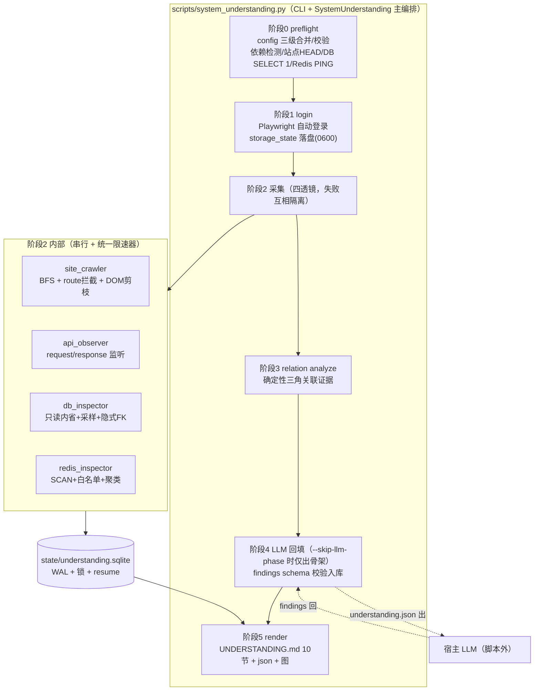
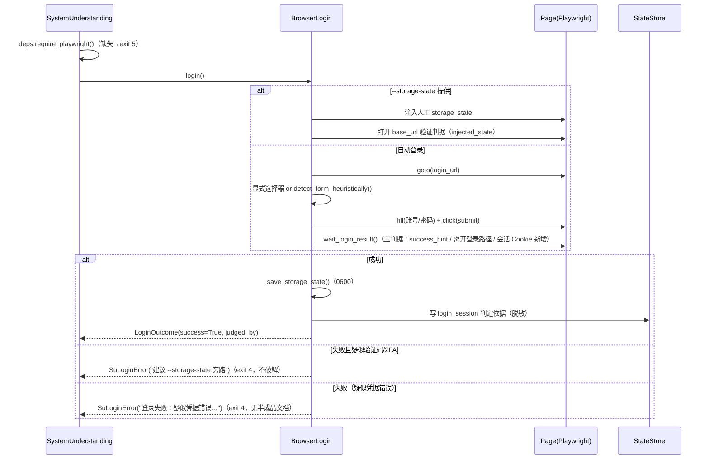
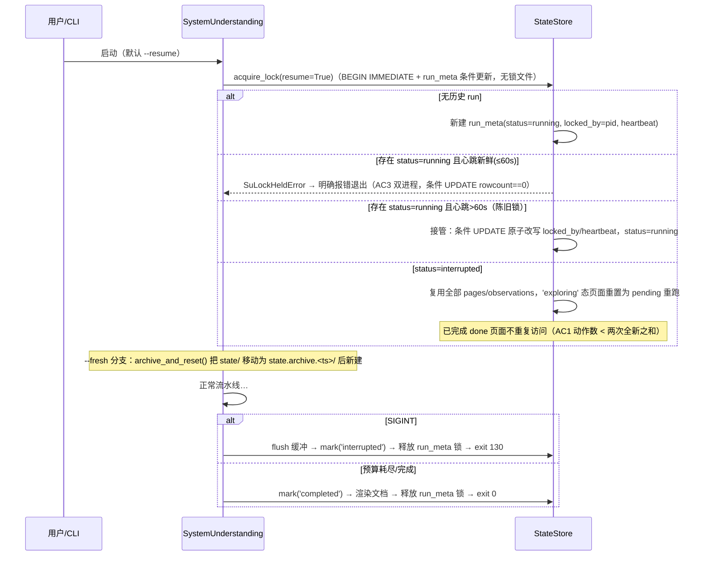

# 既有系统理解能力（SU）架构设计文档

- **文档编号**：ARCH-SU-001
- **所属项目**：TraeMultiAgentSkill
- **能力代号**：SU（System Understanding，既有系统反向理解）
- **文档状态**：评审通过（已按 2026-09-28 架构审查修订）
- **编写角色**：架构师
- **上游输入**：`docs/dev/SYSTEM_UNDERSTANDING_PRD.md`（PRD-SU-001，21 条 REQ + 8 条 NFR）
- **关联红线**：`docs/spec/CONSTITUTION.md`（禁 mock/占位、凭据不进 LLM 上下文、只读 DB 边界、先文档后代码）
- **骨架基准**：`scripts/project_understanding.py`（argparse + 单一主类 + `generate()` / `save()`）

> 本文为**设计文档**，只给出模块职责、类/方法签名、DDL、时序与契约，不含实现代码。
> 实现阶段必须逐条回勾本设计与 PRD 的 REQ→模块追溯矩阵（第 10 章）。

---

## 目录

1. [设计原则与总体架构](#1-设计原则与总体架构)
2. [模块划分与文件清单](#2-模块划分与文件清单)
3. [SQLite 状态库 Schema](#3-sqlite-状态库-schema)
4. [关键时序图](#4-关键时序图)
5. [安全设计（五条红线代码落点）](#5-安全设计五条红线代码落点)
6. [LLM 协作契约](#6-llm-协作契约)
7. [文档渲染器设计](#7-文档渲染器设计)
8. [配置、CLI 与降级设计](#8-配置cli-与降级设计)
9. [技术选型与决策记录（ADR）](#9-技术选型与决策记录adr)
10. [REQ→模块追溯矩阵](#10-req模块追溯矩阵)
11. [测试架构](#11-测试架构)
12. [遗留风险与实现注意事项](#12-遗留风险与实现注意事项)

---

## 1. 设计原则与总体架构

### 1.1 核心设计原则

| 编号 | 原则 | 说明 |
|---|---|---|
| AP-1 | 脚本层零 LLM 调用 | 所有脚本只做确定性采集/统计/脱敏/渲染；语义结论一律由宿主 LLM 通过 `findings` 表回填（对应 OUT-9、NFR-SU-002） |
| AP-2 | 红线即类型 | 安全边界用"类型约束 + 白名单校验器 + 硬编码命令集"强制，不靠调用方自觉（REQ-SU-002 AC3、NFR-SU-002） |
| AP-3 | 缺失即声明 | 软依赖缺失/透镜失败 → 结构化降级记录 + 文档显式声明，绝不以空数据/假数据冒充（REQ-SU-021） |
| AP-4 | 一切决策可解释 | 分级、拦截、跳过、推断均落库并携带规则名（NFR-SU-008） |
| AP-5 | 状态先于产物 | 所有采集先落 SQLite 状态库，文档是状态库的纯函数视图，可随时重渲染（幂等） |
| AP-6 | 单页面串行遍历 | 遍历为单 BrowserContext、单 Page、BFS 队列串行执行，配合限速器实现对目标系统等效 QPS ≤ 1/delay（NFR-SU-001） |

### 1.2 分层边界：确定性脚本层 vs 宿主 LLM 提示词层

```
┌────────────────────────────────────────────────────────────────────┐
│  宿主 LLM 提示词层（SKILL.md 提示词 + docs/spec/role-prompts/）      │
│  · 读取脱敏后的 understanding.json / snapshots/                     │
│  · 产出 findings（claim/confidence/evidence_refs/status）           │
│  · 回填方式：写 understanding.json 的 findings 段 → 重跑 --render-only│
│    （单一入口：CLI 编排层校验入库后调用渲染器，渲染器不直写 findings） │
│  · 永不接触：明文凭据、storage_state、原始 DB 采样未脱敏值            │
└───────────────▲──────────────────────────────┬─────────────────────┘
        understanding.json（脱敏）        findings（JSON 回填）
┌───────────────┴──────────────────────────────▼─────────────────────┐
│  确定性脚本层（本设计交付物，scripts/system_understanding.py + su/）  │
│  preflight → login → crawl+db/redis 采集 → 关联分析 → 文档渲染        │
│  全部产物落盘前强制过 redact()；SQLite 为唯一事实源                   │
└───────────────┬────────────────────────────────────────────────────┘
                │ 软依赖 try-import（deps.py）
┌───────────────▼───────────────┐   ┌──────────────────────────────┐
│ Playwright(sync) / pymysql /  │   │ 目标系统：Web / MySQL / PG /   │
│ psycopg2 / redis              │──▶│ Redis（全部只读访问）           │
└───────────────────────────────┘   └──────────────────────────────┘
```

**边界规则**：
1. 脚本层 → LLM 层：只允许 `understanding.json`、`snapshots/*.json`、`UNDERSTANDING.md` 三类**已脱敏**产物进入提示词。
2. LLM 层 → 脚本层：只允许 `findings` JSON（`status: "proposed"`）回流，且**回填单一入口契约**固定为：CLI 编排层（`--render-only` 分支，§2.3.1 `_phase_llm_bridge`）读取 `understanding.json` 的 `findings` 段 → `validate_findings_schema()`（§6.2）→ `StateStore.replace_findings()` 全量替换（入库 `status=proposed`）→ 渲染阶段流转 `rendered`。`replace_findings()` 的**唯一调用方 = CLI 编排层**，`document_renderer` 对 findings 只读、绝不直写（schema 不合规整批拒绝，REQ-SU-016 AC2）。
3. 凭据对象（`SystemCredentials`/`DbCredentials`/`RedisCredentials`）实现 `__repr__` 屏蔽 + 序列化即 redact，物理上无法流入 LLM 通道。

### 1.3 六阶段流水线总体架构图



**流水线阶段与退出码映射**（REQ-SU-020）：

| 阶段 | 失败类别 | 行为 | 退出码 |
|---|---|---|---|
| 0 preflight | 配置错误 | 结构化中文报错，列出缺失字段 | 2 |
| 0 preflight | playwright 缺失 | 致命降级报错（含安装命令） | 5 |
| 0 preflight | 站点不可达 | 终止（system 不可达为唯一致命预检项） | 3 |
| 1 login | 登录失败 | 保存诊断信息，不产出半成品文档 | 4 |
| 2~5 | 单透镜失败 | 记录降级，继续（NFR-SU-004） | 0（文档标注缺失） |
| 任意阶段 | SIGINT 中断 | flush 状态、`status=interrupted`，可 `--resume` 续跑 | 130（128+SIGINT，§8.2） |

---

## 2. 模块划分与文件清单

### 2.1 目录结构（新增文件）

```
scripts/
├── system_understanding.py          # CLI 入口 + SystemUnderstanding 主编排类
├── su/                              # SU 能力包（纯标准库 + 软依赖）
│   ├── __init__.py                  # 包版本与公共 DTO 再导出
│   ├── dto.py                       # 跨模块数据 Transfer Object（含 Redacted/Sensitive 标记类型）
│   ├── config.py                    # 三级配置合并 + 校验 + redact 管线（运行时凭据脱敏层）
│   ├── preflight.py                 # 预检（可达性/连通性/依赖）与降级分类
│   ├── browser_login.py             # 自动登录、会话维持、重登、storage_state 旁路
│   ├── site_crawler.py              # BFS 遍历 + url_key 规范化 + 动作分级 + route 拦截
│   ├── api_observer.py              # request/response 监听、shape 摘要、端点聚合
│   ├── db_inspector.py              # 只读校验器 + MySQL/PG 采集 + 采样脱敏 + 隐式FK
│   ├── redis_inspector.py           # SCAN + 命令白名单 + 键模式聚类
│   ├── relation_analyzer.py         # 页面↔API↔表↔Redis 确定性关联证据
│   ├── state_store.py               # SQLite 状态机、锁、resume、幂等写入
│   ├── document_renderer.py         # 10 节文档 + understanding.json + Mermaid
│   ├── limiter.py                   # 全局限速器与预算计数器
│   └── deps.py                      # 软依赖 try-import 与降级报告
├── tests/
│   ├── test_su_config.py            # （详见第 11 章）
│   ├── test_su_url_key.py
│   ├── test_su_action_tier.py
│   ├── test_su_readonly_guard.py
│   ├── test_su_implicit_fk.py
│   ├── test_su_redis_patterns.py
│   ├── test_su_relation.py
│   ├── test_su_state.py
│   ├── test_su_doc_render.py
│   ├── test_su_degrade.py
│   └── fixtures/
│       ├── su_site/                 # 纯标准库 http.server 测试站（≥12 页 fixture）
│       ├── su_state_builder.py      # 状态库 seed builder（现场生成 seed.sqlite，§11.2）
│       └── su_configs/              # 各类配置正负例 JSON
└── tests/scripts/
    └── run_system_understanding.sh  # 集成测试聚合脚本
docs/spec/role-prompts/
└── su-llm-backfill.md               # 宿主 LLM 回填提示词契约（第 6 章）
```

### 2.2 模块拆分理由说明

对任务给出的建议拆分做两点微调（其余照单采纳）：

1. **新增 `su/dto.py`**：REQ-SU-002 AC3（2026-09-28 审查修订）确立"标记类型 + 写盘入口运行时 `isinstance` 断言 + 静态审查 + 集成 grep 收口"的**四层组合**约束。若 DTO 分散在各模块，redact 管线与落盘函数会形成循环依赖且类型约束无法集中审计。集中一个 `dto.py` 定义 `RedactedDict`/`SensitiveStr` 标记类型，`state_store` 与 `document_renderer` 的写盘入口声明并运行时断言只接受其中的 `*Redacted` 变体，是落实"红线即类型"四层组合的最小代价方案。
2. **不引入 `su/prompts/` 目录**：宿主 LLM 提示词属于文档层（与既有 `docs/spec/role-prompts/` 体系一致），不放进脚本包，避免"脚本内置提示词=变相内置 LLM 调用"的歧义（AP-1）。

### 2.3 逐文件职责与核心签名

> 签名均为 Python 3.8+ 语法（`typing` 显式标注）。软依赖类型用字符串注解或 `typing.TYPE_CHECKING` 规避 import 期硬依赖。
> **凭据字面量禁令**（红线①）：`su/` 各模块签名中出现的 `password: SensitiveStr` 等类型仅表示"运行期内存中的凭据形态"，示例值一律用 `<系统密码>`/`<DB密码>` 占位描述——任何真实凭据字面量严禁写入代码与测试 fixture（静态审查项，§5.1）。

#### 2.3.1 `scripts/system_understanding.py`（CLI 入口 + 主编排）

**职责**：argparse 定义（REQ-SU-020 全参数表）、退出码控制、六阶段编排、SIGINT 处理、预算摘要打印（NFR-SU-006）。骨架与 `project_understanding.py` 同构。

```python
EXIT_OK, EXIT_CONFIG, EXIT_UNREACHABLE, EXIT_LOGIN, EXIT_DEPS = 0, 2, 3, 4, 5
EXIT_INTERRUPTED = 130   # 128 + SIGINT：被用户中断，状态库已存 interrupted（REQ-SU-019/020）

class SystemUnderstanding:
    """SU 能力主编排类：六阶段流水线的组合根（composition root）。"""

    def __init__(self, args: argparse.Namespace) -> None: ...

    # ---- 与 project_understanding.py 骨架对齐的两个门面方法 ----
    def generate(self) -> Dict[str, Any]:
        """执行阶段 0~3（采集+关联），返回脱敏后的结构化理解结果（understanding.json 数据）。"""

    def save(self, output_dir: str) -> None:
        """执行阶段 5：从状态库渲染 UNDERSTANDING.md/understanding.json/summary.json/图，
        全部写盘函数入参只接受 su.dto 中的 Redacted 类型（REQ-SU-002 AC3 四层组合之①②）。"""

    # ---- 阶段方法（内部编排，供 generate 调用）----
    def _phase_preflight(self) -> PreflightReport: ...
    def _phase_login(self, store: StateStore) -> LoginOutcome: ...
    def _phase_collect(self, store: StateStore) -> LensReport: ...
    def _phase_relations(self, store: StateStore) -> None: ...
    def _phase_llm_bridge(self, store: StateStore) -> None:
        """findings 回填的**单一入口**（§1.2 边界规则 2）：--skip-llm-phase 时只产出骨架；
        --render-only 时（前置校验：状态库 status ∈ {completed, interrupted} 且
        understanding.json 含 findings 段，否则按配置错误 exit 2）跳过阶段 0~3，
        读 findings 段 → validate_findings_schema() → store.replace_findings() 全量替换
        （status=proposed）→ 进入渲染（校验失败 exit 2）。
        本方法是 StateStore.replace_findings() 的唯一调用方。"""

    def _install_signal_handlers(self, store: StateStore) -> None:
        """SIGINT → store.flush(); run_meta.status='interrupted'; 释放 run_meta 锁;
        以退出码 130 退出（REQ-SU-019.3，PRD 退出码表同步）。"""

def main() -> int:
    """argparse 解析 → 依退出码返回（0/2/3/4/5/130）。`--help` 全部中文说明（REQ-SU-020 AC1）。"""
```

#### 2.3.2 `scripts/su/dto.py`（跨模块 DTO 与类型约束）

```python
REDACTED_PLACEHOLDER = "***REDACTED***"

@dataclass(frozen=True)
class SensitiveStr:
    """明文凭据专用**独立**类型（2026-09-28 审查修订：不继承 str——继承 str 会经
    join/format/切片等字符串操作静默扩散明文，不可控）。真实值存私有字段 _value，
    __repr__/__str__ 恒返回 ***REDACTED***；唯一取回明文的途径是显式 .reveal()，
    且只允许出现在登录填表 / DB/Redis 建连两类边界（静态审查项，§5.1）。"""
    _value: str
    def reveal(self) -> str: ...          # 仅限登录/连库边界调用，其余位置禁用
    def __repr__(self) -> str: ...        # 恒 '***REDACTED***'
    def __str__(self) -> str: ...         # 恒 '***REDACTED***'

class RedactedDict(Dict[str, Any]):
    """脱敏完成**标记类型**（2026-09-28 审查修订：普通 dict 子类，不用 dataclass——
    dict 与 dataclass 组合语义不清）。约束力来自四层组合（REQ-SU-002 AC3）：
    写盘函数入参类型声明 + 入口运行时 isinstance 断言 + CI 静态审查 + 集成 grep 收口；
    约定构造唯一合法途径是 config.redact() 的返回值。"""

class SuError(Exception):
    """SU 结构化错误基类：中文 message + code + hints（安装命令/修复建议）。"""
    def __init__(self, message: str, code: str, exit_code: int, hints: List[str] = ...) -> None: ...
```

#### 2.3.3 `scripts/su/config.py`

**职责**：三级配置合并（CLI > env > JSON）、必填校验、engine 枚举校验、统一 `redact()` 管线（REQ-SU-001/002/003 的配置侧）。

```python
ENV_OVERRIDES: Dict[Tuple[str, ...], str] = {
    # (配置路径) → 环境变量名，如 ("system","password") → "SU_SYSTEM_PASSWORD"
    ("system", "username"): "SU_SYSTEM_USERNAME",
    ("system", "password"): "SU_SYSTEM_PASSWORD",
    ("database", "password"): "SU_DB_PASSWORD",
    ("redis", "password"): "SU_REDIS_PASSWORD",
}

@dataclass
class LoginSelectors:  username: Optional[str]; password: Optional[str]; submit: Optional[str]

@dataclass
class SystemConfig:
    base_url: str; login_url: str
    username: SensitiveStr; password: SensitiveStr
    login_selectors: LoginSelectors; success_hint: Optional[str]
    allowed_origins: List[str]          # 默认 = base_url 同源（REQ-SU-007）

@dataclass
class DatabaseConfig:
    engine: Literal["mysql", "postgresql"]  # 3.8 兼容：实际用 str + 运行时枚举校验
    host: str; port: int; user: str; password: SensitiveStr
    database: str; schemas: List[str]

@dataclass
class RedisConfig:
    host: str; port: int; password: SensitiveStr; db: int
    key_allowlist: List[str]

@dataclass
class RunBudget:
    max_pages: int = 100; max_depth: int = 6; max_actions_per_page: int = 30
    time_budget_minutes: int = 60; delay_ms: int = 1500; page_timeout_ms: int = 30000
    sample_rows: int = 10; redis_max_keys: int = 5000

@dataclass
class SuConfig:
    system: SystemConfig
    database: Optional[DatabaseConfig]
    redis: Optional[RedisConfig]
    budget: RunBudget
    out_dir: Path; system_id: str
    resume: bool; headed: bool; skip_llm_phase: bool
    storage_state_path: Optional[Path]

def load_config(args: argparse.Namespace) -> SuConfig:
    """JSON 文件 → env 覆盖 → CLI 覆盖，逐层合并；返回前调用 validate()。
    失败抛 SuConfigError（结构化列出缺失字段名，REQ-SU-001 AC3）。"""

def validate(cfg: SuConfig) -> List[str]:
    """engine ∈ {mysql, postgresql}、URL 可解析、budget 各值为正整数等；返回中文错误列表。"""

# ---- 统一 redact 管线（REQ-SU-002 全模块共用，NFR-SU-002 红线①）----
SENSITIVE_KEY_PATTERN = re.compile(
    r"(?i)^(password|passwd|pwd|secret|token|api_?key|authorization|cookie|session(_?id)?)$")
PII_VALUE_PATTERNS: Dict[str, Pattern] = {...}  # 手机号/身份证/邮箱/银行卡 值形态（PRD §8：值形态优先）

from typing import Union as _Union   # redact 返回类型：顶层非 dict 输入时不强行包装

def redact(obj: Any, *, max_str_len: int = 200) -> _Union[RedactedDict, list, str]:
    """递归脱敏 dict/list/str：键名命中 SENSITIVE_KEY_PATTERN → ***REDACTED***；
    字符串值过 PII 值形态双通道；URL 内嵌 user:pass@ 先剥离（strip_url_credentials）。
    dict 输入必返 RedactedDict；list/str 顶层输入返回脱敏后的同形值（调用方再包装）。
    RedactedDict 是落盘入口的唯一合法 dict 类型（写入前运行时 isinstance 断言）。"""

def strip_url_credentials(url: str) -> str: ...
def scrub_text(text: str) -> str:
    """自由文本（页面文案/日志）PII 扫描替换，供 crawler/api_observer 复用。"""
```

#### 2.3.4 `scripts/su/preflight.py`

**职责**：REQ-SU-003 预检；输出结构化报告 `state/preflight.json`；致命/可降级二分。

```python
@dataclass
class PreflightItem:
    name: str                    # "site" / "database" / "redis" / "dep:playwright" ...
    status: Literal["ok", "failed", "skipped"]
    reason: Optional[str]        # 中文失败原因
    degradable: bool             # site/dep:playwright=False；db/redis 等=True

class Preflight:
    def __init__(self, cfg: SuConfig, deps: DependencyReport) -> None: ...
    def check_site(self) -> PreflightItem:
        """标准库 urllib HEAD（跟随重定向，超时 10s）。失败 → 致命（退出码 3）。"""
    def check_database(self) -> PreflightItem:
        """握手 + 'SELECT 1'（经 ReadOnlyGuard 通道执行，预检自身也走白名单）。可降级。"""
    def check_redis(self) -> PreflightItem:
        """PING（经 RedisGuard 命令白名单）。可降级。"""
    def run_all(self) -> PreflightReport:
        """汇总；写 state/preflight.json（RedactedDict）；fatal_failed 非空时上层终止。"""
```

#### 2.3.5 `scripts/su/browser_login.py`

**职责**：REQ-SU-004 自动登录、成功三判据、重登 ≤3、storage_state 旁路与 0600 落盘。

```python
LOGIN_MAX_RETRY = 3

@dataclass
class LoginOutcome:
    success: bool
    judged_by: Literal["success_hint", "url_left_login", "session_cookie", "injected_state"]
    detail: str                       # 中文判定依据，写 state/login_session.json（脱敏）

class BrowserLogin:
    def __init__(self, cfg: SuConfig, pw: "sync_playwright", limiter: RateLimiter) -> None: ...

    def login(self) -> LoginOutcome:
        """打开 login_url → 显式选择器或启发式定位表单 → 填写提交 → 判定。
        启发式：input[type=password] 同 form 最近文本框 + form 内 submit 按钮。
        疑似验证码/2FA（页面含 captcha/otp 特征且判定失败）→ 直接终止并提示
        --storage-state 旁路，绝不尝试破解（OUT-4）。"""

    def detect_form_heuristically(self, page: "Page") -> LoginSelectors: ...
    def wait_login_result(self, page: "Page") -> Optional[str]:  # 三判据，返回 judged_by
    def save_storage_state(self, context: "BrowserContext") -> None:
        """context.storage_state(path=...) 后 os.chmod(0o600)（REQ-SU-004.2 / NFR-SU-003）。"""
    def inject_storage_state(self, context: "BrowserContext") -> None:
        """--storage-state 人工态注入（AC3 旁路）。注入前先把源文件**复制**进 state/ 并对
        副本 os.chmod(0o600)（源文件不动，§5.5）；副本禁入快照/understanding.json。
        注入后仍执行一次登录成功判定。"""
    def relogin_if_needed(self, page: "Page") -> bool:
        """crawler 检测到回跳登录页时调用；内部计数 ≤ LOGIN_MAX_RETRY，
        超限抛 SuLoginError（'会话反复失效，请检查账号风控/验证码'，退出码 4，AC4）。"""
```

#### 2.3.6 `scripts/su/site_crawler.py`

**职责**：REQ-SU-005/006/007/008 的浏览器侧全部逻辑——BFS、url_key、DOM 剪枝、动作分级、route 拦截、就绪等待。**单 Page 串行**（AP-6）。

```python
TIER_T1, TIER_T2, TIER_T3 = "T1", "T2", "T3"
DANGER_VERBS = ["删除", "提交", "发布", "审批", "支付", "重置", "导出全部", "清空", "停用", "启用",
                "delete", "submit", "publish", "approve", "pay", "reset", "export", "clear", ...]
SAFE_VERBS = ["搜索", "查询", "筛选", "查看", "详情", "下一页", "search", "query", "filter", "view", ...]
# 用途约束（2026-09-28 审查修订）：SAFE_VERBS 仅用于给 T3 记录补充"预估只读语义"
# 解释信息（写 rule_name/evidence），**不作为任何执行/点击依据**；裸按钮命中 SAFE_VERBS
# 仍判 T3。可执行档位只认结构条件（T1 链接 / T2 显式 GET 表单）。
TRACKING_PARAMS = ("utm_", "_t", "timestamp", ...)   # url_key 剥离名单

@dataclass
class ElementSignature:
    """DOM 剪枝产物（不存全量 HTML，NFR-SU-005 单快照 ≤64KB）。"""
    tag: str; role: Optional[str]; text: Optional[str]; aria_label: Optional[str]
    href: Optional[str]; is_form_control: bool; form_method: Optional[str]
    selector: str                    # 稳定 CSS 路径（供 T2 执行与 T3 记录）

@dataclass
class ActionDecision:
    element: ElementSignature; tier: str; rule_name: str   # 命中的规则名（NFR-SU-008）

def url_key(raw_url: str) -> str:
    """纯函数：小写主机名、协议归一 https、query 键排序、剥离追踪参数、
    数字/UUID 段→{id}、hash 路由保留 '#/path'（REQ-SU-005.2）。"""

class SiteCrawler:
    def __init__(self, cfg: SuConfig, page: "Page", store: StateStore,
                 observer: ApiObserver, limiter: RateLimiter) -> None: ...

    def crawl(self) -> CrawlReport:
        """BFS 主循环：queue → 去重(查 pages 表幂等) → goto/click → 就绪等待 →
        剪枝 → 分级 → T1/T2 入边队列、T3 只记录 → 预算检查（页数/深度/动作/时间）。"""

    def install_route_guard(self, context: "BrowserContext") -> None:
        """context.route('**/*', handler)（红线④）。
        **handler 执行模型（2026-09-28 审查硬性约束）**：route handler 运行在 Playwright
        的回调上下文内，**体内禁止调用任何 sync Playwright API**（page.evaluate/
        locator/goto 等 sync 调用会死锁）。handler 内仅允许三类操作：
          ① 内存计数器（拦截计数）；② 有界 `queue.Queue.put(block=False)`——满则丢弃并
             计数 dropped_blocked_events；③ `route.abort()` / `route.continue_()`。
        落库在 **BFS 每页边界 drain**：主循环每完成一个页面调用 `_drain_blocked()`，
        把队列中的 blocked_events 批量 `insert_blocked_event()` 落库（与 heartbeat 同点）。
        `triggered_from_page` 不由 handler 现查 URL，而由 crawler 维护的
        `current_url_key`（每次 goto/click 后在主线程更新）注入。
        - method ∈ {POST,PUT,PATCH,DELETE} → route.abort() + 队列入 BlockedEvent
          （url 只存 path + query 键名化、post_data 经 redact，§2.3.7/§3 DDL）
        - origin ∉ allowed_origins → abort + state/blocked_origins.json
        - Content-Disposition 下载、context.on('page') 新窗口 → 拒绝并记录
          （'page' 回调同理仅记内存队列，页边界 drain；不在线程内碰 Playwright API）
        单测必须覆盖："handler 内不调用 Playwright API"（以 mock page 断言零调用）。"""

    def classify_action(self, el: ElementSignature, form_ctx: Optional[dict]) -> ActionDecision:
        """纯函数分级器（单测友好，REQ-SU-006 AC1/AC4）。2026-09-28 审查收窄后的判定链：
        ① 命中 DANGER_VERBS / form method ∈ {POST,PUT,PATCH,DELETE} / 文件上传 / 登出
           → T3（规则名如 danger_verb、post_form）；
        ② 显式 `<form method="GET">` 且 form 内文本（按钮/标签/字段名）无 DANGER_VERBS
           → T2（规则名 get_form）；
        ③ 同域 <a href> / GET 型导航 → T1（规则名 same_origin_link）；
        ④ **其余一律 T3**——含 SAFE_VERBS 命中的裸按钮（rule_name=safe_verb_button，
           SAFE_VERBS 仅用于该解释性 rule_name 与记录语义，不作为执行依据；理由：
           method 客户端自报、遗留系统 GET 端点可能改状态、裸按钮 JS 副作用不可撤销）；
        ⑤ 未知形态默认 T3（fail-safe）。"""

    def extract_signature(self, page: "Page") -> List[ElementSignature]:
        """DOM 剪枝提签名。**隐私硬约束（2026-09-28 审查）**：本方法与
        semantic_skeleton **永不读取 input 的 value 属性**（用户可能已输入敏感内容），
        只读 name/type/placeholder/aria-label/文本等静态属性。"""
    def semantic_skeleton(self, page: "Page") -> RedactedDict:
        """标题层级 + main 区文本摘要（scrub_text 脱敏），写 snapshots/<page_id>.json。
        同样不得读取任何表单控件 value（同 extract_signature 约束）。"""
    def wait_ready(self, page: "Page") -> None:
        """**有界算法（2026-09-28 审查修订，取代"网络静默+DOM 稳定"双等待的开放描述）**：
        最多 3 轮，每轮 =
          ① `wait_for_load_state("domcontentloaded")`；
          ② 网络静默 500ms——实现方式写明：由 response/request 事件回调更新
             `last_request_ts`，主线程 `time.sleep` 轮询该时间戳，距今 ≥500ms 即静默
             （回调只写一个 float，不碰 Playwright API）；
          ③ `page.evaluate` 取 main/body textContent 摘要 hash + 可交互元素数。
        相邻两轮 (hash, 元素数) 相同 → 判定稳定返回；3 轮后仍不同 → 记
        `wait_ready_timeout`（pages.error 字段）并**继续**，不阻塞 BFS。"""
    def fill_neutral(self, el: ElementSignature) -> str:
        """T2 中性值：'test'/空串，长度 ≤20 且 ^[A-Za-z0-9]*$（REQ-SU-006 AC3 由断言保证）。"""
```

#### 2.3.7 `scripts/su/api_observer.py`

**职责**：REQ-SU-009 全部观测逻辑。

```python
MAX_RECORD_BYTES = 8 * 1024      # 单条上限（NFR-SU-005）
MAX_SAMPLES_PER_ENDPOINT = 5
MAX_TEXT_SAMPLE = 200            # 非 JSON 前 200 字符脱敏文本

@dataclass
class ApiObservation:
    """url_path: str — 去 query 值、保留键名（/x?ids=KEY）
    **脱敏边界（2026-09-28 审查修订）**：观测记录**默认不落任何 headers**——
    shape 只含 body + status + content-type 三要素（headers 常带 auth，整段弃存；
    content-type 从 body 侧 response.headers 仅取该单键，不做全文 headers 快照）。
    request_shape: RedactedDict — JSON→键路径+类型+脱敏示例；否则 content-type+前200字符
    response_shape: RedactedDict
    observed_on_page: str  # page_id
    ts: float
    """
    url_path: str; method: str; status: int
    request_shape: RedactedDict
    response_shape: RedactedDict
    observed_on_page: str; ts: float

class ApiObserver:
    def __init__(self, store: StateStore) -> None: ...
    def attach(self, page: "Page") -> None:
        """page.on('response', ...)；resource_type ∈ {xhr, fetch, document} 才记录。"""
    def summarize_shape(self, body: bytes, content_type: str) -> RedactedDict:
        """shape 三要素（2026-09-28 审查）：JSON→递归 shape（键路径/类型/示例值
        redact+截断）+ status + content-type；二进制/图片→{content_type, size}，
        不落正文（AC3）。**永不记录 headers 整段**（auth 泄露面，§6.2 三层命中动作表）。"""
    def flush(self) -> None:
        """同 (path, method) 聚合进 api_observations 表，样本 ≤5。"""
```

#### 2.3.8 `scripts/su/db_inspector.py`

**职责**：REQ-SU-010/011/012/013 + 红线②。

```python
class ReadOnlyGuard:
    """SQL 语句白名单前置校验器（状态机见 §5.3）。红线②唯一执行点：
    本模块——乃至整个 su/ 包——不允许出现绕过 Guard 的 cursor.execute。"""
    def validate(self, sql: str) -> None:
        """剥离注释(块/行) → 状态机扫描：首关键字 ∈ {SELECT, SHOW, EXPLAIN}、
        单引号/双引号/反引号内分号不视为分隔符、任何引号外分号即多语句 → 拒绝。
        违规抛 SuReadonlyViolation（中文，含语句摘要脱敏）。"""
    def execute(self, conn, sql: str, params: Sequence = ()) -> List[tuple]:
        """validate() → cursor.execute(sql, params) → 取全部行 → 逐 cell 过 config.redact。
        返回 RedactedDict 行列表。"""

class DbSessionHardener:
    def harden(self, conn, engine: str) -> None:
        """MySQL: SET SESSION TRANSACTION READ ONLY + 验证 tx_read_only；
        PG: SET default_transaction_read_only = on + BEGIN READ ONLY（此两条为内部固定语句，
        不经用户输入，仍走 execute() 以保持单一执行通道）。"""

def build_containment_sql(child_table: str, child_col: str, parent_table: str,
                          parent_col: str, limit: int = 1000) -> Tuple[str, str]:
    """**包含度查询生成器（纯函数，2026-09-28 审查拆层）**：输出
    `(非空值数 SQL, 未命中数 SQL)` 两条只读语句。未命中数必须用
    `NOT EXISTS (SELECT 1 FROM parent p WHERE p.<col> = c.<col>)` 形态——
    **禁用 `NOT IN (SELECT …)`**（子查询含 NULL 时三值逻辑导致整体恒 0 的陷阱）。
    表/列名只允许来自采集所得字面量（不接受用户输入），标识符转义后内插 +
    值侧参数化；两语句均须通过 ReadOnlyGuard.validate（单测断言）。"""

class ImplicitFkCountExecutor:
    """**计数执行器（薄层，2026-09-28 审查拆层）**：执行生成器产出的两条 SQL 取回计数。
    单测注入行内存过滤替身（纯 Python 按行算非空/未命中计数），不依赖真实方言；
    真实 MySQL/PG 方言正确性由容器场景验证（§11.2/§11.3 [8]）。"""

class DbInspector:
    def __init__(self, cfg: DatabaseConfig, guard: ReadOnlyGuard, store: StateStore) -> None: ...
    def collect_schema(self) -> int:
        """MySQL: information_schema.{TABLES,COLUMNS,KEY_STATISTICS,REFERENTIAL_CONSTRAINTS,
        STATISTICS,VIEWS,ROUTINES}；PG: information_schema + pg_catalog(pg_class/
        pg_attribute/pg_constraint/pg_index/pg_description)。schemas 限定/系统库排除。
        行数估算 table_rows/reltuples。写 db_tables/db_columns 表。"""
    def sample_tables(self, rows: int) -> None:
        """每表 ORDER BY 主键 LIMIT ≤50；逐列过 DataMasker；写 db_samples。"""
    def prescreen_implicit_fks(self, include_threshold: float = 0.85) -> List[ImplicitFkCandidate]:
        """三重预筛（REQ-SU-013）：命名约定(单复数归一) → 类型族兼容 →
        包含度（委托 build_containment_sql + ImplicitFkCountExecutor，
        NOT EXISTS 形态、子侧 ≤1000 去重值）。
        每条 candidate 带 prescreen_score + 命中规则记录（止步于哪一规则也记录）。"""

class DataMasker:
    SENSITIVE_COLUMN_DICT = {"password","passwd","pwd","secret","token","api_key","phone",
        "mobile","email","id_card","bank","card","address",
        "身份证","手机号","邮箱","银行卡","地址"}
    def mask_value(self, column_name: str, comment: Optional[str], value: Any) -> str:
        """列名/注释命中词典 或 值形态正则（手机号/身份证/邮箱）→ '<REDACTED:类型>'
        并保留长度区间/字符类别；BLOB/超长 → '<BLOB size=N>'。"""
```

#### 2.3.9 `scripts/su/redis_inspector.py`

**职责**：REQ-SU-014/015 + 红线③。

```python
READONLY_COMMANDS = frozenset({
    "SCAN","TYPE","TTL","PTTL","MEMORY USAGE","GET","HGETALL","HSCAN",
    "LRANGE","SMEMBERS","ZRANGE","OBJECT ENCODING",
})  # 硬编码；KEYS/FLUSHALL/SET/DEL/CONFIG/DEBUG/EVAL 等隐式拒绝（not in → raise）

class RedisGuard:
    def call(self, client, command: str, *args) -> Any:
        """命令名 ∈ READONLY_COMMANDS 否则抛 SuRedisViolation（中文报错）。"""

class RedisInspector:
    def __init__(self, cfg: RedisConfig, guard: RedisGuard, store: StateStore,
                 max_keys: int) -> None: ...
    def scan_keys(self) -> List[RedisKeyRecord]:
        """SCAN count=200 MATCH <allowlist 前缀逐个> 游标收敛到 0；预算 max_keys 截断；
        每键采集 type/ttl/encoding/MEMORY USAGE/值样例（截断 512B + config.redact）。"""
    def cluster_patterns(self, keys: List[RedisKeyRecord]) -> List[RedisPatternRecord]:
        """键名分段：UUID/数字/日期/长 hex → {uuid}/{n}/{date}/{hex}；
        冒号/下划线对齐聚类；每模式：count、TTL 分布（无 TTL 占比单列）、类型分布、
        脱敏样例 ≤3（REQ-SU-015 AC2：模式不含完整敏感值）。"""
```

#### 2.3.10 `scripts/su/relation_analyzer.py`

**职责**：REQ-SU-016/017 的确定性部分（只出证据，不出结论，AP-1）。

```python
class RelationAnalyzer:
    def __init__(self, store: StateStore, key_overlap_threshold: float = 0.5) -> None: ...
    def page_to_api(self) -> List[Relation]:
        """api_observations.observed_on_page 直连分组；GET 与被拦截观测非 GET 分开标注。"""
    def api_to_table(self) -> List[Relation]:
        """端点 path 段 ↔ 表名归一匹配（单复数、驼峰↔下划线、大小写）；
        响应 JSON 键名 ↔ 列名重合度 ≥ 阈值 → 证据（含重合度数值）。"""
    def redis_to_entity(self) -> List[Relation]:
        """键模式段 ↔ 表名/实体名；值样例 JSON 键 ↔ 列名（REQ-SU-017）。"""
    @staticmethod
    def normalize_name(name: str) -> str:
        """orders↔order↔OrderItem 等归一：小写、下划线/驼峰互转、英文常用单复数还原。"""
    def persist(self, relations: List[Relation]) -> None:
        """写 relations 表：type/left_ref/right_ref/score/evidence_json。"""
```

#### 2.3.11 `scripts/su/state_store.py`

**职责**：REQ-SU-019 全量——schema 迁移、锁/心跳、resume、幂等 upsert、SIGINT flush。

```python
SCHEMA_VERSION = 1
HEARTBEAT_STALE_SECONDS = 60

class StateStore:
    def __init__(self, db_path: Path, system_id: str) -> None:
        """sqlite3.connect + PRAGMA journal_mode=WAL + executescript(DDL §3)。"""

    # ---- 生命周期与锁（2026-09-28 审查：删除 fcntl/run.lock 双机制）----
    def acquire_lock(self, resume: bool) -> RunMeta:
        """互斥**唯一机制** = WAL + `BEGIN IMMEDIATE` 事务内对 run_meta 的条件更新：
        `UPDATE run_meta SET locked_by=?, heartbeat_ts=? WHERE run_id=?
         AND (locked_by IS NULL OR heartbeat_ts < ?-60 OR status!='running')`，
        rowcount==0 → 他进程持锁且心跳新鲜 → SuLockHeldError 退出；
        affected → 持锁成功；心跳 >60s → 陈旧锁条件天然满足即接管（locked_by/heartbeat 同句原子改写）；
        status=interrupted → resume 复用 / fresh 归档。不存在任何独立锁文件。"""
    def heartbeat(self) -> None: ...          # crawler 每完成一个页面调用
    def mark(self, status: str) -> None:      # running/interrupted/completed
    def archive_and_reset(self, out_dir: Path) -> None:
        """--fresh：state/ → state.archive.<ts>/ 后重建（REQ-SU-019 AC2）。"""

    # ---- 幂等写入（全部 INSERT OR IGNORE / UPSERT，采集先查后采）----
    def upsert_page(self, node: PageNodeRedacted) -> int: ...
    def page_done(self, url_key: str) -> bool: ...
    def insert_edge(self, e: EdgeRedacted) -> None: ...
    def insert_action(self, a: ActionDecisionRedacted) -> None: ...
    def insert_blocked_event(self, b: BlockedEventRedacted) -> None: ...
    def upsert_api_endpoint(self, o: ApiObservationRedacted) -> None: ...   # 聚合样本 ≤5
    def upsert_db_table(self, t: DbTableRedacted) -> None: ...
    def insert_samples(self, table: str, rows: List[RedactedDict]) -> None: ...
    def insert_implicit_fk(self, c: ImplicitFkCandidateRedacted) -> None: ...
    def upsert_redis_key(self, k: RedisKeyRecordRedacted) -> None: ...
    def insert_relation(self, r: RelationRedacted) -> None: ...
    def replace_findings(self, findings: List[Finding]) -> None:
        """LLM 回填唯一入库原语：**唯一调用方 = CLI 编排层 `_phase_llm_bridge()`**
        （§1.2 边界规则 2 单一入口契约，本方法内部 assert 调用来源）。
        先过 validate_findings_schema（§6.2），不合规整批拒绝（ProposedByCliOrchestratorOnly）。"""

    # ---- 读取（供渲染）----
    def export_understanding(self) -> RedactedDict: ...   # understanding.json 数据源
    def frontier(self) -> List[PageNodeRedacted]: ...      # 预算耗尽剩余节点（第10节）
    def stats(self) -> RunStats: ...                        # 预算消耗摘要（NFR-SU-006）
```

#### 2.3.12 `scripts/su/document_renderer.py`

**职责**：REQ-SU-018 十节文档、Mermaid 生成、understanding.json/summary.json、findings 强制校验、渲染幂等。详见第 7 章。

```python
class DocumentRenderer:
    def __init__(self, store: StateStore, cfg: SuConfig) -> None: ...
    def render(self) -> RenderOutcome:
        """纯函数式：只读状态库 → 输出全部产物；同一状态库二次渲染除时间戳外逐字节稳定（AC4）。"""
    def _section_1_overview(self) -> str: ...   # ~ def _section_10_uncovered(self) -> str
    def _render_finding(self, f: Finding) -> str:
        """confidence=low 或缺 evidence_refs → 前缀 '⚠ 待人工确认'；缺字段根本进不了这里（§6.2）。"""
    def build_navigation_mermaid(self) -> str:
        """graph TD；>60 节点按 BFS 深度+URL 首段模块聚类折叠为 subgraph（AC2）。"""
    def build_er_mermaid(self) -> str:
        """erDiagram；显式 FK 实线 ||--o{；隐式 FK 虚线样式并注 '推断，需确认'。
        表数 >40（或单表列 >12）时同样按深度+URL 首段分 subgraph、每组截断计数。"""
```

#### 2.3.13 `scripts/su/limiter.py`

```python
class RateLimiter:
    """全局限速器（NFR-SU-001：任何循环不得绕过）。"""
    def __init__(self, delay_ms: int) -> None: ...
    def wait(self, bucket: str = "default") -> None:
        """相邻动作（跨 bucket 全局）间隔 ≥ delay_ms，time.monotonic 实现。"""

class BudgetTracker:
    """预算计数器：pages/depth/actions/time 四维，任一耗尽即 exhausted=True 并记录原因。"""
    def __init__(self, budget: RunBudget) -> None: ...
    def consume_page(self) -> bool: ...
    def consume_action(self) -> bool: ...
    def depth_allowed(self, depth: int) -> bool: ...
    @property
    def exhausted(self) -> Optional[str]: ...      # 返回耗尽维度名或 None
    def summary(self) -> BudgetSummaryRedacted: ... # 第 1 节 + summary.json 数据
```

#### 2.3.14 `scripts/su/deps.py`

```python
@dataclass
class DependencyReport:
    playwright: Optional[ModuleType]; pymysql: ...; psycopg2: ...; redis: ...
    missing: List[str]
    def require_playwright(self) -> "ModuleType":
        """缺失 → 抛 SuDepsError(中文报错含 pip+playwright install chromium 命令, exit=5)。"""
    def require_db_driver(self, engine: str) -> "ModuleType":
        """按 engine 判定；缺失 → 可降级：返回 None 并由调用方登记降级记录（REQ-SU-021）。"""
    def require_redis(self) -> Optional["ModuleType"]: ...

def probe_all(import_fn=importlib.import_module) -> DependencyReport:
    """try-import 四个软依赖，产出降级报告，preflight 与编排层共享。
    **显式注入点（2026-09-28 审查）**：`import_fn` 默认 `importlib.import_module`，
    内部一律经 `import_fn(name)` + try/except ImportError 探测——单测（test_su_degrade）
    注入 fake importer 即可确定性制造缺失组合，无需 monkeypatch 全局 import 机制。
    requirements.txt 同步注释化声明。"""
```

---

## 3. SQLite 状态库 Schema

文件：`docs/system-understanding/<system_id>/state/understanding.sqlite`，WAL 模式。
表清单与 PRD REQ-SU-019 一致（13 张核心表），另加 `db_columns`（REQ-SU-011 列级明细需要）与 `schema_meta`（版本迁移）两张支撑表，理由在 DDL 后说明。

```sql
-- ============ 迁移与运行元信息 ============
CREATE TABLE schema_meta (
    version     INTEGER NOT NULL             -- 迁移版本号，当前 1
);

CREATE TABLE run_meta (                       -- 单行表：run 状态机 + 进程锁
    run_id          TEXT PRIMARY KEY,         -- uuid
    system_id       TEXT NOT NULL,
    status          TEXT NOT NULL CHECK (status IN
                      ('running','interrupted','completed','failed')),
    locked_by       TEXT,                     -- 'pid:12345'，NULL=未持锁。进程互斥唯一机制：
                                              -- WAL + BEGIN IMMEDIATE 下本行条件更新
                                              -- （locked_by/heartbeat_ts 原子改写，REQ-SU-019.4），
                                              -- 不使用 fcntl/独立锁文件
    heartbeat_ts    REAL,                     -- 最近心跳 unix 秒；>60s 未更新=陈旧锁
    started_at      REAL NOT NULL,
    finished_at     REAL,
    exit_reason     TEXT,                     -- 'budget_exhausted:pages'/'sigint'/'login_failed'…
    config_snapshot TEXT NOT NULL             -- RedactedDict JSON（绝无明文凭据，REQ-SU-002）
);

-- ============ UI 透镜 ============
CREATE TABLE pages (
    page_id       INTEGER PRIMARY KEY AUTOINCREMENT,
    url_key       TEXT NOT NULL UNIQUE,       -- 规范化去重键（REQ-SU-005.2）
    url           TEXT NOT NULL,              -- 已 strip_url_credentials
    title         TEXT,
    depth         INTEGER NOT NULL,
    discover_from INTEGER REFERENCES pages(page_id),   -- BFS 父节点
    status        TEXT NOT NULL CHECK (status IN
                    ('pending','exploring','done','timeout','error')),
    snapshot_path TEXT,                       -- snapshots/<page_id>.json（≤64KB，脱敏）
    tech_fingerprint TEXT,                    -- server header/html 特征 JSON（第1节）
    error         TEXT,
    created_at    REAL NOT NULL,
    updated_at    REAL NOT NULL
);
CREATE INDEX idx_pages_status_depth ON pages(status, depth);
CREATE INDEX idx_pages_parent ON pages(discover_from);

CREATE TABLE page_actions (                    -- 全部候选动作 + 分级依据（REQ-SU-006/008）
    action_id   INTEGER PRIMARY KEY AUTOINCREMENT,
    page_id     INTEGER NOT NULL REFERENCES pages(page_id),
    element_sig TEXT NOT NULL,                 -- ElementSignature JSON
    tier        TEXT NOT NULL CHECK (tier IN ('T1','T2','T3')),
    rule_name   TEXT NOT NULL,                 -- 命中规则名（NFR-SU-008 可解释）
    executed    INTEGER NOT NULL DEFAULT 0,    -- T3 恒为 0（红线⑤）
    UNIQUE(page_id, element_sig)               -- 幂等：同页重复发现不重复入库
);                                             -- 无 result 列（2026-09-28 审查删除：
                                               -- T2 执行结果无消费方；T3 恒 NULL 为死字段）

CREATE TABLE edges (
    edge_id  INTEGER PRIMARY KEY AUTOINCREMENT,
    from_key TEXT NOT NULL,                    -- 源 url_key
    to_key   TEXT NOT NULL,                    -- 目标 url_key
    via_action INTEGER REFERENCES page_actions(action_id),
    UNIQUE(from_key, to_key, via_action)
);

CREATE TABLE api_observations (                -- 端点聚合（REQ-SU-009.3）
    endpoint_id  INTEGER PRIMARY KEY AUTOINCREMENT,
    url_path     TEXT NOT NULL,                -- query 只留键名；不落任何 headers（§2.3.7）
    method       TEXT NOT NULL,
    latest_status INTEGER,
    request_shape  TEXT,                       -- RedactedDict JSON（≤8KB）
    response_shape TEXT,                       -- RedactedDict JSON（≤8KB）
    sample_count INTEGER NOT NULL DEFAULT 0,   -- ≤5，超出丢弃最旧
    samples      TEXT,                         -- JSON 数组
    observed_on_pages TEXT NOT NULL,           -- page_id 逗号集（首次观测页为首元素）
    UNIQUE(url_path, method)
);

CREATE TABLE blocked_events (                  -- route 拦截日志（REQ-SU-007）
    block_id  INTEGER PRIMARY KEY AUTOINCREMENT,
    kind      TEXT NOT NULL CHECK (kind IN
                ('aborted_method','blocked_origin','download','new_window')),
    url       TEXT NOT NULL,                   -- 只存 path；query 值全部键名化（值置 KEY，
                                               -- 防凭据经查询串落库，§2.3.6/§6.2 动作表）
    method    TEXT,
    post_data TEXT,                            -- 已过 redact()（REQ-SU-007 原文要求）
    page_id   INTEGER,                         -- 由 crawler current_url_key 注入（§2.3.6）
    ts        REAL NOT NULL
);
CREATE INDEX idx_blocked_kind ON blocked_events(kind);

-- ============ DB 透镜 ============
CREATE TABLE db_tables (
    table_id    INTEGER PRIMARY KEY AUTOINCREMENT,
    schema_name TEXT NOT NULL,
    table_name  TEXT NOT NULL,
    kind        TEXT NOT NULL CHECK (kind IN ('BASE TABLE','VIEW')),
    row_estimate INTEGER,
    comment     TEXT,
    columns_json TEXT NOT NULL,                -- 列明细（名称/类型/可空/默认/注释/PK/FK/索引）
    UNIQUE(schema_name, table_name)            -- 幂等：重跑内省不重复
);

CREATE TABLE db_columns (                      -- 列级平表：关联分析/隐式FK 的匹配索引源
    column_id  INTEGER PRIMARY KEY AUTOINCREMENT,
    table_id   INTEGER NOT NULL REFERENCES db_tables(table_id),
    name       TEXT NOT NULL,
    data_type  TEXT NOT NULL,
    type_family TEXT NOT NULL CHECK (type_family IN ('int','string','uuid','other')),
    is_pk      INTEGER NOT NULL DEFAULT 0,
    fk_target  TEXT,                           -- 显式 FK 目标 'schema.table.column'
    comment    TEXT,
    UNIQUE(table_id, name)
);
CREATE INDEX idx_dbcol_name ON db_columns(name);

CREATE TABLE db_samples (                      -- 采样（DataMasker 逐列处理后，REQ-SU-012）
    sample_id INTEGER PRIMARY KEY AUTOINCREMENT,
    table_id  INTEGER NOT NULL REFERENCES db_tables(table_id),
    row_json  TEXT NOT NULL,                   -- RedactedDict：敏感列已 <REDACTED:类型>
    row_no    INTEGER NOT NULL,
    UNIQUE(table_id, row_no)
);

CREATE TABLE implicit_fk_candidates (          -- REQ-SU-013
    cand_id      INTEGER PRIMARY KEY AUTOINCREMENT,
    child_table  TEXT NOT NULL,
    child_column TEXT NOT NULL,
    parent_table TEXT NOT NULL,
    parent_column TEXT NOT NULL,
    prescreen_score REAL NOT NULL,             -- 三重命中加权
    stopped_at_rule INTEGER NOT NULL,          -- 止步规则（1/2/3=达标）
    containment REAL,                          -- 包含度（止步 1/2 时为 NULL）
    evidence_json TEXT NOT NULL,               -- 命中规则记录，一律标"推断，需确认"
    UNIQUE(child_table, child_column, parent_table, parent_column)
);

-- ============ Redis 透镜 ============
CREATE TABLE redis_keys (
    key_id    INTEGER PRIMARY KEY AUTOINCREMENT,
    key_name  TEXT NOT NULL UNIQUE,            -- 键名非敏感值，脱敏后存样例
    key_type  TEXT NOT NULL,
    ttl_ms    INTEGER,                         -- -1=无 TTL，-2 不出现（键存在性已验证）
    encoding  TEXT,
    mem_bytes INTEGER,
    value_sample TEXT                          -- ≤512B 且 config.redact()
);

CREATE TABLE redis_patterns (
    pattern_id   INTEGER PRIMARY KEY AUTOINCREMENT,
    pattern      TEXT NOT NULL UNIQUE,         -- 如 'sess:{uuid}'
    key_count    INTEGER NOT NULL,
    no_ttl_ratio REAL NOT NULL,                -- 无 TTL 占比（潜在泄漏信号，REQ-SU-015）
    ttl_summary  TEXT,                         -- 分桶分布 JSON
    type_summary TEXT,                         -- 类型分布 JSON
    sample_keys  TEXT                          -- 脱敏样例键 ≤3
);

-- ============ 关联与结论 ============
CREATE TABLE relations (                       -- 确定性证据（REQ-SU-016/017，脚本写）
    relation_id INTEGER PRIMARY KEY AUTOINCREMENT,
    rtype       TEXT NOT NULL CHECK (rtype IN ('page_api','api_table','redis_entity')),
    left_ref    TEXT NOT NULL,                 -- 'pages:12' / 'api:3' / 'redis_pattern:5'
    right_ref   TEXT NOT NULL,
    score       REAL NOT NULL,                 -- 重合度/包含度等数值证据
    evidence_json TEXT NOT NULL,
    UNIQUE(rtype, left_ref, right_ref)
);

CREATE TABLE findings (                        -- LLM 结论回填（宿主 LLM 唯一可写表）
    finding_id    INTEGER PRIMARY KEY AUTOINCREMENT,
    claim         TEXT NOT NULL,               -- 结论正文（中文）
    confidence    TEXT NOT NULL CHECK (confidence IN ('high','medium','low')),
    evidence_refs TEXT NOT NULL,               -- JSON 数组，≥1 条 '<table>:<id>' 引用
    status        TEXT NOT NULL DEFAULT 'proposed'
                    CHECK (status IN ('proposed','rendered','human_confirmed','rejected')),
    kind          TEXT NOT NULL CHECK (kind IN
                    ('mapping','business_rule','redis_entity','semantic_name')),
    created_at    REAL NOT NULL
);   -- evidence_refs 缺失/空数组在 replace_findings() 即拒绝（REQ-SU-016 AC2），
     -- 故此处无需再设 NOT NULL 之外的兜底；CHECK 保证 confidence 枚举合法。
```

**表清单与 PRD 对照**：PRD 13 张表全部保留；新增 `db_columns`（列名匹配是 REQ-SU-016 重合度与 REQ-SU-013 规则 2 的高频查询点，存 JSON 无法加索引）与 `schema_meta`（结构演进所需）。均为纯增量，不违背 REQ-SU-019。

---

## 4. 关键时序图

### 4.1 自动登录（REQ-SU-004）



### 4.2 遍历 + route 拦截流（REQ-SU-005/006/007/009）

```mermaid
sequenceDiagram
    participant C as SiteCrawler
    participant R as RateLimiter/Budget
    participant P as Page
    participant G as route 拦截处理器
    participant O as ApiObserver
    participant S as StateStore
    C->>G: install_route_guard(context)（context.route "**/*"；handler 内禁 sync Playwright API，§2.3.6）
    loop BFS 直到预算耗尽/队列空
        C->>R: wait()（≥delay_ms）+ Budget.consume_page()
        C->>S: page_done(url_key)? 已完成→跳过（幂等/resume）
        C->>P: goto / click（T1 直接访问；T2 显式 GET 表单填中性值提交；SAFE_VERBS 裸按钮已判 T3 不点击）
        C->>C: 更新 current_url_key（triggered_from_page 注入源）
        Note over P,G: 页面任何 XHR/fetch 触发 → route 处理器先行（handler 仅计数+有界队列+abort/continue_）
        alt method ∈ {POST,PUT,PATCH,DELETE}（T2 显式 GET 表单除外）
            G->>G: route.abort() + blocked 事件入内存队列（url 只存 path、query 值置 KEY）
        else origin ∉ allowed_origins
            G->>G: route.abort() + blocked_origins.json（同样经队列）
        else 放行（GET/HEAD + 白名单域）
            G-->>P: route.continue_()
            P-->>O: response 事件（xhr/fetch/document）
            O->>O: summarize_shape()（body+status+content-type，不落 headers）
        end
        C->>P: wait_ready()（≤3 轮：domcontentloaded+网络静默 500ms+DOM 摘要 hash 比对；超限记 wait_ready_timeout 继续）
        Note over C,P: SPA hash-only 导航分支：hash 链接点击零网络请求、不经 route，
        T1 仍执行 click；就绪判定只用 DOM 摘要 hash；api_observations 不新增记录属预期
        C->>C: extract_signature() + semantic_skeleton()（剪枝，永不读 input value）
        C->>S: snapshots/<id>.json + upsert_page()
        loop 每个候选动作（≤max_actions_per_page）
            C->>C: classify_action() → T1/T2/T3 + rule_name
            alt T1/T2 且预算允许
                C->>S: insert_edge() 入队
            else T3（危险/POST 目标/SAFE_VERBS 裸按钮/上传/登出）
                C->>S: insert_action(executed=0)（只记录，红线⑤）
            end
        end
        C->>G: _drain_blocked()（页边界把 blocked/new_window 队列批量落库，heartbeat 同点）
        C->>S: heartbeat()
        opt 检测到回跳登录页
            C->>C: BrowserLogin.relogin_if_needed()（≤3 次，超限存断点 exit 4）
        end
    end
    C-->>C: CrawlReport（页面数/动作数/拦截数/frontier）
```

### 4.3 断点续跑恢复（REQ-SU-019）



---

## 5. 安全设计（五条红线代码落点）

### 5.1 红线→代码强制点总表（NFR-SU-002）

| # | 红线 | 强制执行类.方法 | 机制类型 |
|---|---|---|---|
| ① | 凭据不进 LLM 上下文、不落盘明文 | `config.redact()`（唯一脱敏入口）；`dto.SensitiveStr.__repr__`/`__str__`（`.reveal()` 仅限登录填表/DB·Redis 建连边界）；`dto.RedactedDict` 标记类型（`state_store` 全部 insert*、`document_renderer.render`、`preflight.run_all` 的入参类型 + 入口运行时 `isinstance` 断言） | 四层组合（标记类型+运行时断言+静态审查+grep 收口）+ 单一管线 |
| ② | DB 会话只读，严禁 DDL/DML/DROP/drop_all | `db_inspector.DbSessionHardener.harden()` + `ReadOnlyGuard.validate()/execute()`（su/ 包唯一 cursor.execute 所在处） | 会话级 + 语句状态机 |
| ③ | Redis 只读命令白名单 | `redis_inspector.RedisGuard.call()`（frozenset 硬编码，未命中即抛） | 硬编码白名单 |
| ④ | 浏览器拦截全部非 GET 与白名单外域 | `site_crawler.SiteCrawler.install_route_guard()`（context.route 处理器；handler 内禁 sync Playwright API，§2.3.6） | 网络层 abort |
| ⑤ | 危险按钮零点击 | `site_crawler.SiteCrawler.classify_action()` 判 T3（T2 仅显式 GET 表单，SAFE_VERBS 裸按钮一律 T3）+ `page_actions.executed` CHECK 约束 + 主循环对 T3 分支无 click 调用路径 | 分级器 + 落库约束 + 代码路径审查 |

**静态审查项**（REQ-SU-010 AC3 / NFR-SU-002）：CI 检查——`su/` 包内 `cursor.execute` 仅出现于 `ReadOnlyGuard.execute`；`route.abort` 处理器先于任何 `page.click` 安装（`crawl()` 首行调用）；route handler 体内零 Playwright API 调用（含 `context.on('page')` 回调）；`.reveal()` 调用点白名单核对；`extract_signature`/`semantic_skeleton` 不读取 `value` 属性；集成脚本对 fixture server POST 计数断言为 0。

### 5.2 redact 管线设计（DTO 约束）

```
任意来源数据（配置/HTTP body/DB 采样/Redis 值/页面文案/日志）
        │
        ▼
config.redact(obj) ── 键名命中 SENSITIVE_KEY_PATTERN → ***REDACTED***
        │            ── URL 内嵌 user:pass@ → strip_url_credentials()
        │            ── 字符串值过 PII 值形态正则（手机号/身份证/邮箱/银行卡，优先级更高）
        │            ── 截断：单值 ≤max_str_len、单记录 ≤8KB
        ▼
返回 dto.RedactedDict（dict 子类标记类型；约定外部只经 redact() 获得，§2.3.2）
        │
        ▼
state_store.insert* / document_renderer / preflight / snapshots 写盘
        —— 类型签名声明 RedactedDict / *Redacted + 入口运行时 isinstance 断言 ——
```

**四层组合保证**（REQ-SU-002 AC3，2026-09-28 审查修订——不再宣称纯"结构性保证"）：
① `RedactedDict` 标记类型：写盘函数入参类型声明；
② 运行时 `isinstance` 断言：未脱敏的普通 `dict` 进入任何写盘函数即抛错；
③ CI 静态审查：写盘签名清单核对（§5.1 静态审查项）；
④ 集成收口：测试以全目录敏感串 grep 0 命中兜底（§11）。
四层各自可失效（类型可绕过、断言可漏改、审查可遗漏），组合后才是 AC3 的达标口径。

### 5.3 SQL 白名单校验器状态机（ReadOnlyGuard.validate）

```
输入 sql
  S0 剥注释：循环移除 /*...*/ 与 --/＃ 到行尾（防止注释分割关键字绕过，如 SEL/**/ECT）
  S1 首关键字：正则 ^\s*(SELECT|SHOW|EXPLAIN)\b —— 不匹配 → 拒绝
  S2 逐字符状态机：
      STATE_NORMAL：遇 '/"/` → 进对应 QUOTED 态；遇 ; → 多语句 → 拒绝
      STATE_SQ/DQ/BQ：遇配对引号回 NORMAL（'' 双写转义正确处理）；EOF 仍在 QUOTED → 拒绝（未闭合）
  S3 引号外发现任何 ; 即拒绝（SELECT 1; DROP TABLE x → 拒）
  S4 通过 → 交 execute()：参数化 params，禁止字符串拼接构造
附加层（纵深防御）：连接后 harden() 会话只读 → 即便校验器被绕过，服务端也拒绝写。
```

拒绝集正负例（≥60 条，含 `UNION SELECT`（放行但记录，本身只读）、`CALL`、`GRANT`、`TRUNCATE`、`drop_all()` 类 ORM 调用——后者按"不存在任何 ORM 依赖"从根上排除）。

### 5.4 命令白名单（Redis）

`READONLY_COMMANDS` frozenset 硬编码（§2.3.9），`RedisGuard.call` 为 su/ 包唯一 redis 命令出口；`MEMORY USAGE`/`OBJECT ENCODING` 以两词命令整体为 key 匹配（第二段也校验，防 `MEMORY DOCTOR` 之类混入）。

### 5.5 文件系统边界

- `state/storage_state.json`：`os.chmod(0o600)`；列入文档第 9 节"敏感文件清单"并提示用后清理（NFR-SU-003）。
- `--storage-state <path>` 注入（2026-09-28 审查补充）：先把用户提供的注入文件**复制**进 `state/` 并对副本 `chmod 0600`（**源文件不动、不改权限**）；该副本列入敏感文件清单，**严禁进入** `snapshots/`、`understanding.json` 或任何对外产物（渲染器与 export 路径不含该文件名，集成 grep 收口覆盖）。
- 输出目录固定 `<--out>/<system_id>/`，所有写盘前 `Path.resolve()` 后断言在输出根内（防遍历产物路径注入）。
- 日志 handler 挂 `RedactingFormatter`（复用 scrub_text），`--verbose` 亦不例外（REQ-SU-020）。

---

## 6. LLM 协作契约

### 6.1 understanding.json（脚本 → LLM，脱敏中间产物）

JSON Schema 要点（draft-07 子集，`document_renderer` 产出时自检）：

```json
{
  "meta": { "system_id": "str", "run_id": "uuid", "generated_at": "float",
            "schema_version": 1, "preflight": "PreflightReport", "budget": "BudgetSummary" },
  "lenses": {
    "ui":   { "status": "collected|skipped|failed", "skip_reason": "str?",
              "pages": [{"page_id": 0, "url_key": "str", "title": "str",
                          "depth": 0, "actions": [{"action_id": 0, "tier": "T1|T2|T3",
                          "rule_name": "str", "element": "ElementSignature"}]}] },
    "api":  { "status": "...", "endpoints": [{"endpoint_id": 0, "url_path": "str",
              "method": "str", "request_shape": {}, "response_shape": {},
              "observed_on_pages": [0]}] },
    "db":   { "status": "...", "skip_reason": "str?",
              "tables": [{"table_id": 0, "schema": "str", "name": "str",
              "columns": [], "samples": [], "implicit_fk_candidates": []}] },
    "redis":{ "status": "...", "patterns": [{"pattern_id": 0, "pattern": "str",
              "key_count": 0, "no_ttl_ratio": 0.0}] }
  },
  "relations": [{"relation_id": 0, "rtype": "page_api|api_table|redis_entity",
                  "left_ref": "pages:1", "right_ref": "api:2", "score": 0.0,
                  "evidence": {}}],
  "findings_prompt": { "instructions_ref": "docs/spec/role-prompts/su-llm-backfill.md",
                        "output_contract": "<见 6.2>" }
}
```

硬约束：`lenses.*.status != "collected"` 时该透镜节点必须同时携带中文 `skip_reason`（依赖缺失/不可达/预算），供渲染器输出显式缺失声明（REQ-SU-021 AC2）。

### 6.2 findings 回填格式（LLM → 脚本）

宿主 LLM（或人工）将下列数组写入 `understanding.json` 的 `findings` 段后重跑
`--render-only`；**校验与入库统一由 CLI 编排层执行**（§1.2 边界规则 2 单一入口契约）：
`validate_findings_schema()` → `StateStore.replace_findings()` 全量替换（status=proposed）→
渲染阶段流转 rendered。校验规则如下：

```json
{
  "findings": [
    {
      "claim": "订单列表页（pages:12）的 /api/orders（api:3）读取 orders 表（db_tables:7）",
      "kind": "mapping",                       // mapping|business_rule|redis_entity|semantic_name
      "confidence": "high",                    // high|medium|low（必填，枚举）
      "evidence_refs": ["pages:12", "api:3", "db_tables:7", "relations:5"],  // ≥1，必须命中已有记录
      "status": "proposed"                     // 固定填 proposed，入库后由渲染器流转 rendered
    }
  ]
}
```

校验规则（全部违反即整批拒绝、中文报错列出违约项——REQ-SU-016 AC2）：
1. `confidence` 缺失或非枚举 → 拒绝（无证据/无置信结论禁入文档）；
2. `evidence_refs` 空数组或引用不存在的记录 id → 拒绝；
3. `claim` 含**键值对形态凭据** → 拒绝（2026-09-28 审查收窄：仅匹配
   `(?i)(password|token|api[_-]?key)\s*[:=]\s*\S+`，即"敏感键名 + 冒号/等号 + 非空值"；
   **不做全文 PII 正则**——业务结论文本合法提及"手机号字段""token 列"等词组不构成泄露，
   全文误杀会制造假拒绝）；
4. `confidence=low` 合法入库，渲染时自动加"⚠ 待人工确认"前缀并汇总到第 10 节。

**三层命中动作表**（脱敏口径按数据流向分层，避免一刀切全文正则）：

| 层 | 作用对象 | 命中规则 | 动作 |
|---|---|---|---|
| 落盘管线（§5.2） | 状态库/产物/快照全部落盘数据 | 键名命中 SENSITIVE_KEY_PATTERN + PII 值形态正则 | 替换 `***REDACTED***` / `<REDACTED:类型>` |
| findings 校验（本节） | LLM 回填的 claim 文本 | **仅** `(?i)(password\|token\|api[_-]?key)\s*[:=]\s*\S+` 键值对形态 | **拒绝**该批 findings（不静默替换，语义须由 LLM 修正） |
| 日志（RedactingFormatter） | 运行日志 | 键名 + PII 值形态（复用 scrub_text） | 替换 `***REDACTED***` |

### 6.3 两阶段工作流（--skip-llm-phase）

```
阶段A（确定性）：python scripts/system_understanding.py --config cfg.json --skip-llm-phase
  → 完整采集 + 关联证据 + 骨架文档（第 5/7 节写"待 LLM 语义回填"占位声明，不虚构结论）
  → understanding.json 就绪
阶段B（宿主 LLM）：SKILL.md 提示词（docs/spec/role-prompts/su-llm-backfill.md）
  → 读取 understanding.json（全部脱敏）→ 产出 findings JSON → 合并写回
阶段C（渲染收口）：python scripts/system_understanding.py --out <同目录> --render-only
  → 校验并入库 findings → 重渲染 UNDERSTANDING.md（10 节完整、幂等）
```

> `--render-only` **PRD 已收录**（2026-09-28 审查修订：REQ-SU-020 参数表已含该行）——
> 前置条件 = 输出目录存在 `completed`/`interrupted` 状态库 且 `understanding.json` 含
> `findings` 段；满足则跳过阶段 0~3 直接"校验入库 findings + 重渲染"，退出码 0/2
>（findings 校验失败为 2）。实现复用 §7 幂等渲染，不重复采集。

---

## 7. 文档渲染器设计

### 7.1 十节渲染数据来源映射（REQ-SU-018）

| 节 | 标题 | 数据来源（状态库/产物） | 降级形态 |
|---|---|---|---|
| 1 | 系统概览 | `run_meta.config_snapshot`、`pages.tech_fingerprint`、`limiter.BudgetTracker.summary()`、`preflight.json` | — |
| 2 | 功能地图 | `pages`（按 depth/discover_from 树排）+ `page_actions`（tier/rule_name） | playwright 缺失→"UI 未采集"声明 |
| 3 | 导航图 | `edges`+`pages` → Mermaid `graph TD`；孤点=无出入边页面 | 同上 |
| 4 | 数据模型 | `db_tables`+`db_columns`+`implicit_fk_candidates` → 表卡片 + `erDiagram` | 透镜 skipped→"未采集：驱动缺失/未配置（安装命令）" |
| 5 | UI↔数据映射 | `relations` ⋈ `findings(kind=mapping)` 矩阵，逐条 confidence+证据引用 | `--skip-llm-phase`→"待 LLM 语义回填" |
| 6 | 缓存与中间件 | `redis_patterns`；未采集说明来自 preflight/lens 状态 | "未采集：Redis 不可达（原因）" |
| 7 | 业务规则汇编 | `findings(kind=business_rule)` ⋈ `db_samples`/页面文案证据 | 同第 5 节 |
| 8 | API 面 | `api_observations` + `relations(api_table)` + `blocked_events(kind=aborted_method)` 写请求观测清单 | — |
| 9 | 证据附录 | `evidence/evidence-index.json`、脱敏声明、方法论声明（常量文案+运行参数） | — |
| 10 | 未验证推断与未覆盖 | 全部 low findings 汇总、`page_actions WHERE tier='T3'`、`BudgetTracker.frontier 快照`、`pages.status∈(timeout,error)`、缺失透镜清单 | 恒输出 |

### 7.2 Mermaid 生成规则

- **折叠统一规则**（2026-09-28 审查裁减：取消"每组最多展开 15 节点 + 跨组边过滤"的复杂策略）：导航图（>60 节点）与 ER 图（>40 表）一律按 **`(深度桶, URL 首段路径段 / 表名前缀)` 分 subgraph + 每组截断计数**——每组节点按主键序取前 N（导航图 N=15、ER 图 N=12 列/表），其余折叠为一个 `(...+K)` 计数节点，**不**做模块间跨组边过滤（保留全部跨组边，实现最简、语义无损）。
- **导航图**：节点 id=`P<page_id>`，标签=title 截断 40 字符（`\"` 转义）；边=edges 去重。
- **ER 图**：显式 FK 画 `||--o{` 实线关系；隐式 FK 候选额外生成 `%% 推断，需确认` 注释行 + 虚线样式（Mermaid 无原生虚线关系，用关系标签 `\"推断FK(包含度0.92)\"` 显式标注——保证正则校验可识别"推断"字样，REQ-SU-018 AC2）。
- 两份 `.mmd` 源同步写 `diagrams/`；生成后跑内置正则校验（括号配对、关系行格式、标签引号转义）。

### 7.3 幂等策略（REQ-SU-018 AC4）

- 渲染是状态库的**纯函数**：查询一律 `ORDER BY` 主键/唯一键，字典遍历全部 `sorted()`；
- 唯一非确定源=时间戳，统一从 `run_meta.started_at` 取（run 级常量），`generated_at` 单独放文档头部行；
- findings 用 `status` 字段幂等流转（`proposed→rendered` 只更新该列，不改内容哈希相关字段），重复渲染内容相同；
- 单测 `test_su_doc_render.py`：同一 fixture 状态库渲染两次 diff，断言仅头部时间行外全部一致。

---

## 8. 配置、CLI 与降级设计

### 8.1 CLI 参数 → 内部字段映射

REQ-SU-020 参数表逐项映射到 `SuConfig`（§2.3.3），合并顺序固定：
`JSON 文件 ← env(4 个 SU_*) ← CLI 显式参数`（单测断言三级优先级，AC2）。
`--db-url/--redis-url` 解析为对应 Config 段（`urllib.parse`），并在 usage 提示"shell 历史泄露风险自担，推荐配置文件/env"（原文要求）。

### 8.2 退出码状态机（SystemUnderstanding.run 收口）

```
0    成功（含预算耗尽正常收尾、透镜降级完成）
2    配置/参数错误（SuConfigError / argparse SystemExit(2) / --render-only findings 校验失败）
3    system 不可达（preflight 唯一致命项）
4    登录失败 / 会话反复失效（SuLoginError）
5    playwright 缺失（唯一依赖类致命码；db/redis 驱动缺失走 0 + 文档声明）
130  SIGINT 中断（状态库已存 interrupted，可 --resume 续跑；REQ-SU-019/020）
```

### 8.3 降级矩阵实现（REQ-SU-021 / NFR-SU-004）

| 触发点 | 检测者 | 行为实现 |
|---|---|---|
| playwright 缺失 | `deps.probe_all()` → `require_playwright()` | 抛 `SuDepsError(exit=5, hints=["pip install 'playwright>=1.40.0' && playwright install chromium"])`；不产出 UI 正文（渲染器见 lens status=skipped 只输出缺失声明） |
| pymysql/psycopg2 与 engine 不匹配 | `preflight.check_database()` | 降级记录 + `db` 透镜 skip_reason=驱动缺失(安装命令)，流程继续 |
| redis 驱动缺失 / PING 失败 | `deps` / `preflight.check_redis()` | 同上，第 6 节显式"未采集：Redis 不可达（原因）" |
| 单页超时/4xx5xx | crawler `page_timeout_ms` | `pages.status=timeout/error`，继续 BFS，汇入第 10 节 d 项 |
| 单表/单键采集失败 | db/redis inspector try-per-item | 记录进对应表 error 字段，继续下一个（失败隔离） |

---

## 9. 技术选型与决策记录（ADR）

| # | 决策点 | 选择 | 备选 | 决策理由 | 后果/代价 |
|---|---|---|---|---|---|
| ADR-1 | 浏览器自动化 | **Playwright sync API**（`sync_playwright()`，单 Page 串行） | Selenium、requests 直爬、agent-browser CLI | 需要：① `page.route` 网络层 abort（红线④唯一可靠落点，requests 无法拦截页面自发 XHR）；② storage_state 原生导出/注入（REQ-SU-004）；③ SPA 网络静默等待原语。PRD 指定 agent browser=Playwright 系 | 软依赖体积大、需 `playwright install chromium`（以退出码 5 + 安装命令引导）；sync 单线程与"单页串行+限速"目标天然一致，无 asyncio 复杂度 |
| ADR-2 | DB 驱动 | **pymysql / psycopg2 裸驱动** | SQLAlchemy、SQLModel | 红线②要求"不存在绕过校验器的 execute"——ORM 的 `drop_all()`/`metadata` 反射/隐式 commit 恰是 PRD 明令禁止面；裸驱动+ReadOnlyGuard 使执行面收窄到一个函数。ORM 连接池对本任务（一次性内省）无收益 | 需手写双方言 information_schema SQL（已按 REQ-SU-011 枚举清单）；方言差异测试成本由 fixture 容器承担 |
| ADR-3 | 状态存储 | **标准库 sqlite3（WAL）** | JSON 文件、shelve、LevelDB | REQ-SU-019 指定；断点续跑需要：行级 UPSERT 幂等、`heartbeat_ts` 条件更新原子性（进程互斥即由 `BEGIN IMMEDIATE` 下 run_meta 条件更新实现，无需文件锁，§2.3.11）、13 张关系表交叉查询（渲染时按 join）。JSON 文件方案在 SIGINT 中断时本身可能写坏（无事务） | 单文件需随输出目录归档（`--fresh` 的 archive 行为覆盖）；并发只有进程级锁（够用，本设计无多线程写） |
| ADR-4 | 脚本层零 LLM 调用 | **确定性脚本 + findings 回填契约** | 脚本内置 OpenAI/Anthropic API 调用 | OUT-9 + 宿主即 TRAE 多智能体本身：模型在 skill 外层，凭据管理、模型选择、角色分发（架构师读 1/3/4 节等）都在宿主完成。脚本内置模型=凭据二次泄露面 + 违背 CONSTITUTION 禁 mock/自建模型层红线 | 需两阶段工作流（§6.3）与 `--render-only` 收口；findings schema 校验器必须严格（无证据即拒） |
| ADR-5 | 遍历并发模型 | **单页面串行 + 全局限速器** | 多 context 并发 | NFR-SU-001 等效 QPS ≤1/delay 与"不打垮老系统"（PRD §8 风控风险）；并发会破坏 route 拦截审计与 BFS 深度单调性 | 100 页×1.5s≈最少 2.5 分钟下限（预算默认 60 分钟足够）；老系统会话脆弱场景反而更安全 |
| ADR-6 | HTTP 预检 | **urllib.request（标准库）** | requests | 站点 HEAD/登录前探测不引入新软依赖；requests 的能力本设计用不到 | 无 |
| ADR-7 | Python 版本 | **3.8+ 兼容基线** | 3.10+（match/dataclass slots） | NFR-SU-007；`Literal` 用 `str`+运行时校验替代，DDL/逻辑不变 | 少量类型糖损失 |

---

## 10. REQ→模块追溯矩阵

| REQ | 主题 | 主责模块 | 协作模块 |
|---|---|---|---|
| REQ-SU-001 | 三级凭据配置 | `su/config.py`（load_config/ENV_OVERRIDES/validate） | system_understanding.py（argparse 表） |
| REQ-SU-002 | 凭据安全处理 | `su/config.py` redact 管线 + `su/dto.py` RedactedDict/SensitiveStr | state_store/document_renderer/preflight（写盘类型约束）、api_observer、redis_inspector |
| REQ-SU-003 | 预检 | `su/preflight.py` | deps.py、db_inspector（SELECT 1 走 Guard）、redis_inspector（PING 走 RedisGuard） |
| REQ-SU-004 | 自动登录 | `su/browser_login.py` | site_crawler（relogin_if_needed 回调）、state_store（login_session） |
| REQ-SU-005 | BFS 遍历 | `su/site_crawler.py`（crawl/url_key/extract_signature） | state_store（pages/edges 幂等）、limiter |
| REQ-SU-006 | 动作分级 | `su/site_crawler.py` classify_action + DANGER 动词表（SAFE_VERBS 仅解释记录语义） | state_store（page_actions.rule_name/executed 约束） |
| REQ-SU-007 | 网络级拦截 | `su/site_crawler.py` install_route_guard | state_store（blocked_events/blocked_origins.json） |
| REQ-SU-008 | 预算与限速 | `su/limiter.py`（RateLimiter/BudgetTracker） | site_crawler（消费点）、document_renderer（frontier 报告） |
| REQ-SU-009 | API 观测 | `su/api_observer.py` | config.redact（shape 脱敏）、state_store（api_observations 聚合） |
| REQ-SU-010 | DB 只读边界 | `su/db_inspector.py` ReadOnlyGuard + DbSessionHardener | preflight、隐式FK/采样全部经 execute 单通道 |
| REQ-SU-011 | Schema 清单 | `su/db_inspector.py` collect_schema | state_store（db_tables/db_columns） |
| REQ-SU-012 | 采样与脱敏 | `su/db_inspector.py` sample_tables + DataMasker | config.redact（值形态正则复用） |
| REQ-SU-013 | 隐式 FK 三重预筛 | `su/db_inspector.py` prescreen_implicit_fks | db_columns 索引、ReadOnlyGuard（包含度查询只读性） |
| REQ-SU-014 | Redis SCAN/白名单 | `su/redis_inspector.py` RedisGuard + scan_keys | deps.py、preflight |
| REQ-SU-015 | 键模式聚类 | `su/redis_inspector.py` cluster_patterns | state_store（redis_patterns）、config.redact（样例） |
| REQ-SU-016 | 三角关联 | `su/relation_analyzer.py` page_to_api/api_to_table | document_renderer（findings schema 校验/待人工确认标记）、state_store.relations |
| REQ-SU-017 | Redis↔实体关联 | `su/relation_analyzer.py` redis_to_entity | 同上 |
| REQ-SU-018 | 10 节文档 | `su/document_renderer.py` | state_store.export_understanding、limiter.summary、diagrams/ |
| REQ-SU-019 | 状态机与续跑 | `su/state_store.py` | system_understanding（SIGINT→exit 130/`--resume`/`--fresh`；互斥=run_meta 条件更新，无锁文件） |
| REQ-SU-020 | CLI 入口 | `scripts/system_understanding.py` | config.py（映射表）、退出码收口（0/2/3/4/5/130）、su-llm-backfill.md（两阶段）、--render-only |
| REQ-SU-021 | 软依赖降级 | `su/deps.py` | preflight（消费报告）、document_renderer（缺失声明渲染）、system_understanding（exit 5） |

NFR 覆盖：NFR-001→limiter；NFR-002→§5 全章；NFR-003→browser_login(0600)+config；NFR-004→§8.3 降级矩阵；NFR-005→crawler 剪枝+observer 8KB 上限；NFR-006→logging 配置(RedactingFormatter)+预算摘要；NFR-007→§9 ADR-7；NFR-008→rule_name/evidence 全落库。
PRD §2.1-12 清单文件同步：属交付动作（skill-manifest.yaml、skills-index.json、claude-code-skill.json、registry/skills.json、SKILL.md、requirements.txt 注释化软依赖行），由实现阶段最后一个 commit 统一完成，集成脚本含 diff 校验步骤（§11.3）。

---

## 11. 测试架构

### 11.1 单元测试（`scripts/tests/`，unittest，11 文件）

文件命名与 PRD §6.1 一致（PRD 10 文件 + 本次审查新增 `test_su_route_guard.py`，共 11 文件）；每个测试文件到模块/关键用例的映射：

| 测试文件 | 目标模块（被测单元） | 关键断言设计 |
|---|---|---|
| `test_su_config.py` | config.py | 三级优先级矩阵（CLI>env>JSON 8 组合）；缺字段错误消息含字段名；engine 非法值；redact：嵌套 dict/URL user:pass@/PII 文本 → 0 明文残留且返回 RedactedDict |
| `test_su_url_key.py` | site_crawler.url_key（纯函数） | ≥12 边界：参数乱序、utm_* 剥离、`/123`与 UUID→{id}、hash `#/path` 保留、主机大小写、端口默认值归一 |
| `test_su_action_tier.py` | site_crawler.classify_action（纯函数） | fixture HTML 元素 → T1/T2/T3 预期表逐条（REQ-SU-006 AC1/AC4 收窄后）：显式 GET 表单=T2、form 内危险动词=T3、post form=T3、**SAFE_VERBS 裸按钮=T3**、DANGER_VERBS=T3；T2 中性值 `^test$|^[A-Za-z0-9]{0,20}$` |
| `test_su_route_guard.py`（新增） | site_crawler.install_route_guard（回调单元） | mock page/route：断言 handler 体内**零 Playwright API 调用**；有界队列满→丢弃并计数；current_url_key 注入 triggered_from_page；SPA hash 导航→route 观测面为空、api_observations 不新增 |
| `test_su_readonly_guard.py` | db_inspector.ReadOnlyGuard | ≥60 语句正负例：`SELECT 1;DROP`、注释绕过分隔 `SEL/**/ECT`、引号内分号放行、未闭合引号拒绝、SHOW/EXPLAIN 放行 |
| `test_su_implicit_fk.py` | build_containment_sql（纯函数）+ prescreen（经行内存过滤替身） | PRD AC1 三例：真 FK(1.0 达标)/类型不符止于规则2/包含度0.5止于规则3；0.85 边界(0.849/0.85/0.851)；断言 SQL 为 NOT EXISTS 形态且过 ReadOnlyGuard；NULL 三值逻辑用例 |
| `test_su_redis_patterns.py` | redis_inspector | RedisGuard 拒绝集（KEYS/FLUSHALL/SET/DEBUG/EVAL…）；聚类占位符（uuid/n/date/hex）；预算截断；模式无敏感值 |
| `test_su_relation.py` | relation_analyzer + document_renderer 校验 | orders↔/api/orders↔列重合 0.5 阈值；findings 缺 confidence/evidence_refs → 拒绝；坏 evidence id → 拒绝 |
| `test_su_state.py` | state_store | UPSERT 幂等（二次写入行数不变）；陈旧锁接管（伪造 heartbeat_ts）；双进程互斥（BEGIN IMMEDIATE 条件 UPDATE 竞态，第二个 SuLockHeldError）；interrupted→resume 重置 exploring 页；`--fresh` 归档目录存在性 |
| `test_su_doc_render.py` | document_renderer | 10 节标题顺序；Mermaid 正则（graph TD/erDiagram/推断标注）；low→"⚠ 待人工确认"；二次渲染 diff 仅头部时间行 |
| `test_su_degrade.py` | deps.py + 渲染缺失声明 | `probe_all(import_fn=fake)` 注入 fake importer（§2.3.14 显式注入点）制造三依赖缺失组合：报错文案、退出码（5/0）、文档"未采集"声明、无 UI 正文 |

### 11.2 Fixture 设计

**测试站（无外部依赖，纯标准库）**：`scripts/tests/fixtures/su_site/` —
`http.server.ThreadingHTTPServer` 封装的登录型多页站（≥12 页）：
- `/login`（POST→Set-Cookie；错误密码回 401 页）+ cookie 校验中间件（未登录重定向，供 relogin 场景）；
- 页面含：重复链接/乱序查询参数/hash 路由（验 url_key）、"删除"按钮+真实 POST 的陷阱页（验 route abort）、**SAFE_VERBS 文本的裸按钮陷阱**（验分级收窄后不点击、write-counter 仍为 0）、GET 搜索表单（T2）、fetch `/api/orders` JSON 端点（observer shape）、`/api/write-counter` 计数端点（断言 POST==0）、白名单外链接（blocked_origins）、`Content-Disposition` 下载链、可控慢响应页（page_timeout）；
- **选型说明**：PRD 6.2 提及 aiohttp/Flask，本设计改用纯标准库 http.server——零额外测试依赖、CI 无网络即可跑，满足全部场景（决策记录并入 ADR-6 精神：能标准库不外求）。

**DB/Redis 容器场景（可选）**：
- 探测顺序：`docker info` 可用 且 环境变量 `SU_TEST_MYSQL_DSN`/`SU_TEST_PG_DSN`/`SU_TEST_REDIS_URL` 提供 → 跑真容器场景（内省/采样/隐式 FK/SCAN 全量断言 + 服务端 audit 只读性检查；隐式 FK 真方言 NOT EXISTS 语句在此验证，§2.3.8）；
- 否则打印显式 skip 声明（`SKIP: docker 不可用，DB/Redis 场景未执行`，非假通过，PRD 6.2 原文要求）；ReadOnlyGuard/url_key/聚类等在纯函数单测中已有替身覆盖。

**状态库 fixture**：`fixtures/su_state_builder.py`（seed builder 脚本，命名固定，2026-09-28 审查补录 §2.1）现场生成 `fixtures/su_state/seed.sqlite`（非二进制入库）——doc_render 用固定种子数据保证幂等断言。

### 11.3 集成聚合脚本 `scripts/tests/scripts/run_system_understanding.sh`

```
run_system_understanding.sh
 ├─ [0] 前置检查：`python -c "import playwright"` + `playwright install --dry-run`
 │      探测 chromium 是否就绪；缺失 → 依赖浏览器的场景 [2]~[7] 显式打印
 │      `SKIP: playwright/chromium 未安装（pip install 'playwright>=1.40.0' &&
 │      playwright install chromium）`并跳过（非假通过），[8]/[9] 照常执行
 ├─ [1] 启动 fixture 测试站（后台，trap 收尾 kill）
 ├─ [2] 全链路：CLI --skip-llm-phase 跑 fixture → 断言 10 节 + write-counter==0（PRD 场景1/2）
 ├─ [3] 安全红线回归：输出目录+sqlite 全量敏感串 grep==0；blocked_events 含 aborted POST（场景2）
 ├─ [4] 断点续跑：首跑中途 kill -INT → 断言退出码 130 + 状态库 interrupted →
 │      --resume 断言进度继承、--fresh 断言归档（场景3）
 ├─ [5] 预算：--max-pages 3 恰好 3 页 + frontier 数正确（场景4）
 ├─ [6] 降级：无 redis 配置 → 第6节缺失声明；playwright 假缺失 → exit 5（场景5）。
 │      "假缺失"在**独立临时 venv**（不装 playwright）中运行，与主环境完全隔离，
 │      避免 monkeypatch 全局 import 污染其他场景
 ├─ [7] 凭据错误：错密码 → exit 4 且无 UNDERSTANDING.md（场景6）
 ├─ [8] docker 可用 → DB/Redis 场景；不可用 → 显式 SKIP 行
 ├─ [9] 清单文件 diff 校验：skill-manifest.yaml/skills-index.json/claude-code-skill.json/
 │      registry/skills.json/SKILL.md 均含 SU 条目，requirements.txt 含 4 行注释化软依赖（PRD §5）
 └─ 任一失败 → 汇总打印失败项并以非 0 退出（与 scripts/tests/run_tests.py 单测入口串联）
```

**fixture server 计数基线**（2026-09-28 审查补充）：`/api/write-counter` 是进程内存计数——
**每个场景独立启动一个新 fixture server 实例**（`[2]`~`[7]` 各起各的端口），
断言"POST==0"只对本场景实例生效，杜绝跨场景计数污染造成假通过/假失败。

运行入口：`scripts/tests/run_tests.py`（既有）自动发现 `test_su_*.py`；shell 场景由 `run_system_understanding.sh` 独立聚合，`run_all.sh` 追加引用。

---

## 12. 遗留风险与实现注意事项

| 风险 | 架构级缓解（已内置） |
|---|---|
| 老系统会话脆弱/风控 | 默认 1500ms+串行（ADR-5）、可配 UA；文档建议先预发试跑（第 9 节方法论声明常量文案） |
| hash 路由去重误判 | url_key 保留 hash path；孤点与疑似重复进第 10 节（§7.1） |
| 采样值含 PII | 列名词典 + 值形态正则双通道、值形态优先（§5.2 管线），PRD §8 对齐 |
| LLM 过度推断 | findings 校验器硬拒缺证据项 + 第 10 节集中披露 low 项（§6.2） |
| route 与页面自发请求的竞态 | route 处理器在 `crawl()` 第一行安装（先于任何 goto/click）；拦截计数独立于观测计数，双计数器对账进 summary.json |
| SQLite 单 run ≤200MB（NFR-SU-005） | 观测 8KB/条 × 样本 ≤5、快照 ≤64KB、采样 ≤50 行/表的各上限分别由 observer/masker/crawler 单元各自强制，summary 统计总量并在超限时告警 |

**实现顺序**（2026-09-28 审查修订定稿，先文档后代码闭环）：dto/config/deps → state_store(+DDL) → limiter/url_key/classify_action → guard 三件套（SQL/Redis/route）→ login/crawler/observer → db/redis inspector → relation_analyzer → renderer → CLI 编排 → preflight 集成 → 测试补齐 → 清单文件同步。每步交付对应单测，最后跑 §11.3 集成脚本全量收口。

---

## 附：本设计对应 PRD 闭环声明

- 21 条 REQ、8 条 NFR 在第 10 章矩阵中全覆盖，无缺口、无超出 PRD 范围的新增功能（新增 `db_columns`/`schema_meta` 表为支撑性内部机制；`--render-only` 已收录 PRD REQ-SU-020 参数表；`test_su_route_guard.py`/`su_state_builder.py` 为测试支撑文件——均已在对应章节注明理由）。
- 全部红线（NFR-SU-002 ①~⑤）均有具名类/方法强制点与静态审查项（§5.1）。
- 本文档已按 2026-09-28 架构审查"有条件通过"结论完成全部 17 条修订与 4 项裁减同步，实现阶段以本文件 + PRD 双文档回勾验收。
