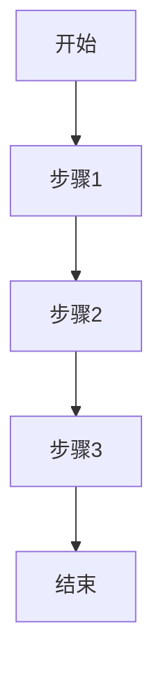
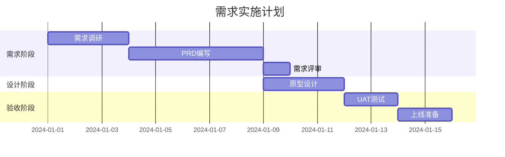

# 产品需求文档模板 (PRD)

> **文档类型**: 产品需求文档 (Product Requirements Document)  
> **负责角色**: 产品经理 (Product Manager)  
> **文档位置**: `docs/product-manager/PRD_<项目名称>_<版本号>.md`

---

## 文档信息

| 项目 | 内容 |
|------|------|
| 文档名称 | |
| 产品名称 | |
| 版本号 | v1.0.0 |
| 创建日期 | YYYY-MM-DD |
| 最后更新 | YYYY-MM-DD |
| 负责产品经理 | |
| 审核人 | |
| 状态 | 草稿/评审中/已批准/已归档 |

---

## 更新履历

| 版本 | 日期 | 更新人 | 更新内容 | 审核状态 |
|------|------|--------|----------|----------|
| v1.0.0 | YYYY-MM-DD | 产品经理姓名 | 初始版本创建 | 待审核 |
| v1.1.0 | YYYY-MM-DD | 产品经理姓名 | 更新内容描述 | 已审核 |

---

## 1. 文档概述

### 1.1 文档目的
- **目标读者**: 开发团队、测试团队、设计团队、业务方
- **文档用途**: 明确产品需求、指导开发实施、验收测试依据
- **阅读建议**: 先读第2章背景，再读第3章需求详情

### 1.2 术语表

| 术语 | 定义 | 说明 |
|------|------|------|
| 术语A | 定义描述 | 补充说明 |
| 术语B | 定义描述 | 补充说明 |

### 1.3 参考资料
- [竞品分析报告](./COMPETITOR_ANALYSIS_<项目名称>.md)
- [用户调研报告](./USER_RESEARCH_<项目名称>.md)
- [架构设计文档](../architect/ARCHITECTURE_DESIGN_<项目名称>.md)

---

## 2. 产品背景

### 2.1 市场背景
- **市场现状**: 描述当前市场状况和趋势
- **市场机会**: 识别市场空白和机会点
- **市场规模**: 目标市场的规模和增长潜力

### 2.2 用户痛点
- **痛点描述**: 用户当前面临的核心问题
- **痛点验证**: 数据或调研支撑痛点的真实性
- **痛点优先级**: 按影响程度和频率排序

### 2.3 竞品分析

#### 2.3.1 直接竞品
| 竞品名称 | 核心功能 | 优势 | 劣势 | 市场份额 |
|----------|----------|------|------|----------|
| 竞品A | 功能列表 | 优势描述 | 劣势描述 | X% |
| 竞品B | 功能列表 | 优势描述 | 劣势描述 | Y% |

#### 2.3.2 间接竞品
| 竞品名称 | 解决方式 | 可借鉴点 | 差异化机会 |
|----------|----------|----------|------------|
| 竞品C | 解决方式 | 可借鉴点 | 差异化机会 |

#### 2.3.3 差异化策略
- **功能差异化**: 我们独有的功能
- **体验差异化**: 更好的用户体验
- **技术差异化**: 技术优势和壁垒

### 2.4 产品目标

#### 2.4.1 业务目标
| 目标项 | 指标 | 目标值 | 时间周期 |
|--------|------|--------|----------|
| 用户增长 | 日活用户(DAU) | X万 | 3个月 |
| 收入增长 | 月收入(MAU) | Y万 | 6个月 |
| 留存提升 | 7日留存率 | Z% | 3个月 |

#### 2.4.2 产品目标
- **核心目标**: 产品要解决的核心问题
- **成功标准**: 如何定义产品的成功
- **关键指标**: 衡量成功的关键指标

---

## 3. 需求分析

### 3.1 用户画像

#### 3.1.1 目标用户
| 用户类型 | 用户描述 | 核心需求 | 使用场景 | 占比 |
|----------|----------|----------|----------|------|
| 用户A | 描述 | 需求列表 | 场景描述 | X% |
| 用户B | 描述 | 需求列表 | 场景描述 | Y% |

#### 3.1.2 用户故事地图
```
用户活动: 活动A
├── 用户任务: 任务A1
│   ├── 用户故事: 故事A1-1
│   └── 用户故事: 故事A1-2
└── 用户任务: 任务A2
    ├── 用户故事: 故事A2-1
    └── 用户故事: 故事A2-2
```

### 3.2 功能需求

#### 3.2.1 功能清单

| 功能ID | 功能名称 | 功能描述 | 优先级 | 所属模块 | 状态 |
|--------|----------|----------|--------|----------|------|
| F-001 | 功能A | 功能描述 | P0 | 模块A | 待开发 |
| F-002 | 功能B | 功能描述 | P1 | 模块A | 待开发 |
| F-003 | 功能C | 功能描述 | P2 | 模块B | 待开发 |

#### 3.2.2 功能详情

##### F-001: 功能A

**功能概述**
- **功能目标**: 功能要实现的目标
- **用户价值**: 为用户带来的价值
- **业务价值**: 为业务带来的价值

**用户故事**
```
作为 [用户角色]
我希望 [功能描述]
以便 [实现价值]
```

**业务流程**


**页面原型**
- **原型链接**: [Figma/Axure链接]
- **交互说明**: 关键交互点说明
- **状态说明**: 页面状态变化说明

**业务规则**
| 规则ID | 规则名称 | 规则描述 | 触发条件 | 执行动作 |
|--------|----------|----------|----------|----------|
| BR-001 | 规则A | 规则描述 | 触发条件 | 执行动作 |
| BR-002 | 规则B | 规则描述 | 触发条件 | 执行动作 |

**数据需求**
| 数据项 | 数据类型 | 数据来源 | 数据格式 | 备注 |
|--------|----------|----------|----------|------|
| 数据A | String | 用户输入 | 文本 | 必填 |
| 数据B | Number | 系统计算 | 数值 | 范围0-100 |

**异常处理**
| 异常场景 | 异常描述 | 处理方式 | 提示信息 |
|----------|----------|----------|----------|
| 异常A | 描述 | 处理方式 | 提示文案 |
| 异常B | 描述 | 处理方式 | 提示文案 |

### 3.3 非功能需求

#### 3.3.1 性能需求
| 需求项 | 需求描述 | 指标要求 | 测试方法 |
|--------|----------|----------|----------|
| 响应时间 | 页面加载时间 | < 2秒 | 性能测试 |
| 并发支持 | 同时在线用户 | > 1000 | 压力测试 |
| 数据量 | 支持数据条数 | > 100万 | 容量测试 |

#### 3.3.2 安全需求
| 需求项 | 需求描述 | 实现方式 | 验收标准 |
|--------|----------|----------|----------|
| 数据加密 | 敏感数据加密 | AES加密 | 安全审计 |
| 访问控制 | 权限控制 | RBAC | 渗透测试 |
| 审计日志 | 操作日志记录 | 全量记录 | 日志审计 |

#### 3.3.3 兼容性需求
| 需求项 | 需求描述 | 支持范围 | 优先级 |
|--------|----------|----------|--------|
| 浏览器 | 浏览器兼容 | Chrome/Firefox/Safari/Edge | P0 |
| 移动端 | 移动端适配 | iOS/Android | P1 |
| 分辨率 | 屏幕适配 | 1920x1080/1366x768/移动端 | P1 |

#### 3.3.4 可用性需求
| 需求项 | 需求描述 | 指标要求 | 验证方式 |
|--------|----------|----------|----------|
| 易用性 | 学习成本 | < 5分钟 | 用户测试 |
| 可访问性 | 无障碍支持 | WCAG 2.0 AA | 自动化测试 |
| 一致性 | 交互一致性 | 符合设计规范 | 设计走查 |

---

## 4. 验收标准

### 4.1 功能验收标准

#### 4.1.1 验收测试用例

| 用例ID | 用例名称 | 前置条件 | 测试步骤 | 预期结果 | 优先级 |
|--------|----------|----------|----------|----------|--------|
| TC-001 | 正常流程测试 | 条件描述 | 1. 步骤1<br>2. 步骤2 | 预期结果 | P0 |
| TC-002 | 异常流程测试 | 条件描述 | 1. 步骤1<br>2. 步骤2 | 预期结果 | P1 |
| TC-003 | 边界条件测试 | 条件描述 | 1. 步骤1<br>2. 步骤2 | 预期结果 | P1 |

#### 4.1.2 验收检查清单

| 检查项 | 检查内容 | 通过标准 | 检查方式 | 负责人 |
|--------|----------|----------|----------|--------|
| 功能完整性 | 功能是否完整实现 | 100%功能点实现 | 功能测试 | 测试专家 |
| 业务流程 | 业务流程是否正确 | 符合PRD描述 | 流程测试 | 测试专家 |
| 数据准确性 | 数据计算是否正确 | 100%准确 | 数据测试 | 测试专家 |
| 异常处理 | 异常场景是否处理 | 全部异常覆盖 | 异常测试 | 测试专家 |

### 4.2 用户体验验收标准

| 检查项 | 检查内容 | 通过标准 | 检查方式 | 负责人 |
|--------|----------|----------|----------|--------|
| 界面设计 | 是否符合设计稿 | 像素级还原 | 视觉走查 | 设计师 |
| 交互流程 | 交互是否流畅 | 无卡顿/无歧义 | 交互测试 | 产品经理 |
| 文案准确性 | 文案是否正确 | 无错别字/无歧义 | 文案审查 | 产品经理 |
| 性能体验 | 加载是否流畅 | 符合性能指标 | 性能测试 | 测试专家 |

### 4.3 技术验收标准

| 检查项 | 检查内容 | 通过标准 | 检查方式 | 负责人 |
|--------|----------|----------|----------|--------|
| 代码质量 | 代码规范 | 符合编码规范 | 代码审查 | 架构师 |
| 测试覆盖 | 测试覆盖率 | > 80% | 覆盖率报告 | 测试专家 |
| 安全漏洞 | 安全扫描 | 高危=0 | 安全扫描 | 架构师 |
| 性能指标 | 性能测试 | 符合性能需求 | 性能测试 | 测试专家 |

---

## 5. 任务拆分与规划

### 5.1 需求实施任务

#### 5.1.1 任务清单

| 任务ID | 任务名称 | 任务描述 | 依赖任务 | 预估工时 | 负责人 | 状态 |
|--------|----------|----------|----------|----------|--------|------|
| PM-001 | 需求调研 | 完成用户调研和竞品分析 | 无 | 3天 | 产品经理 | 待开始 |
| PM-002 | PRD编写 | 编写产品需求文档 | PM-001 | 5天 | 产品经理 | 待开始 |
| PM-003 | 需求评审 | 组织需求评审会议 | PM-002 | 1天 | 产品经理 | 待开始 |
| PM-004 | 原型设计 | 完成产品原型设计 | PM-002 | 3天 | 设计师 | 待开始 |
| PM-005 | UAT测试 | 组织用户验收测试 | 开发完成 | 2天 | 产品经理 | 待开始 |
| PM-006 | 上线准备 | 准备上线材料和培训 | UAT通过 | 2天 | 产品经理 | 待开始 |

#### 5.1.2 任务依赖图



### 5.2 进度检查清单

#### 5.2.1 阶段检查点

| 阶段 | 检查项 | 完成标准 | 检查方式 | 负责人 |
|------|--------|----------|----------|--------|
| 需求完成 | PRD文档 | 文档评审通过 | 评审会议 | 产品经理 |
| 设计完成 | 设计稿 | 设计评审通过 | 设计评审 | 设计师 |
| 开发完成 | 功能实现 | 功能测试通过 | 功能测试 | 测试专家 |
| UAT完成 | 用户验收 | 用户签字确认 | UAT测试 | 产品经理 |
| 上线完成 | 上线检查 | 生产环境验证通过 | 上线检查 | 运维负责人 |

#### 5.2.2 质量门禁

| 门禁项 | 标准 | 检查工具 | 阻断发布 |
|--------|------|----------|----------|
| 需求完整性 | 100%需求点覆盖 | 需求跟踪矩阵 | 是 |
| 设计一致性 | 符合设计规范 | 设计走查 | 是 |
| UAT通过率 | > 95% | UAT测试报告 | 是 |
| 用户满意度 | > 4.0/5.0 | 用户反馈 | 否 |

---

## 6. 风险评估

### 6.1 需求风险

| 风险项 | 风险等级 | 影响范围 | 缓解措施 | 负责人 |
|--------|----------|----------|----------|--------|
| 需求变更 | 高 | 项目进度 | 变更控制流程 | 产品经理 |
| 需求理解 | 中 | 开发质量 | 需求澄清会议 | 产品经理 |
| 需求遗漏 | 中 | 功能完整性 | 需求评审 | 产品经理 |

### 6.2 实施风险

| 风险项 | 风险等级 | 影响范围 | 缓解措施 | 负责人 |
|--------|----------|----------|----------|--------|
| 技术可行性 | 中 | 功能实现 | 技术预研 | 架构师 |
| 资源不足 | 低 | 项目进度 | 资源调配 | 项目经理 |
| 用户接受度 | 中 | 产品成功 | 用户测试 | 产品经理 |

---

## 7. 附录

### 7.1 用户调研报告
- **调研方法**: 用户访谈/问卷调查/数据分析
- **调研样本**: 样本数量和特征
- **关键发现**: 核心发现和洞察
- **用户反馈**: 典型用户反馈

### 7.2 竞品分析报告
- **竞品选择**: 选择理由和分析维度
- **功能对比**: 详细功能对比表
- **体验对比**: 用户体验对比
- **差异化建议**: 差异化机会和建议

### 7.3 数据分析报告
- **数据来源**: 数据来源和采集方式
- **关键指标**: 关键指标和趋势
- **用户行为**: 用户行为分析
- **洞察建议**: 数据洞察和产品建议

### 7.4 相关文档
- [架构设计文档](../architect/ARCHITECTURE_DESIGN_<项目名称>.md)
- [测试计划](../test-expert/TEST_PLAN_<项目名称>.md)
- [用户手册](../solo-coder/USER_MANUAL_<项目名称>.md)

---

## 8. 审核记录

| 审核轮次 | 审核日期 | 审核人 | 审核意见 | 处理结果 |
|----------|----------|--------|----------|----------|
| 第一轮 | YYYY-MM-DD | 审核人 | 审核意见描述 | 已处理 |
| 第二轮 | YYYY-MM-DD | 审核人 | 审核意见描述 | 已处理 |

---

**文档结束**

> 本文档由产品经理角色创建和维护，任何修改必须更新版本号和更新履历。
