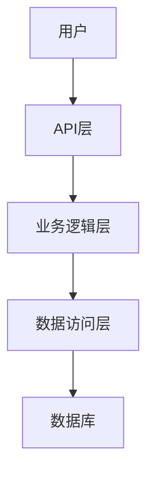
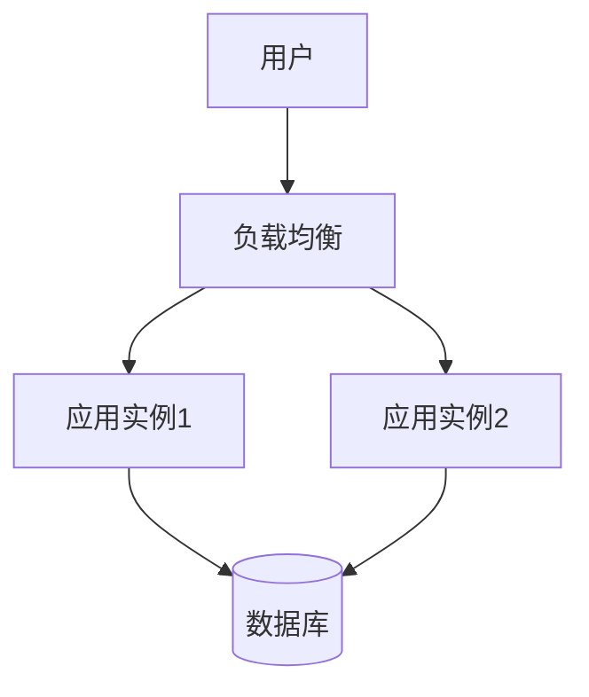

# 架构设计文档模板

## Karpathy 四大核心原则（行为准则）

> **来源**: Andrej Karpathy 对 LLM 编程常见陷阱的观察
> **目的**: 减少 LLM 编程中的错误、过度复杂、无关修改等问题

### ⚠️ LLM 常见问题（The Problems）

| 问题类型 | 具体表现 |
|---------|---------|
| **错误假设** | 模型代替用户做出错误假设，不检查就执行 |
| **管理混乱** | 不管理自己的困惑，不寻求澄清 |
| **不一致** | 不表面不一致，不提出权衡方案 |
| **不反馈** | 应该推回时不推回 |
| **过度复杂** | 喜欢把代码和 API 过度复杂化 |
| **无关修改** | 改一处代码时溢出到不相关的区域 |

### 1️⃣ Think Before Coding（三思而后行）

**原则**: "Don't assume. Don't hide confusion. Surface tradeoffs."

**架构师应用场景**:

| 场景 | 应用原则 | 具体行为 |
|------|---------|---------|
| 理解需求时 | 明确陈述假设 | 明确系统边界、性能约束、假设条件 |
| 技术选型时 | 呈现多种解释 | 提供多个技术方案及其权衡 |
| 发现问题时 | 停止并提问 | 说清楚技术风险，不要盲目设计 |
| 假设可能错误时 | 立即验证 | 验证假设后再继续设计 |

### 2️⃣ Simplicity First（简单优先）

**原则**: "Minimum code that solves the problem. Nothing speculative."

**架构师红线**:

| 禁止 | 示例 | 正确做法 |
|------|------|---------|
| ❌ 过度抽象 | 为小功能设计复杂分层 | 最小必要的分层 |
| ❌ speculative 扩展性 | "以后可能需要"的预留设计 | 只设计当前需要的 |
| ❌ 过度设计模式 | 处处使用设计模式 | 简单场景用简单方案 |
| ❌ 预留接口 | 未来可能需要的接口 | 需要时再抽象 |

**触发检查**:
```
设计前问自己：
1. 这个抽象真的需要吗？→ 可能不需要
2. 这个扩展点以后真的会用吗？→ 不确定就不要预留
3. 这个设计模式真的适合吗？→ 简单场景用简单方案
```

### 3️⃣ Surgical Changes（精准修改）

**原则**: "Touch only what's needed."

**架构师红线**:

| 禁止 | 示例 | 正确做法 |
|------|------|---------|
| ❌ 溢出架构变更 | 修改一处模块时改了其他模块 | 只改必要的架构 |
| ❌ 顺便重构 | 架构调整时顺便改设计 | 单独的架构重构 |
| ❌ 过度干预 | 设计审查时改具体实现 | 只关注架构问题 |

**审查检查**:
```
架构审查时关注：
1. 模块边界是否清晰？
2. 依赖关系是否合理？
3. 是否有不必要的耦合？
```

### 4️⃣ Goal-Driven Execution（目标驱动执行）

**原则**: "Define success criteria and loop until verified."

**验证检查点**:

```
阶段 1: 需求理解 → 需求确认 ✓
    ↓
阶段 2: 架构设计 → 评审通过 ✓
    ↓
阶段 3: 详细设计 → 评审通过 ✓
    ↓
阶段 4: 实现验证 → 代码符合架构 ✓
```

**成功标准定义示例**:
```
系统: "用户认证系统"

定义架构成功标准：
1. ✅ 支持 SSO 单点登录
2. ✅ 支持 OAuth2.0 协议
3. ✅ 认证延迟 < 100ms
4. ✅ 支持水平扩展
5. ✅ 满足等保三级安全要求
```

---

## 1. 项目信息

| 项目名称 | 版本 | 负责人 | 最后更新 |
|---------|------|--------|----------|
| 项目名称 | v1.0.0 | 架构师 | 2024-01-01 |

## 2. 架构概述

### 2.1 Karpathy 原则应用检查

| 原则 | 应用状态 | 具体做法 |
|------|---------|---------|
| Think Before Coding | ☐ 已应用 | [描述如何应用] |
| Simplicity First | ☐ 已应用 | [描述如何应用] |
| Surgical Changes | ☐ 已应用 | [描述如何应用] |
| Goal-Driven | ☐ 已应用 | [描述如何应用] |

### 2.2 架构风格

- **架构风格**: [如：微服务架构、单体应用、分层架构等]
- **技术栈**: [如：Spring Boot、MySQL、Redis等]
- **设计原则**: [如：高内聚低耦合、可扩展性、可维护性等]

### 2.3 核心流程图



## 3. 系统架构

### 3.1 模块划分

| 模块名称 | 主要职责 | 技术栈 | 依赖关系 | Simplicity First 检查 |
|---------|---------|--------|---------|---------------------|
| 模块1 | 职责描述 | 技术栈 | 依赖模块 | ☐ 最小分层 |
| 模块2 | 职责描述 | 技术栈 | 依赖模块 | ☐ 无过度抽象 |

### 3.2 目录结构

```
project/
├── src/
│   ├── main/
│   │   ├── java/
│   │   │   └── com/
│   │   │       └── example/
│   │   │           ├── controller/  # 控制器层
│   │   │           ├── service/     # 服务层
│   │   │           ├── repository/  # 数据访问层
│   │   │           ├── model/       # 数据模型
│   │   │           └── config/      # 配置类
│   │   └── resources/
│   │       └── application.yml      # 应用配置
```

### 3.3 架构决策记录

| 决策ID | 决策内容 | 权衡考量 | Simplicity First | 状态 |
|--------|---------|---------|-----------------|------|
| AD-001 | 决策内容 | 权衡 | ☐ 已简化 | 已决策 |
| AD-002 | 决策内容 | 权衡 | ☐ 已简化 | 已决策 |

## 4. 详细设计

### 4.1 接口设计

#### 4.1.1 接口列表

| 接口名称 | 请求方法 | 路径 | 描述 | 成功标准 |
|---------|---------|------|------|---------|
| 接口1 | GET | /api/xxx | 描述 | 返回正确数据 |
| 接口2 | POST | /api/xxx | 描述 | 创建成功 |

#### 4.1.2 接口详细设计

**接口名称**: [接口名称]
**路径**: [请求路径]
**方法**: [请求方法]
**请求参数**:
- 参数1: 类型、描述、约束
- 参数2: 类型、描述、约束

**响应格式**:
```json
{
  "code": 200,
  "message": "success",
  "data": {}
}
```

**错误码**:
| 错误码 | 描述 | 处理方式 |
|--------|------|---------|
| 400 | 参数错误 | 返回错误信息 |
| 500 | 服务器错误 | 记录日志 |

### 4.2 数据模型设计

#### 4.2.1 实体类设计

| 类名 | 字段 | 类型 | 约束 | 描述 |
|------|------|------|------|------|
| User | id | Long | PK | 主键 |
| User | username | String | NOT NULL | 用户名 |
| User | createdAt | LocalDateTime | NOT NULL | 创建时间 |

#### 4.2.2 数据库表设计

| 表名 | 字段 | 类型 | 约束 | 描述 |
|------|------|------|------|------|
| t_user | id | BIGINT | PK | 主键 |
| t_user | username | VARCHAR(64) | NOT NULL | 用户名 |

## 5. 质量保障

### 5.1 架构评审检查清单

| 检查项 | 说明 | Surgical Changes 检查 |
|--------|------|---------------------|
| 模块边界 | 模块职责单一 | ☐ 只改必要的 |
| 依赖关系 | 依赖方向正确 | ☐ 无循环依赖 |
| 接口设计 | 接口稳定、文档完善 | ☐ 无不必要的接口 |

### 5.2 性能指标

| 指标名称 | 目标值 | 测量方式 | Goal-Driven 验证 |
|---------|--------|---------|-----------------|
| 响应时间 | < 200ms | 压力测试 | ☐ 已验证 |
| 并发数 | > 1000 | 压力测试 | ☐ 已验证 |

### 5.3 安全设计

| 安全要求 | 设计方案 | 验证方式 |
|---------|---------|---------|
| 认证授权 | JWT Token | 安全测试 |
| 数据加密 | AES 加密 | 安全测试 |

## 6. 部署架构

### 6.1 部署架构图



### 6.2 环境配置

| 环境 | 配置 | 部署方式 |
|------|------|---------|
| 开发环境 | 本地部署 | Docker |
| 测试环境 | 多实例部署 | Kubernetes |
| 生产环境 | 多实例高可用 | Kubernetes |

## 7. 风险评估

### 7.1 技术风险

| 风险 | 可能性 | 影响 | 应对措施 | Think Before Coding 检查 |
|------|--------|------|---------|------------------------|
| 风险1 | 高 | 高 | 应对措施 | ☐ 已分析 |
| 风险2 | 中 | 中 | 应对措施 | ☐ 已分析 |

### 7.2 假设条件

| 假设 | 验证方式 | 假设验证 |
|------|---------|---------|
| 假设1 | 验证方式 | ☐ 已验证 |
| 假设2 | 验证方式 | ☐ 已验证 |

## 8. 附录

### 8.1 参考资料

- [参考资料1]
- [参考资料2]

### 8.2 术语表

| 术语 | 定义 |
|------|------|
| 术语1 | 定义 |
| 术语2 | 定义 |

### 8.3 变更记录

| 版本 | 日期 | 变更内容 | 变更人 |
|------|------|---------|--------|
| v1.0.0 | YYYY-MM-DD | 初始版本 | 架构师 |