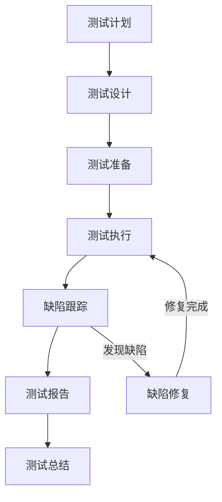
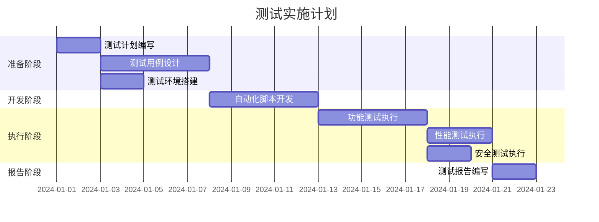

# 测试计划文档模板

> **文档类型**: 测试计划文档 (Test Plan Document)  
> **负责角色**: 测试专家 (Test Expert)  
> **文档位置**: `docs/test-expert/TEST_PLAN_<项目名称>_<版本号>.md`

---

## 文档信息

| 项目 | 内容 |
|------|------|
| 文档名称 | |
| 项目名称 | |
| 版本号 | v1.0.0 |
| 创建日期 | YYYY-MM-DD |
| 最后更新 | YYYY-MM-DD |
| 负责测试专家 | |
| 审核人 | |
| 状态 | 草稿/评审中/已批准/已归档 |

---

## 更新履历

| 版本 | 日期 | 更新人 | 更新内容 | 审核状态 |
|------|------|--------|----------|----------|
| v1.0.0 | YYYY-MM-DD | 测试专家姓名 | 初始版本创建 | 待审核 |
| v1.1.0 | YYYY-MM-DD | 测试专家姓名 | 更新内容描述 | 已审核 |

---

## 1. 测试概述

### 1.1 测试目标
- **质量目标**: 确保产品满足需求规格说明书中的功能和非功能需求
- **覆盖目标**: 实现代码覆盖率>80%，功能覆盖率100%
- **缺陷目标**: 严重缺陷=0，一般缺陷<5个，轻微缺陷<10个

### 1.2 测试范围

#### 1.2.1 包含范围
- **功能测试**: 所有功能模块的测试
- **接口测试**: API接口的功能和性能测试
- **UI测试**: 用户界面和交互测试
- **性能测试**: 负载、压力和稳定性测试
- **安全测试**: 安全漏洞扫描和渗透测试
- **兼容性测试**: 多浏览器、多设备兼容性测试

#### 1.2.2 排除范围
- **第三方服务**: 依赖的第三方服务（除非特别说明）
- **硬件兼容性**: 特定硬件设备的兼容性（除非特别说明）

### 1.3 测试约束
- **时间约束**: 测试周期和里程碑
- **资源约束**: 测试环境和测试数据
- **技术约束**: 测试工具和技术栈

---

## 2. 测试策略

### 2.1 测试金字塔

```
        /\
       /  \
      / E2E\      (10%) 端到端测试
     /------\
    /Integration\  (20%) 集成测试
   /--------------\
  /   Unit Test    \ (70%) 单元测试
 /------------------\
```

### 2.2 测试类型

#### 2.2.1 单元测试
| 测试项 | 测试范围 | 覆盖率要求 | 执行频率 | 负责人 |
|--------|----------|------------|----------|--------|
| 业务逻辑 | 核心业务方法 | >80% | 每次提交 | 开发工程师 |
| 工具类 | 公共工具方法 | >90% | 每次提交 | 开发工程师 |
| 数据访问 | DAO/Repository | >70% | 每次提交 | 开发工程师 |

#### 2.2.2 集成测试
| 测试项 | 测试范围 | 测试重点 | 执行频率 | 负责人 |
|--------|----------|----------|----------|--------|
| 接口集成 | API接口 | 接口契约 | 每日构建 | 测试工程师 |
| 服务集成 | 微服务间调用 | 服务间通信 | 每日构建 | 测试工程师 |
| 数据集成 | 数据库操作 | 数据一致性 | 每日构建 | 测试工程师 |

#### 2.2.3 端到端测试
| 测试项 | 测试范围 | 测试场景 | 执行频率 | 负责人 |
|--------|----------|----------|----------|--------|
| 核心流程 | 用户核心业务流程 | 完整业务流程 | 每日构建 | 测试工程师 |
| 用户场景 | 典型用户操作场景 | 用户故事场景 | 每周构建 | 测试工程师 |

### 2.3 测试环境

#### 2.3.1 环境规划
| 环境 | 用途 | 配置 | 数据 | 访问权限 |
|------|------|------|------|----------|
| 开发环境 | 开发自测 | 2C4G | 模拟数据 | 开发团队 |
| 测试环境 | 功能测试 | 4C8G | 测试数据 | 测试团队 |
| 集成环境 | 集成测试 | 8C16G | 集成数据 | 测试团队 |
| 预发环境 | 验收测试 | 8C16G | 生产脱敏数据 | 全团队 |
| 性能环境 | 性能测试 | 16C32G | 性能测试数据 | 性能测试团队 |

#### 2.3.2 测试数据
| 数据类型 | 数据量 | 生成方式 | 更新频率 | 负责人 |
|----------|--------|----------|----------|--------|
| 基础数据 | 1万条 | 脚本生成 | 每周 | 测试工程师 |
| 业务数据 | 10万条 | 脚本生成 | 每周 | 测试工程师 |
| 性能数据 | 100万条 | 脚本生成 | 每月 | 性能测试工程师 |

---

## 3. 测试用例设计

### 3.1 用例设计方法

#### 3.1.1 等价类划分
- **有效等价类**: 符合需求规格的有效输入
- **无效等价类**: 不符合需求规格的无效输入

#### 3.1.2 边界值分析
- **边界值**: 最小值、最大值、最小值-1、最大值+1
- **典型值**: 正常范围内的典型值

#### 3.1.3 场景法
- **基本流**: 正常业务流程
- **备选流**: 异常和分支流程
- **异常流**: 错误处理流程

### 3.2 功能测试用例

#### 3.2.1 用例模板

| 用例ID | 用例名称 | 所属模块 | 优先级 | 前置条件 | 测试步骤 | 预期结果 | 实际结果 | 状态 |
|--------|----------|----------|--------|----------|----------|----------|----------|------|
| TC-001 | 正常登录 | 用户模块 | P0 | 用户已注册 | 1.输入用户名<br>2.输入密码<br>3.点击登录 | 登录成功，跳转到首页 | | 未执行 |
| TC-002 | 密码错误 | 用户模块 | P1 | 用户已注册 | 1.输入用户名<br>2.输入错误密码<br>3.点击登录 | 提示密码错误 | | 未执行 |

#### 3.2.2 用例分类

##### 正常场景用例
| 用例ID | 用例名称 | 测试目的 | 优先级 |
|--------|----------|----------|--------|
| TC-N-001 | 正常流程A | 验证正常业务流程 | P0 |
| TC-N-002 | 正常流程B | 验证正常业务流程 | P0 |

##### 异常场景用例
| 用例ID | 用例名称 | 测试目的 | 优先级 |
|--------|----------|----------|--------|
| TC-E-001 | 异常场景A | 验证异常处理 | P1 |
| TC-E-002 | 异常场景B | 验证异常处理 | P1 |

##### 边界条件用例
| 用例ID | 用例名称 | 测试目的 | 优先级 |
|--------|----------|----------|--------|
| TC-B-001 | 边界条件A | 验证边界处理 | P1 |
| TC-B-002 | 边界条件B | 验证边界处理 | P1 |

### 3.3 接口测试用例

#### 3.3.1 REST API测试

| 接口 | 方法 | 测试场景 | 请求参数 | 预期响应 | 状态码 |
|------|------|----------|----------|----------|--------|
| /api/users | GET | 查询用户列表 | page=1&size=10 | 用户列表数据 | 200 |
| /api/users | POST | 创建用户 | {name, email} | 创建成功 | 201 |
| /api/users/{id} | GET | 查询用户详情 | id=123 | 用户详情 | 200 |
| /api/users/{id} | PUT | 更新用户 | {name, email} | 更新成功 | 200 |
| /api/users/{id} | DELETE | 删除用户 | id=123 | 删除成功 | 204 |

#### 3.3.2 异常场景测试

| 接口 | 异常场景 | 请求参数 | 预期响应 | 状态码 |
|------|----------|----------|----------|--------|
| /api/users | 参数缺失 | {} | 参数错误提示 | 400 |
| /api/users/{id} | 用户不存在 | id=999999 | 用户不存在提示 | 404 |
| /api/users | 无权限 | - | 无权限提示 | 403 |

### 3.4 性能测试用例

#### 3.4.1 负载测试

| 测试项 | 并发用户数 | 持续时间 | 目标TPS | 目标响应时间 | 通过率 |
|--------|------------|----------|---------|--------------|--------|
| 登录接口 | 100 | 10分钟 | 1000 | < 200ms | > 99% |
| 查询接口 | 200 | 10分钟 | 2000 | < 100ms | > 99% |
| 提交接口 | 50 | 10分钟 | 500 | < 500ms | > 99% |

#### 3.4.2 压力测试

| 测试项 | 起始并发 | 最大并发 | 步长 | 目标 | 预期结果 |
|--------|----------|----------|------|------|----------|
| 系统容量 | 10 | 1000 | 50 | 找到性能拐点 | 确定最大容量 |
| 稳定性 | 100 | 100 | - | 持续24小时 | 系统稳定运行 |

#### 3.4.3 性能指标

| 指标项 | 目标值 | 警告阈值 | 错误阈值 | 监控方式 |
|--------|--------|----------|----------|----------|
| 响应时间(P99) | < 200ms | 200-500ms | > 500ms | APM监控 |
| 吞吐量(TPS) | > 1000 | 800-1000 | < 800 | 性能测试工具 |
| 错误率 | < 0.1% | 0.1%-1% | > 1% | 日志监控 |
| CPU使用率 | < 70% | 70%-80% | > 80% | 系统监控 |
| 内存使用率 | < 80% | 80%-90% | > 90% | 系统监控 |

### 3.5 安全测试用例

#### 3.5.1 安全漏洞扫描

| 测试项 | 测试方法 | 测试工具 | 风险等级 | 修复要求 |
|--------|----------|----------|----------|----------|
| SQL注入 | 自动化扫描 | SonarQube | 高危 | 必须修复 |
| XSS攻击 | 自动化扫描 | OWASP ZAP | 高危 | 必须修复 |
| CSRF攻击 | 自动化扫描 | Burp Suite | 中危 | 必须修复 |
| 敏感信息泄露 | 代码审查 | 人工审查 | 中危 | 必须修复 |

#### 3.5.2 渗透测试

| 测试项 | 测试方法 | 测试工具 | 测试范围 | 执行频率 |
|--------|----------|----------|----------|----------|
| 认证绕过 | 手动测试 | Burp Suite | 登录模块 | 每季度 |
| 权限提升 | 手动测试 | 自定义脚本 | 权限模块 | 每季度 |
| 会话劫持 | 手动测试 | Wireshark | 会话管理 | 每季度 |

### 3.6 兼容性测试用例

#### 3.6.1 浏览器兼容性

| 浏览器 | 版本 | 测试范围 | 优先级 | 负责人 |
|--------|------|----------|--------|--------|
| Chrome | 最新版 | 全部功能 | P0 | 测试工程师 |
| Firefox | 最新版 | 全部功能 | P0 | 测试工程师 |
| Safari | 最新版 | 全部功能 | P1 | 测试工程师 |
| Edge | 最新版 | 全部功能 | P1 | 测试工程师 |

#### 3.6.2 移动端兼容性

| 设备类型 | 操作系统 | 测试范围 | 优先级 | 负责人 |
|----------|----------|----------|--------|--------|
| iPhone | iOS 15+ | 核心功能 | P0 | 测试工程师 |
| Android | Android 10+ | 核心功能 | P0 | 测试工程师 |
| iPad | iPadOS 15+ | 核心功能 | P1 | 测试工程师 |

---

## 4. 测试执行计划

### 4.1 测试阶段

#### 4.1.1 阶段划分

| 阶段 | 开始时间 | 结束时间 | 持续时间 | 测试内容 | 负责人 |
|------|----------|----------|----------|----------|--------|
| 单元测试 | 开发阶段 | 开发阶段 | 持续 | 单元测试 | 开发工程师 |
| 集成测试 | 开发完成 | 集成完成 | 1周 | 接口和服务集成 | 测试工程师 |
| 系统测试 | 集成完成 | 系统完成 | 2周 | 功能和性能测试 | 测试团队 |
| 验收测试 | 系统完成 | 上线前 | 1周 | UAT和回归测试 | 测试团队 |

#### 4.1.2 里程碑

| 里程碑 | 时间 | 完成标准 | 交付物 | 负责人 |
|--------|------|----------|--------|--------|
| 开发完成 | 第4周 | 代码开发完成 | 可测试版本 | 开发团队 |
| 集成完成 | 第5周 | 集成测试通过 | 集成测试报告 | 测试团队 |
| 系统测试完成 | 第7周 | 系统测试通过 | 系统测试报告 | 测试团队 |
| 验收完成 | 第8周 | UAT通过 | 验收测试报告 | 测试团队 |

### 4.2 测试执行流程



### 4.3 缺陷管理

#### 4.3.1 缺陷等级

| 等级 | 定义 | 示例 | 修复时限 |
|------|------|------|----------|
| P0-致命 | 系统崩溃或核心功能不可用 | 系统无法启动 | 立即 |
| P1-严重 | 主要功能异常或数据错误 | 核心业务流程失败 | 24小时 |
| P2-一般 | 次要功能异常或界面问题 | 非核心功能异常 | 3天 |
| P3-轻微 | 界面细节或建议性问题 | 文案错误 | 下次迭代 |

#### 4.3.2 缺陷生命周期

```
新建 → 确认 → 分配 → 修复 → 验证 → 关闭
         ↓      ↓      ↓      ↓
       拒绝   延期   重开   重开
```

#### 4.3.3 缺陷跟踪

| 缺陷ID | 缺陷描述 | 等级 | 状态 | 负责人 | 发现日期 | 修复日期 |
|--------|----------|------|------|--------|----------|----------|
| BUG-001 | 描述 | P1 | 已修复 | 开发工程师 | 2024-01-01 | 2024-01-02 |
| BUG-002 | 描述 | P2 | 待修复 | 开发工程师 | 2024-01-01 | - |

---

## 5. 任务拆分与规划

### 5.1 测试实施任务

#### 5.1.1 任务清单

| 任务ID | 任务名称 | 任务描述 | 依赖任务 | 预估工时 | 负责人 | 状态 |
|--------|----------|----------|----------|----------|--------|------|
| TEST-001 | 测试计划编写 | 编写测试计划文档 | 无 | 2天 | 测试专家 | 待开始 |
| TEST-002 | 测试用例设计 | 设计功能测试用例 | TEST-001 | 5天 | 测试工程师 | 待开始 |
| TEST-003 | 测试环境搭建 | 搭建测试环境 | TEST-001 | 2天 | 测试工程师 | 待开始 |
| TEST-004 | 自动化脚本开发 | 开发自动化测试脚本 | TEST-002 | 5天 | 测试开发 | 待开始 |
| TEST-005 | 功能测试执行 | 执行功能测试 | 开发完成 | 5天 | 测试工程师 | 待开始 |
| TEST-006 | 性能测试执行 | 执行性能测试 | TEST-005 | 3天 | 性能测试工程师 | 待开始 |
| TEST-007 | 安全测试执行 | 执行安全测试 | TEST-005 | 2天 | 安全测试工程师 | 待开始 |
| TEST-008 | 测试报告编写 | 编写测试报告 | 测试完成 | 2天 | 测试专家 | 待开始 |

#### 5.1.2 任务依赖图



### 5.2 进度检查清单

#### 5.2.1 阶段检查点

| 阶段 | 检查项 | 完成标准 | 检查方式 | 负责人 |
|------|--------|----------|----------|--------|
| 计划完成 | 测试计划 | 文档评审通过 | 评审会议 | 测试专家 |
| 用例完成 | 测试用例 | 用例评审通过 | 用例评审 | 测试专家 |
| 环境就绪 | 测试环境 | 环境验证通过 | 环境检查 | 测试工程师 |
| 测试完成 | 测试执行 | 测试用例100%执行 | 测试报告 | 测试专家 |
| 上线准备 | 质量评估 | 质量门禁通过 | 质量评审 | 测试专家 |

#### 5.2.2 质量门禁

| 门禁项 | 标准 | 检查工具 | 阻断发布 |
|--------|------|----------|----------|
| 测试覆盖率 | > 80% | 覆盖率报告 | 是 |
| 缺陷遗留 | P0=0, P1<3 | 缺陷报告 | 是 |
| 性能指标 | 满足SLA | 性能测试报告 | 是 |
| 安全漏洞 | 高危=0 | 安全扫描报告 | 是 |

---

## 6. 测试工具

### 6.1 功能测试工具

| 工具名称 | 用途 | 版本 | 使用场景 |
|----------|------|------|----------|
| JUnit/TestNG | 单元测试 | 最新版 | 开发阶段 |
| Selenium | UI自动化 | 最新版 | 回归测试 |
| Postman | 接口测试 | 最新版 | 接口验证 |
| JMeter | 性能测试 | 最新版 | 压力测试 |

### 6.2 代码质量工具

| 工具名称 | 用途 | 版本 | 检查内容 |
|----------|------|------|----------|
| SonarQube | 代码质量 | 最新版 | 代码规范、漏洞 |
| ESLint | JS代码规范 | 最新版 | JS代码规范 |
| Checkstyle | Java代码规范 | 最新版 | Java代码规范 |

### 6.3 安全测试工具

| 工具名称 | 用途 | 版本 | 检查内容 |
|----------|------|------|----------|
| OWASP ZAP | 安全扫描 | 最新版 | Web安全漏洞 |
| Burp Suite | 渗透测试 | 最新版 | 手动安全测试 |
| SonarQube | 代码安全 | 最新版 | 代码安全漏洞 |

---

## 7. 风险评估

### 7.1 测试风险

| 风险项 | 风险等级 | 影响范围 | 缓解措施 | 负责人 |
|--------|----------|----------|----------|--------|
| 测试环境不稳定 | 中 | 测试进度 | 环境监控+快速恢复 | 测试工程师 |
| 测试数据不足 | 中 | 测试质量 | 数据生成脚本 | 测试工程师 |
| 自动化覆盖率低 | 低 | 回归效率 | 逐步补充自动化 | 测试开发 |
| 性能测试环境差异 | 中 | 性能评估 | 环境对标生产 | 性能测试工程师 |

### 7.2 项目风险

| 风险项 | 风险等级 | 影响范围 | 缓解措施 | 负责人 |
|--------|----------|----------|----------|--------|
| 需求变更 | 高 | 测试范围 | 变更控制流程 | 产品经理 |
| 开发延期 | 中 | 测试时间 | 压缩测试范围 | 项目经理 |
| 缺陷修复慢 | 中 | 测试进度 | 缺陷优先级管理 | 开发团队 |

---

## 8. 附录

### 8.1 测试用例库
- **功能用例**: [功能测试用例](./TEST_CASES_FUNCTIONAL_<项目名称>.md)
- **接口用例**: [接口测试用例](./TEST_CASES_API_<项目名称>.md)
- **性能用例**: [性能测试用例](./TEST_CASES_PERFORMANCE_<项目名称>.md)
- **安全用例**: [安全测试用例](./TEST_CASES_SECURITY_<项目名称>.md)

### 8.2 测试数据
- **基础数据**: [基础测试数据](./TEST_DATA_BASIC_<项目名称>.sql)
- **业务数据**: [业务测试数据](./TEST_DATA_BUSINESS_<项目名称>.sql)
- **性能数据**: [性能测试数据](./TEST_DATA_PERFORMANCE_<项目名称>.sql)

### 8.3 自动化脚本
- **单元测试**: `src/test/java/...`
- **接口测试**: `src/test/api/...`
- **UI测试**: `src/test/ui/...`
- **性能测试**: `src/test/performance/...`

### 8.4 相关文档
- [PRD文档](../product-manager/PRD_<项目名称>.md)
- [架构设计文档](../architect/ARCHITECTURE_DESIGN_<项目名称>.md)
- [接口文档](../architect/API_SPEC_<项目名称>.md)

---

## 9. 审核记录

| 审核轮次 | 审核日期 | 审核人 | 审核意见 | 处理结果 |
|----------|----------|--------|----------|----------|
| 第一轮 | YYYY-MM-DD | 审核人 | 审核意见描述 | 已处理 |
| 第二轮 | YYYY-MM-DD | 审核人 | 审核意见描述 | 已处理 |

---

**文档结束**

> 本文档由测试专家角色创建和维护，任何修改必须更新版本号和更新履历。
